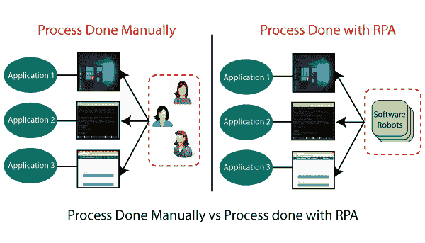

# RPA 蓝色棱镜

> 原文：<https://www.tutorialandexample.com/rpa-blue-prism/>

**蓝棱镜:机器人流程自动化**

Blue prism 是一家总部位于英国的软件开发公司，与机器人过程自动化领域相关。它提供机器人软件，帮助自动化重复性的后端办公室任务，这完全像人类一样工作。

蓝棱镜也是 RPA 的领先工具。该工具具有更好的安全性、灵活性和可扩展性。它提供了一个带有拖放功能的流程图，以自动化业务流程的每一步。

该软件工具通过自动化手动、重复的后端办公室任务，使业务流程或操作变得敏捷且经济高效。它还提高了发展数字化劳动力的准确性。

Blue Prism 工具基于 java 编程语言，支持可视化设计器。它是在 2001 年开发的，不同于市场上最近出现的其他工具。

### 蓝色棱镜的先决条件

蓝棱镜是一个软件工具。该工具有一些先决条件，如下所示:

*   Blue Prism 用于在不同的企业规模上创建和支持工业强度的数字劳动力。
*   实施不需要 It 技能。
*   该工具在 IT 基础设施中进行管理，并可在各种环境中轻松处理。
*   它通过自筹资金回报提供了巨大的回报，ROI(投资回报)具有 80%的高一致性。
*   与其他解决方案相比，它更便宜。

### 蓝棱镜自动化工具的未来

蓝棱镜工具有望成为未来 RPA(机器人过程自动化)的高端产品。它是数字激活劳动力的成功提供商。

**图:蓝色棱镜工具的未来。**

Blue Prism 是全球不同组织的可靠程序来源。它还确保流程中的高安全性标准。

蓝棱镜遵循基于规则的系统来保持执行时的相似性。RPA 可以在用户设备上轻松设计和执行。

### Object Studio-蓝色棱镜

Object Studio 是 Blue Prism 的一个组件。它用于开发对象。我们有不同类型的操作，如下所示:

*   应用程序模块来监视元素。
*   初始页面和清理页面

Object Studio 还包含一个应用程序建模器，它可以创建任何应用程序的模型。对象中的页面称为操作。

用户在 Object Studio 中有两种类型的对象如下:

*   基于应用程序的对象。
*   基于实用程序的对象。

基于应用程序的对象需要用户对应用程序参数进行建模，或者通过. net API 与应用程序进行交互。实用程序对象使用多个进程。

### 应用建模器-蓝色棱镜

应用建模器用于应用的监视过程。间谍是识别应用程序中的元素的过程。应用建模器具有嵌入式功能。

各种接口应用程序在应用程序建模器中预配置，以创建 RPA 机器人来识别外部应用程序的元素。

下面给出了一些外部应用:

*   Windows 应用程序。
*   Java 应用程序。
*   浏览器应用。
*   大型机应用程序。

### 应用程序建模器中的监视模式

应用程序建模器在 Blue Prism 中有四种不同的监视模式，如下所示:

1.Win32 模式。

2.HTML 模式。

3.辅助功能模式。

4.区域模式。

### 蓝色棱镜的优势

以下是蓝色棱镜工具的一些优点:

*   Blue Prism 工具为多个行业构建了一个高效、自动化的端到端业务流程。
*   它是健壮的，并且具有丰富的分析套件的特征。
*   该工具改进了控制室，提供机器人状态的实时反馈，并允许用户获得数字劳动力的完整视图。
*   Blue Prism 提供了仪表板，以便用户可以分析数据和流程的时间段。
*   它提供更好的服务质量。我们可以借助数字劳动力的端到端审计性能来分析该工具的优质服务。
*   蓝棱镜以这样的方式执行任务，以高精度和低误差产生输出。
*   它提供了一种可扩展的方法，因为这个工具不依赖于脚本或记录器。但是它需要智能的数字劳动力来自动执行任务。
*   蓝色棱镜工具是灵活的；这就是为什么它有一支数字化的员工队伍。因此，它可以 24x7 全天候工作，无需休息或休息，并以高精度给出类似的结果。
*   该工具还提供了快速简单的部署服务。借助 Blue Prism，它可以自动控制应用程序，与屏幕位置无关。
*   Blue Prism 根据业务需求提供工作能力支持，这意味着该工具随时准备允许云支持。用户可以按需创建员工并集中管理他们。
*   这个工具具有执行智能的品质。根据这种特性，当机器人连接到系统时，它们动态地做出反应，以响应多个环境中的数据。
*   蓝棱镜工具很容易在 4 到 6 周的短时间内实现。
*   Blue Prism 工具提供定制的数字前端，以集成前端办公代理和后端办公自动化，从而提高人类机器人的交互性和生产力。
*   该工具使用多层算法，提供安全的连接、数据存储和访问。
*   Blue Prism 的自定义权限功能允许特定用户访问机器人组，并处理安全机器人自动化流程。

### 蓝棱镜建筑

Blue Prism 的最新版本是 v4.2，它被世界各地的大量组织广泛使用。

它有两种配置，如下所示:

1.蓝棱镜的自托管版本

2.云版蓝棱镜

蓝棱镜配置中有四种类型的软件元素，如下所示:

*   项目工作室
*   对象工作室
*   发布经理
*   控制室

**项目工作室**

Process Studio 用于在 Blue Prism 的帮助下构建、设计、测试以及编辑任务的流程。

**对象工作室**

Object Studio 是 Blue Prism 的一个重要软件元素。Object Studio 中的对象通常被认为是一些重要而复杂的业务流程的构建块。

**发布经理**

发布管理器也是蓝棱镜架构的一个软件元素。

该元素用于发布、自动化和简化与管理相关的功能。

**控制室**

控制室是蓝棱镜的指挥中心。它支持集中式管理控制台，用于控制、监控、执行和安排数字化工作人员的自动化流程。

Figure: Control Room Architecture.

控制室也是资源管理的总枢纽。

蓝棱镜的架构可以根据产品和操作进行分类，如下所示:

### 产品架构

Blue Prism 的产品架构只是采用了一种适应性强且灵活的部署模型。

这是基于网格系统的虚拟化控制方法。产品架构确保了任务的快速扩展和更快的可伸缩性。

这个架构确认了所有的能力定义了一个业务的优势，这个优势被简单地转换到下一个级别。

产品架构中有一个高级调度器，它是基于资源池的。调度程序的主要目的是在机器中创建组节点，这被称为它们的例程和调度。

产品体系结构使用户能够根据需求创建独立的池。

### 操作架构

Blue Prism 架构的操作方法考虑了整个业务流程周期，以执行下面给出的一些重要功能:

*   操作支持
*   开发和部署支持
*   进程管理

操作架构有一些关键组件，它们负责任何级别的自动化的成功实施。这种架构在 Blue Prism 的 4.2 版本中可用。

它还存在于云和自托管配置中，具有集中式服务器架构，提供了支持企业实施的组件。

蓝棱镜过程的配置涉及到四个关键软件的使用。Blue prism operational architecture 是一个 4.2 版本的产品，可通过集中式服务器架构在云和自托管配置中使用。该体系结构还提供了支持企业实现的组件。

蓝棱镜工艺的配置涉及到四个关键软件的使用。下面给出了操作体系结构的一些组件:

*   技术服务监控和企业自有转诊管理工作。
*   它有一套蓝棱镜实施最佳实践的操作方法。
*   这种架构具有 IT 治理的特征。
*   蓝棱镜架构允许操作配置。
*   Blue Prism 的运营架构具有支持安全和合规实施的产品、基础设施和方法功能。
*   Blue Prism 的运营架构还提供了一个弹性、可扩展的基础架构，支持根据业务需求进行部署和扩展。

Figure: The Operational Architecture of Blue Prism.

### 蓝色棱镜的缺点

下面给出了蓝色棱镜的一些缺点:

*   此时，当没有专家或指导来帮助用户时，就出现了获得该工具的知识的关键条件。
*   有时，由于项目的新情况，蓝棱镜的项目经理不能满足客户的要求。
*   学习蓝棱镜的高级概念是非常困难的，因为大量的资源是不可用的。
*   如果蓝棱镜的用户在开发阶段面临一些复杂的问题，那么需要一段时间才能从官方蓝棱镜的专家社区得到答案。在这种情况下，处理发展中出现的问题就不容易了。

### Process Studio-蓝色棱镜

Process Studio 是蓝棱镜的界面，用户可以在这里开发流程的流程。它只有一个主页。

Process Studio 主要用于开发和测试。它看起来类似于传统的流程图。

Figure: Process Studio.

Process Studio 是创建自动化实际流程的地方。这个过程就像人类行为一样。它实现机器人软件的逻辑。

### 异常处理-蓝色棱镜

异常管理定义了无辅助自动化中的异常处理。异常处理确保问题被自动解决。

异常处理是任何自动化解决方案的关键部分。异常是在处理器对象执行期间出现的问题。如果在 Blue Prism 中遇到错误，它会生成一个异常。

### 蓝色棱镜的特性

蓝棱镜工具的一些功能如下所示:

*   Blue Prism 自动化了在 java、大型机、基于 web 和 windows 应用程序中开发的软件。
*   该工具可以自动处理 Excel、XML、CSV、pdf 和图像等软件。
*   使用蓝棱镜工具时不需要编码技能。
*   异常阶段被设置为在蓝色棱镜工具中保存屏幕截图。当在生产环境中使用该工具时，其异常阶段功能以安全模式解决了资源处理问题。
*   Blue Prism 为虚拟员工提供安全、可扩展的集中管理。
*   这个工具有一个完整的自动化解决方案，可以在工作分配和队列管理方面提供准确的结果。
*   它有许多强大的功能，如负载平衡、加密和审计。这个工具还提供了自动定义和管理任务的软件机器人。
*   Blue Prism tool 为不同种类的应用程序提供了几种类型的间谍模式。
*   Blue Prism 工具具有各种配置仪表板的改进功能。这就是为什么会话信息被直接存储用于外部分析和系统监控。
*   6 th 最新版本的 Blue Prism 支持微软 Azure 和亚马逊 AWS 云部署模式。

### 蓝色棱镜的组件

蓝色棱镜有四个主要组件，如下所示:

1.流程图。

2.Process Studio。

3.Object Studio。

4.应用建模师。

**流程图**

流程图是企业对组织的工作流程，其表现就像一个软件程序。这些图表使用核心 java 编程语言的概念，并创建类似流程图的操作流程。

它们主要以图形表示的形式用于组织流程的工作流，以创建、分析、修改和扩展业务功能。

**工艺工作室**

process Studio 是一个创建流程图的区域。Blue Prism 的这个组件提供了不同类型的特性，比如业务逻辑、控制循环和变量。这个区域的每个进程都会创建需要首先执行的主页面。

**对象工作室**

几乎每个组织都需要自动化来完成重复和枯燥的任务。该组织使用 Object Studio 以自动方式与外部应用程序进行通信。

在 Process Studio 的帮助下，此任务是不可能完成的。Object Studio 也是创建可视化业务对象的地方。

可视化业务对象只不过是图形程序，它与执行各种操作的外部应用程序进行交互。

**应用建模师**

应用建模器是使用 Object Studio 创建应用模型的功能。它将用户界面元素从目标应用程序泄露给蓝棱镜程序。