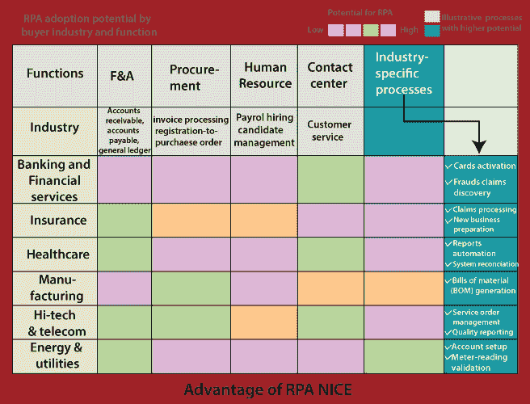

# RPA 不错

> 原文：<https://www.tutorialandexample.com/rpa-nice/>

NICE RPA 是机器人流程自动化工具之一。它具有有人值守 bot 系统的特点。用户可以自动化流程，这需要流程和流之间的人工交互。

图:RPA NICE 在 Twitter 上的使用。

它提供了关于 bot 性能和使用的详细分析信息。完整的统计数据是根据该工具中不同的可定制参数提供的。

RPA NICE 工具提供基于分类信息的图表和饼图，这些信息在用户界面的用户控制面板上提供。NICE 工具具有有人值守 Bot 系统的特性。

用户可以在机器人系统的帮助下自动完成这个过程。这个过程需要人与人之间的相互作用，流程才能变得自动化。

NICE 工具的无人值守 bot 功能有助于自动化该过程，不需要任何人工参与。从开始到结束的流程是完全自动化的，不会因为任何错误或异常情况的发生而停止运行。

NICE 工具支持与许多其他第三方应用程序的集成。通过使用第三方应用程序，可以减少好工具中存在的缺点。

这个工具完全基于云，所以不需要额外的手动安装。

用户可以在漂亮的 RPA 工具中获得 web GUI 进行工作。NICE 工具的一些缺点是不支持基于图像识别的自动化。

用户不能自动执行图像驱动的过程，并且需要图像识别。该工具没有 OCR 引擎，因此用户依赖于其他 OCR 引擎来执行任务，而这些其他 OCR 引擎并没有如此优化。

这个 RPA NICE 工具的另一个缺点是一个流程构建器。用户需要重新启动整个流程，以使其在 Process builder 中工作。

该工具中执行的后台任务没有提供任何适当的通知。RPA NICE 工具创建的应用程序在分析任务、报告、性能/流程管理和智能工作流管理方面表现出色。

### 优势

RPA NICE 工具的一些优点如下:

*   客户满意度。
*   生产力。
*   发展的准确性。
*   资源利用。
*   投资过程的回报。
*   减少人员配备问题。
*   增加和加快生产量或产量。
*   认证合规性。
*   易于扩展。
*   提高员工参与度。
*   与手动任务相比，降低项目成本。

### 不足之处

以下是机器人过程自动化的 RPA NICE 工具的几个缺点:

*   RPA NICE 工具的开发需要大量投资。
*   这个工具的用户界面有点笨拙。因此，设计者在项目开发中面临困难。
*   RPA NICE 的主要缺点是实现的高度复杂性。

### 结论

RPA NICE 工具提供了更好的流程自动化。该工具使日常桌面任务变得简单、快速、无误，从而提高了效率和客户满意度。

NICE RPA 工具也被称为 NEVA-NICE 员工虚拟服务员。它是帮助员工完成重复性任务的智能工具。