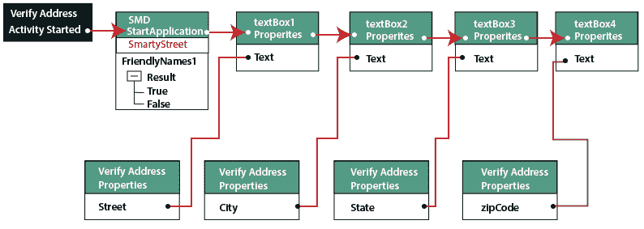
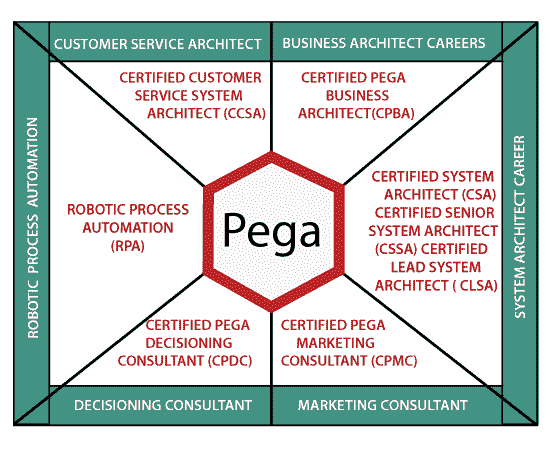
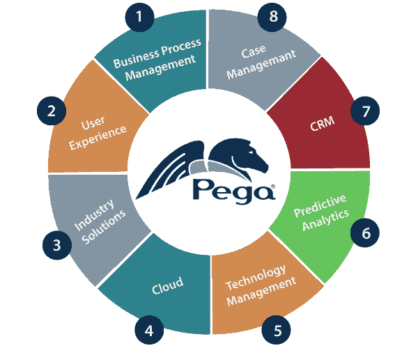

# Pega RPA

> 原文：<https://www.tutorialandexample.com/pega-rpa/>

Pega RPA(机器人流程自动化)用于通过现有应用程序的用户界面添加任务自动化功能。机器人自动化用于自动化工作流程中的重复性常规任务。

Pega 可以通过自动执行用户操作来帮助用户加速手动任务。自动化是在 Pega 机器人工作室创建的。最新的 Pega 版本是 8.0，目前已经上市。

组织通过使用 Pega RPA 来自动化阻碍生产力和效率的工作，减少了繁琐的手动工作。

与手动案例处理相比，用户可以创建批量处理大量数据的流程，错误更少。

图:使用 Pega RPA 实现机器人自动化。

Pega 系统在客户参与和卓越运营方面是云软件领域的领导者。

有几个 Pega RPA 示例，用户可以在其中与 Pega automation 进行交互。这些例子是信用卡、自动驾驶汽车和自动索赔提交。

### Pega 的各种模块

以下是 Pega RPA 提供的几个职业模块:

*   系统架构师职业模块
*   业务架构师职业模块
*   Pega 营销顾问
*   Pega 决策顾问
*   Pega 客户服务架构师
*   Pega 机器人过程自动化

图:Pega RPA 的模块。

### 1.系统架构师职业模块

*   **认证系统架构师(CSA)**

系统架构师可以构建、配置和执行 Pega 应用程序。Pega CSA 的作用对于成功实施 Pega 项目至关重要。

*   **注册高级系统架构师(CSSA)**

CSSA 考试提供高级系统架构师认证，以提高其 Pega 技能。该认证允许开发人员在 Pega 项目中跨各种业务重复使用设计和构造。

*   **注册首席系统架构师(CLSA)**

CLSA 考试是针对首席系统架构师的认证，这是精英团队的一部分，也是 Pega 项目所需的资源。

### 2.业务架构师职业模块

*   **注册 Pega 商业建筑师(CPBA)**

这一认证使得架构师有足够的能力参与 Pega 应用程序的设计和构建阶段。

### 3.Pega 营销顾问

*   **注册 Pega 营销顾问(CPMC)**

该认证仅面向参与 Pega 营销解决方案设计和开发的专业人士。

### 4.Pega 决策顾问

*   **注册 Pega 决策顾问(CPDC)**

这条职业道路也面向能够参与 Pega 决策管理或客户决策中心解决方案的设计和开发的专业人士。

### 5.Pega 客户服务架构师

*   **注册客户服务系统架构师**

该认证专注于创建 Pega 客户服务解决方案。

### 6.Pega 机器人过程自动化

Pega Robotic Process Automation 是一款软件应用程序，可自动执行那些由人工完成的任务和流程。

Pega 机器人流程自动化包括基于 Microsoft visual-studio 的设计工具。

通过使用这个工具，用户可以生成自动化和运行时客户端，后者在用户的桌面和基于云的工具上运行自动化。这个工具帮助用户实现和处理由用户或开发者开发的自动化。

### Pega RPA 优势

以下是 Pega RPA(机器人流程自动化)的优势:

1.由于 Pega 技术的流程完成速度更快，因此节省了大量人力。

2.Pega 工具对于手动和重复性任务来说具有成本效益，因为它减少了全职员工的数量。

3.通过使用 Pega 工具，员工变得更有效率。

4.它减少了手动数据编辑。

5.机器人过程自动化的 Pega 工具提高了数据质量。

6.它还降低了合规风险。

图:Pega RPA 工具的优势。

### Pega RPA 的先决条件

下面给出了 Pega RPA 的一些先决条件:

*   用户必须有。NET 和 Java 编程经验。
*   Pega RPA 工具需要了解其公司中使用的业务流程和策略。
*   Pega 用户需要对业务应用程序开发有基本的了解。
*   Pega RPA 工具需要公开 Microsoft Visual Studio 或任何其他集成开发环境。

### Pega RPA 劣势

RPA 工具 Pega 的缺点如下:

*   由于 RPA Pega 是一个强大的平台，它的设置需要大量的技术帮助。
*   Pega RPA 学院是一个无限的资源，但它只对其客户开放。
*   RPA 的 Pega 工具是低代码平台；这就是为什么它没有让开发人员感到兴奋，因为他们通常喜欢开发新的令人兴奋的语言。

### 结论

Pega RPA 工具有助于特定技术的未开发应用程序实现日常工作的自动化和标准化。这个工具以较低的投资创造了较高的生产率和价值。

这种技术工具将人力资源从日常和重复的任务中解放出来。它还允许用户专注于核心业务目标。