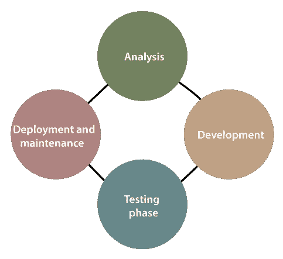
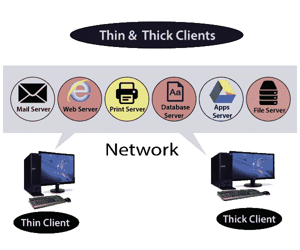

# 2020 年前 30 个 RPA 面试问题

> 原文：<https://www.tutorialandexample.com/rpa-interview-questions/>

### Q1。什么是 RPA(机器人过程自动化)？

机器人过程自动化是市场上的趋势技术，其中:

机器人:机器人的意思是“模仿人类行为的机器”

**过程:**过程是指“导致有意义活动的一系列步骤”

自动化:自动化的意思是“由机器人或机器完成的任何过程，无需任何人工干预。”

我们可以说“RPA(机器人流程自动化)允许组织像人类一样复制手动任务，而无需任何人为干预。”

用户可以在机器人的帮助下实现业务操作自动化，以减少人工劳动。

### Q2。RPA 有什么好处？

RPA(机器人流程自动化)有以下几种好处:

**1。成本降低:**组织可以轻松地自动化 RPA 中的手动和重复性任务。我们可以减少 RPA 项目的工作量和成本。

**2。在更短的时间内更准确:**机器人或机器不会犯任何错误。他们完全按照编码说明来工作。通过这种方式，RPA 总是帮助我们在重复和繁琐的任务中减少人为错误。

**3。易于学习和实现:** RPA 非常容易被任何人理解，因为用户不需要任何编码技能。任何人都可以通过使用拖放功能来自动化手动任务。

**4。不需要典型的编码:**用户可以实现机器人流程自动化，以自动化任何组织内的重复任务或流程。计算机做所有自动化的工作。自动化的方法与任何桌面工具或 web 应用程序相关。

**5。改进的业务成果:**通过使用 RPA 技术，员工可以节省时间。他们专注于附加值更高的活动。

### Q3。UiPath，Blue Prism，和 Automation Anywhere 有什么区别？

| **UiPath** | **蓝色棱镜** | **自动化无处不在** |
| 1.UiPath 是最流行的工具。 | 1.蓝棱镜工具比自动化更受欢迎。 | 1.RPA(机器人流程自动化)的这个工具是最不受欢迎的。 |
| 2.市场上有该工具的免费版和社区版。 | 2.市场上没有该工具的试用版或免费版。如果有人想学习这个工具，用户必须购买。 | 2.Automation Anywhere 的试用版现已推出，但将在 30 天后过期。 |
| 3.对于这个工具，用户不需要很高的编码技能。UiPath 有一个用户友好的可视化设计器。 | 3.Blue Prism 有一个可视化设计器，这个工具比任何地方的自动化都容易。 | 3.Automation Anywhere 工具是开发人员友好的。也需要很高的编程技巧。 |
| 4.用户可以通过 UiPath 开发前台和后台机器人。 | 4.蓝棱镜工具仅用于后台办公自动化。 | 4.我们可以在自动化的帮助下在任何地方创造字体和后台机器人。 |
| 5.这个工具有一个基于网络的编排器。 | 5.Blue Prism 也有客户端-服务器架构。 | 5.Automation Anywhere 工具具有客户端-服务器架构。 |

### Q4。RPA 的生命周期是什么？

机器人过程自动化(RPA)在多种类型的行业中使用，通过自动化工作来帮助人类。

图:RPA 的生命周期。

RPA 生命周期有四个阶段，如下所示:

**1。分析阶段:**业务团队和 RPA 架构师一起分析 RPA 开发的业务流程。

**2。Bot 开发阶段:**开发团队开始在不同的开发环境中进行自动化的工作流程。

**3。测试:**用户可以运行 SDLC 等测试生命周期来分析质量和纠正缺陷。

**4。支持和维护:**bot 在开发和测试阶段后进入维护阶段。维护阶段提供持续的支持，并有助于立即解决缺陷。

### Q5。解释一下 RPA 的特点？

组织需要一些关键挑战，如降低成本、卓越运营、法规遵从性等。RPA 提供了所有这些功能。它还支持简单性、灵活性和低投资。

RPA 的一些主要特征如下:

1.计算机编码软件

2.程序模仿人类与应用程序的交互

3.跨职能应用

4.由业务运营控制的虚拟劳动力

5.敏捷和非侵入性，与 IT 结构和治理一起工作。

### Q6。为什么聊天机器人不同于机器人流程自动化？

聊天机器人:聊天机器人是一种编程机器人(自动化程序)，用于与用户(人类)聊天。聊天机器人或智能机器人参与一些形式的对话互动。它通过声控或信息接口让用户参与进来。

**RPA(机器人流程自动化):**机器人(自动化程序)用于 RPA。它被编程为自动化人工业务流程。bot 用于执行组织内的任务或活动，以实现业务运营的增长。

RPA 可以应用于不涉及任何类型的用户交互的离散流程。

### Q7。你所理解的 RPA 中的机器人是什么？

这个机器人是一个自动化程序。它作为一个代理或另一个程序运行，并复制人类活动。

机器人是可配置的软件，用于控制和执行开发人员分配的任务。它们与内部应用程序、网站和用户门户等进行交互。

### Q8。RPA 工具有什么优势？

RPA 工具在重复任务中节省了时间和人力。这些工具是配置自动化任务的软件。RPA 工具的各种优势如下所示:

1.资源的优化使用。

2.提高流程的适应性和灵活性。

3.改善沟通。

4.保护企业数据。

5.无错误操作。

6.发现自动响应和触发器。

### Q9。哪个 RPA 工具是用于自动化的开源平台，为什么？

Robot Framework 是一个开源的机器人流程自动化解决方案。它用于自动化业务流程。

它是可扩展的，这意味着它可以虚拟地与任何其他工具集成。

### Q10。解释 RPA(机器人过程自动化)的架构？

RPA 体系结构是多种工具、平台和不同基础架构元素的组合。RPA 体系结构有五个层来执行各种任务。RPA 的体系结构层如下所示:

1.机器人过程自动化的应用。

2.RPA(机器人过程自动化)平台。

3.RPA 工具。

4.RPA 的执行基础架构

5.RPA 中的配置管理。

### Q11。详细讲解 RPA 的热门工具？

RPA 技术允许软件机器人复制人类行为。RPA 的一些最受欢迎的工具如下所示:

**1。UiPath**

UiPath 是一个 windows 软件，旨在使业务分析师能够自动化业务操作。

UiPath 也是一个全球性的软件行业，为机器人过程自动化开发平台。

**2。蓝色棱镜**

Blue Prism 是一家总部位于英国的软件开发公司，致力于机器人过程自动化领域。

它提供机器人软件来自动完成重复和无聊的任务，就像人类一样工作。

**3。自动化无处不在**

Automation Anywhere 是最受欢迎的 RPA 供应商或工具之一。它提供了强大且用户友好的 RPA 功能来自动化复杂的重复性任务。

这是一个基于网络的管理系统，使用控制室来执行自动化任务。

**4。Pega**

Pega robotics 用于在现有应用程序的用户界面的帮助下，增加重复任务的自动化能力。用户可以在 Pega Robotic Studio 中创建自动化。

**6。雅克达**

Jacada 与低代码自动化交互。它允许业务分析师跨多个渠道重用集成和传统流程。

**7。WinAutomation**

WinAutomation 是一个自动化工具。这是一个强大而直观的 windows 平台，允许用户自动执行任何桌面和基于网络的任务。WinAutomation 的宏记录器将计算机设置为自动驾驶。

**8。不错的系统**

NICE 是一个 RPA 工具，用于基本的流程自动化。它提供了关于 bot 性能和使用的详细信息。该工具具有参与机器人系统的功能。

### Q12。RPA 的应用有哪些？

RPA 软件机器人与内部应用程序、网站和用户门户进行交互。

RPA 开发人员还通过使用人工智能和机器学习来创建应用程序。

有不同种类的应用程序使用 RPA 来自动执行任务。下面给出了一些 RPA 应用程序:

1.大量电子邮件的生成、实现和提取

2.HR(人力资源)

3.数据格式和图形的转换

4.制造业和零售业

5.进程列表和文件存储

6.旅游和物流

7.银行和金融服务

8.网络购物

9.财务管理

10.ERP 交易

### Q13。用户实施 RPA 需要哪些步骤？

用户需要实施 RPA(机器人流程自动化)的一些主要步骤如下:

1.识别自动化机会。

2.优化已确定的流程或操作。

3.建立一个商业案例。

4.根据开发人员的选择选择 RPA 供应商。

5.创建 RPA 开发模型。

6.继续构建 RPA 机器人。

### Q14。胖客户端和瘦客户端有什么区别？

**胖客户端**

胖客户端是直接安装在本地计算机上的应用程序。它实现它的特性，从不依赖它的服务器。

胖客户端可以连接到服务器，但是当它断开连接时仍然可以工作。

胖客户端是客户端-服务器架构或网络。这些网络提供了客户机-服务器的广泛的独立功能。

它也被称为“客户端”或“胖客户端”胖客户端至少需要定期连接网络或中央服务器，但它可以在没有连接的情况下执行许多功能。

胖客户端的购买和运行成本很高。这是一个传统的台式电脑塔单位。

它连接到服务器，但自己处理数据。它将数据传输到服务器，而不是依赖服务器来完成工作。

胖客户机中的服务器只立即访问所需的数据。因此，该客户端不会丢失数据或生产时间。

胖客户机的单个单元较少，需要服务器。It 团队的部署更加困难。

**瘦客户端**

瘦客户机就是软件。瘦客户端的特性依赖于服务器，比如云平台。它被设计成与服务器通信。

我们可以说瘦客户端基于远程服务器。瘦客户机的功能依赖于更快的网络连接。数据通常存储在这些客户端的服务器上。

### Q15。你对 RPA 未来范围的理解是什么？

RPA 的未来范围是无限和巨大的。它是 It 行业无声的革命。

预计在不久的将来，RPA 在使用和劳动力实施方面将获得更大的潜力。

机器学习和人工智能也被用于 RPA，RPA 变得日益流行和趋势化。未来，与银行业相关的六个领域将实现完全自动化。

### Q16。解释不同类型的机器人？

机器人用于执行开发人员分配的任务。RPA 流程中使用的几种 RPA 机器人类型如下:

1.  任务机器人
2.  Meta Bot
3.  智商测验
4.  聊天机器人

### Q17。用户如何创建 RPA bot？

在 Bot Store 中，用户将获得许多针对自动化领域各种业务类型的预建 Bot。

RPA Bot 可以通过执行下面给出的步骤来创建:

1.记录任务

2.完成 Bot 的实施

3.测试机器人

4.在自动化中上传机器人性能

### Q18。RPA 里的截屏你懂什么？

屏幕报废是 RPA 工具最有用的功能。它与从屏幕上捕捉位图数据并对照存储的信息交叉检查该数据有关。

屏幕报废的几个好处如下:

1.它在不可访问的应用程序上工作，即使使用 UI(用户界面)框架。

2.它通过光学特性提供测试数字化。

3.屏幕刮除易于实现，并能准确捕捉数据。

屏幕抓取用于处理应用程序界面。该界面不能通过可用的 UI(用户界面)框架或代码直接访问。

### Q19。解释用于软件自动化测试的框架？

软件自动化测试中使用的四种框架类型:

1.混合软件自动化测试框架。

2.关键词驱动的自动化测试框架。

3.模块化自动化框架。

4.数据驱动的自动化框架。

### 问题 20。解释 RPA(机器人过程自动化)的工作流程？

RPA 是工作流自动化的子集，它依靠“软件机器人”来自动化重复性任务。

它通过集成外部系统的 API 或者通过控制外部系统的 GUI(图形用户界面)来自动化枯燥的任务。

### 问题 21。机器人和宏有什么区别？

| **机器人** | **宏** |
| 1.机器人允许用户从重复和无聊的过程中学习和提高自己。 | 1.宏和脚本是具有短序列的编程代码。用户从重复和乏味的任务中学不到任何东西。 |
| 2.它可以自主行动，复制人类的行为。 | 2.它不能像机器人一样自主工作。 |
| 3.它对外界刺激做出反应，并对自身进行重新编程。 | 3.它对任何外界刺激都没有反应。 |
| 4.机器人提供高度安全的自动化。 | 4.在宏中，安全性不是一个优先考虑的问题。 |

### 问题 22。解释任意两个电子邮件自动化命令？

电子邮件自动化命令用于自动化电子邮件帐户任务。电子邮件自动化的两个命令如下:

**1。从邮件服务器**获取电子邮件

**从邮件服务器获取邮件**命令允许用户从邮件服务器中检索邮件。

**2。从邮件服务器删除邮件**

此命令用于从收件箱中删除最近的消息。它与 LOOP 命令一起使用，根据条件或情况逐个删除电子邮件。

### 问题 23。在任何地方解释自动化的变量？

自动化中存在两种主要类型的变量，如下所示:

*   系统变量
*   局部变量

### 问题 24。RPA 中的默认日志是什么？

日志是带有时间戳的文件。这些包含与应用程序相关的信息性事件、错误和警告消息。

如果 orchestrator 不可用，则日志存储在本地数据库中，在连接恢复之前，本地数据库在磁盘空间中可用。

连接恢复后，日志将按照生成的顺序成批发送。

UiPath 中的六种默认日志类型如下:

1.执行开始

2.执行结束

3.交易开始

4.交易结束

5.错误日志

6.调试日志

### 问题 25。你所理解的数据抓取是什么？

数据抓取是一种将信息从网站导入电子表格或保存在计算机上的本地文件的技术。它也被称为网页抓取。

数据抓取是从网站上获取数据的最有效的方式之一。

计算机程序从人类可读的输出中提取数据。

该输出由数据抓取过程中的另一个程序生成。组织以多种方式使用数据搜集来发展业务。

### 问题 26。RPA 中有哪些用例？

机器人流程自动化是一种允许企业自动执行任务的系统，通常由员工执行。

下面给出了 RPA 的几种使用情形:

1.客户服务

2.发票处理

3.工资单

4.价格比较

5.处理 HR(人力资源)信息

6.医疗保健部门

### Q27。解释 RPA 使用情形的任意三个方面？

机器人流程自动化使组织能够利用软件机器人来完成耗时工作中的所有重复性任务，从而提高客户满意度。

RPA 使用情形的三个方面如下所示:

1.  网站抓取
2.  将数据从一个系统转移到另一个系统。
3.  呼叫中心运营。

### 问题 28。解释自动化 RPA 使用情形的任意四种方法？

下面给出了几种自动化 RPA 使用情形的方法或工具:

1.RPA UiPath

2.RPA 蓝色棱镜

3.RPA 的自动化随处工具

4.爱国军的 Pega

RPA 工具或供应商就是软件。用户正在配置任务，以便在软件工具的帮助下实现业务流程的自动化。

### 问题 29。UiPath 中的项目调试是什么？

调试是从给定的项目中识别和消除错误的过程。

这样做是为了确保项目或应用程序没有错误。断点用于暂停项目执行，以检查给定点的状态。

日志使我们能够在输出面板中显示项目中发生的事情的细节。这使得用户更容易调试自动化。

### Q30。什么是跟踪，我们如何在 UiPath 中启用跟踪？

默认情况下，UiPath 会生成一个日志文件。日志文件跟踪工作室和机器人的活动。

点击**打开日志**按钮后，通过执行功能区选项卡访问日志。

复杂的问题需要自动化的更多细节。必须启用跟踪来收集自动化的细节。

跟踪会生成。UiPath Studio 中的 etl 文件。该文件包含用于跟踪的二进制日志数据，例如磁盘访问和页面错误。

的。etl 文件用于记录高频事件，同时跟踪任何操作系统的性能。