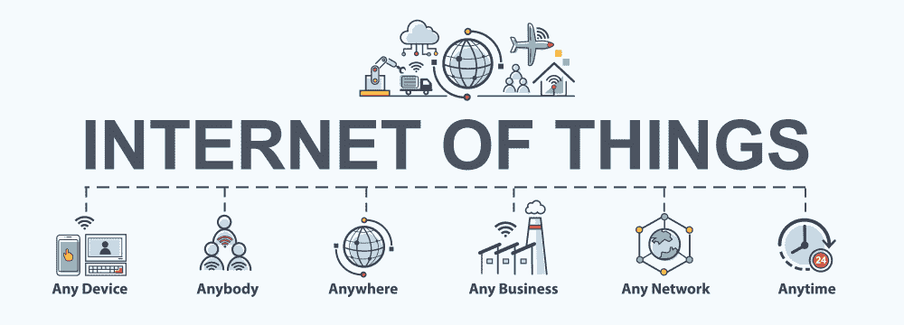

# 物联网教程|什么是物联网

> 原文：<https://www.tutorialandexample.com/iot-tutorial/>

**IoT** 代表**物联网**。术语“事物”是指我们在日常生活中使用的物体(家用电器和设备)。这些对象可以通过互联网访问或连接，称为物联网。

物联网可以定义为，集成到**软件、**和**传感器**中的物理对象网络，允许这些对象收集和交换数据。

物联网的目标是从计算机、手机和电子设备等标准设备扩展互联网连接。物联网通过数据收集、人工智能算法和网络的力量改善我们生活的某些方面，使几乎所有东西都变得“智能”。

**比如:**我们以家庭自动化为例。假设，你的家人外出度假，不小心让机器开着。在这种情况下，没有物联网，我们没有选择，这也可能导致设备损坏。但是，在物联网的帮助下，这些电器可以通过手机或电脑来控制，并且可以在任何时间和任何地方打开或关闭。

### 物联网的历史

“**物联网**这个名词从二十年前就有了。但联网设备的真正概念存在的时间更长，至少从 70 年代就开始了。当时，这个想法通常被称为**【综合互联网】**或**【广义计算】。**术语**“物联网”**是由 **[凯文·阿什顿](https://en.wikipedia.org/wiki/Kevin_Ashton)** 于 1999 年发明的，当时他正与**宝洁&公司**(后来成为麻省理工学院的 Auto-ID 中心)合作。从事供应链优化工作的凯文·阿什顿希望将高级管理层的注意力吸引到一种名为 RFID 的令人兴奋的新技术上。因为互联网在 1999 年是最流行的，而且很有道理，他把自己的演示叫做物联网。

### 物联网的特点

### 1.智力

物联网伴随着算法、计算机、软件和硬件的组合，使其变得智能。物联网中的环境信息增强了他们的能力，使他们能够对给定的情况做出智能响应，并帮助他们执行特定的任务。物联网智能不被视为设备之间的交互方式，而用户和设备之间的通信是通过标准输入方法和图形用户界面实现的。

### 2.连通性

连通性通过将日常生活中的物体聚集在一起，增强了物联网。这些对象的连接至关重要，因为简单的对象级交互有助于物联网网络内的集体智能。它允许网络的可访问性和事物的兼容性。有了这种连接，物联网的新机遇可以通过联网智能对象和应用程序来创造。

### 3.动态性质

物联网的主要活动是从环境中收集数据，通过设备周围发生的动态变化来实现。这些设备的状态会动态变化。例如，睡眠和醒来，连接和断开，以及在设备或电器的上下文中，包括温度、位置和速度。除了设备状态之外，设备的数量也随着人、地点和时间而动态变化。

### 4.巨大的规模

要管理和相互通信的设备的数量将远远高于连接到当前互联网的设备的数量。从这些设备生成的数据的管理，以及它们对应用对象的解释变得更加重要。

Gartner，Inc .在评估报告中确认了物联网的巨大规模。该报告指出，每天将有 550 万个新的东西被连接起来，2016 年全球将有 64 亿个联网的东西被使用，自 2015 年以来每年增长 30%。该报告还预测，到 2020 年，联网设备的数量将达到 208 亿。

### 5.感觉

没有传感器，物联网就无法工作。传感器检测或测量环境的变化。它生成可以告知其状态或甚至与情况交互的数据。传感技术创造了反映对物质世界和构成它的人们的真实认识的能力。传感信息只是物理世界的模拟输入，但它可以提供对我们复杂世界的丰富理解。

### 6.异质性

异构性是物联网的关键特征。物联网设备基于不同的硬件和网络平台。它可以跨多个网络与其他设备或服务平台进行交互。物联网架构支持异构网络之间的直接网络连接。异构对象及其物联网环境的基本设计要求是**可扩展性、可伸缩性、可伸缩性、**和**互操作性。**

### IoT(物联网)主题

1.  [物联网的介绍和历史](https://www.tutorialandexample.com/iot-tutorial/)
2.  [物联网的优缺点](https://www.tutorialandexample.com/advantages-disadvantages-of-iot/)
3.  [物联网应用](https://www.tutorialandexample.com/applications-of-iot/)
4.  [物联网硬件](https://www.tutorialandexample.com/iot-hardware/)
5.  [物联网软件](https://www.tutorialandexample.com/iot-software/)
6.  [物联网协议](https://www.tutorialandexample.com/iot-protocols/)
    *   [数据链路层协议](https://www.tutorialandexample.com/data-link-layer-protocols/)**T3T5】**
    *   [网络层协议](https://www.tutorialandexample.com/network-layer-protocols/)
    *   [会话层协议](https://www.tutorialandexample.com/session-layer-protocols/)
7.  [物联网组件](https://www.tutorialandexample.com/components-of-iot/)
8.  [物联网生态系统](https://www.tutorialandexample.com/iot-ecosystem/)
9.  [物联网架构](https://www.tutorialandexample.com/iot-architecture/)
10.  [物联网技术](https://www.tutorialandexample.com/iot-technologies/)
11.  [物联网平台](https://www.tutorialandexample.com/iot-platform/)
    *   [月蚀物联网](https://www.tutorialandexample.com/eclipse-iot/)
    *   [给字首](https://www.tutorialandexample.com/ge-predix/)
    *   [Salesforce 物联网云](https://www.tutorialandexample.com/salesforce-iot-cloud/)
    *   [ThingWorx](https://www.tutorialandexample.com/iot-thingworx/)
12.  [物联网的挑战](https://www.tutorialandexample.com/challenges-of-iot/)
13.  [物联网主板](https://www.tutorialandexample.com/major-boards-of-iot/)
14.  [Contiki OS](https://www.tutorialandexample.com/contiki-os/)
15.  [物联网开发者所需的技能](https://www.tutorialandexample.com/skills-required-for-an-iot-developer/)
16.  [什么是物联网设备？](https://www.tutorialandexample.com/what-is-an-iot-device/)
17.  [为 windows 安装 Ardunio 软件](https://www.tutorialandexample.com/download-and-install-arduino-in-windows/)
18.  **物联网项目**
    *   [Arduino UNO 蓝牙 LED](https://www.tutorialandexample.com/arduino-uno-bluetooth-led-controls/)
    *   [Arduino UNO 家庭自动化](https://www.tutorialandexample.com/arduino-uno-home-automation/)
    *   [带 PIR 运动传感器的 Arduino UNO 板](https://www.tutorialandexample.com/arduino-uno-board-with-pir-motion-sensor/)
    *   [借助 Arduino 板和 LDR 传感器检测黑暗度](https://www.tutorialandexample.com/detect-darkness-using-arduino-and-ldr-sensor/)
    *   Arduino UNO 雷达项目
    *   [Arduino UNO 远程项目](https://www.tutorialandexample.com/arduino-uno-distance-project/)