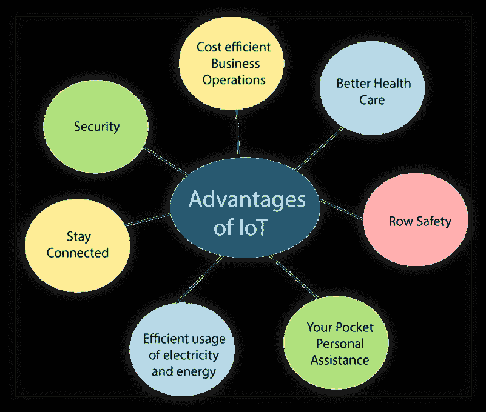

# 物联网的优势和劣势

> 原文：<https://www.tutorialandexample.com/advantages-disadvantages-of-iot/>

### 物联网应用的优势

*   **安全:**你可以通过手机控制你的家。它提供个人保护。
*   保持联系:您可以虚拟地与家人联系。
*   **高效用电:** **您可以高效用电，因为这些设备直接连接并与手机**等**控制器设备通信。所以你不必担心不必要的用电和电器。**
*   **你的口袋个人助理:**物联网应用可以提供个人助理，提醒你的日常计划。
*   **道路安全:** **通用汽车安吉星**是一个汽车集成系统，可检测车祸或道路事故。如果检测到事故或撞车，它会自动发出呼叫。
*   **更好的医疗保健和管理:**无需医生出诊即可实时监控患者。它使他们能够作出决定，并提供循证治疗。
*   **经济高效的业务运营:**许多业务运营，如资产跟踪、库存控制、运输、安全、个人订单跟踪、客户管理、个性化营销和销售服务等。在一家公司里，使用适当的跟踪系统可以有效地做到这一点。

### 物联网应用的缺点

*   **隐私问题:** **黑客可以**进入系统窃取隐私数据。我们希望生活中有个人空间。因此，通过总是告诉家人和朋友我们生活活动的所有细节来与他们保持联系是不好的。你的信息有可能被滥用。
*   对科技和电子产品的极度依赖:年轻一代在这些唾手可得的东西中成长。互联网和科技让他们变得不聪明。一个简单的数学计算是用我们手机上的计算器完成的。我们信任和依赖互联网，如果失去它，我们更有可能成为严重事件的受害者。
*   变得懒惰:人们更熟悉基于点击的工作，这使得他们懒于任何类型的身体活动。
*   失业:没有技能的人面临失业的高风险。保安、女佣、铁人和干洗服务等。他们可能没有足够的工作机会，因为物联网设备取代了他们的工作。人民可以独立工作。