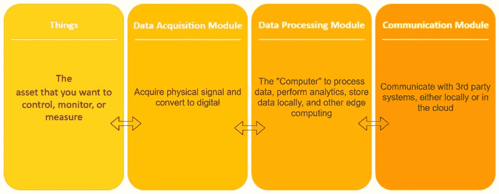

# 物联网硬件

> 原文：<https://www.tutorialandexample.com/iot-hardware/>

物联网硬件包括的设备种类繁多，如**路由设备、网桥、传感器**等。这些物联网设备支持关键任务和功能，如**系统激活、安全、行动规范、通信、**和特定目标的**检测。**

硬件是物联网设备的重要组成部分。物联网能够感知真实世界的参数，如**温度、湿度、光线、压力、**等。有了这个智能硬件，我们可以执行像打开和关闭设备这样的操作。

### **物联网设备硬件的构建模块:**

物联网设备硬件有四个组成部分:

**1。事情**

物联网中的**【事物】**是您想要控制、监控或测量的资产。

在许多物联网产品中，“物”完全与智能设备结合在一起。例如，想象一下智能家居设备或自动车辆等产品。这些产品可以自我控制和监控。

有时，在许多其他应用中，产品是单个设备，连接一个单独的产品以确保智能功能。

**2。数据采集模块**

数据采集模块主要是采集“事物”的物理信号，并将其转换成计算机可以处理的数字信号。

它是一个硬件部分，包括所有采集真实世界信号的传感器，如运动、温度、光线、振动等。传感器的类型和数量取决于您的应用。

在数据采集模块中，必须考虑的要点是:

*   我需要多少个任何类型的传感器？
*   我需要什么类型的传感器？
*   测量真实信号的速度应该有多快？(即采样速率)
*   我的测量需要多少技巧？(即传感器分辨率)

**3。数据处理模块**

物联网硬件设备的第三个构建模块是**数据处理模块**。它是处理数据和执行操作的中央单元。例如，本地存储数据、本地分析以及执行其他计算操作。

**4。通信模块**

物联网硬件的最后一个模块是**通信模块**。这些是允许云平台和第三方系统之间通信的连接。

该模块可包括通信端口，如 USB、串行(232/485)、can 或 Modbus。它还包括用于无线通信的无线电技术，如 Wi-Fi、LoRA、ZigBee 等。

通信模块可以包含在与其其他模块相同的设备中，或者可以包含在专门为通信设计的独立设备中。这种方法通常被称为**“网关架构”**

例如，如果您在一个房间中有三个传感器需要向云发送数据。这些传感器可以连接到同一房间的单个网关。网关整合这些数据并将其发送到云端。使用这种方法，您只需要一个通信模块，而不是三个。

### **物联网传感器**

物联网传感器是硬件中最重要的部分。这些设备由各种模块组成，如**射频模块、能量模块、电源管理模块、**和**检测模块。**