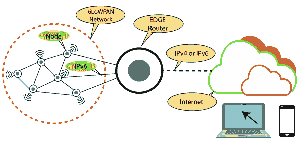
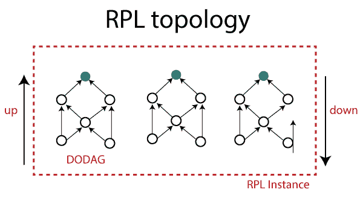

# 网络层协议

> 原文：<https://www.tutorialandexample.com/network-layer-protocols/>

1.  **网络层封装协议**
2.  **网络层路由协议**

### 1.网络层封装协议

**a** ) **6LoWPAN**

**6LoWPAN** 代表 **IPv6 Over 低功耗无线个域网**。这是这一类别中最常用的标准。它有效地将长 IPv6 报头封装在不超过 128 字节的小 IEEE802.15.4 数据包中。该规范支持不同长度的**地址、低带宽和不同拓扑、** **功耗、低成本、可扩展网络、移动性、不可靠性、**和**延长停机时间。**

它提供报头压缩以降低传输成本，提供分段以满足 IEEE802.15.4 中 128 字节的最大帧长度。它还支持多跳传输。

**6LoWPAN 帧使用** **四种** **类型的头:**

 **1.  **No 6loWPAN 报头(00):** 在 No 6loWPAN 报头的情况下，任何不符合 6loWPAN 规范的帧都会被忽略。**T3】**
2.  **调度报头(01):** 调度报头用于多播和 IPv6 报头压缩。**T3】**
3.  **网状报头(10):** 网状报头用于传输数据。**T3】**
4.  **分片报头(11):** 分片报头对长 IPv6 报头进行分割，使其能够包含最长 128 字节的分片。**T3】**

**b****6 第六**

6TiSCH 是 IETF ( 互联网工程任务组**)的一个工作组。** **该组织**开发 IPv6 标准。

## 2.网络层路由协议

**一个****RPL**

2012 年，IETF 针对低功率(RPL) 和**有损网络**推出了载波远程**路由协议** **。RPL 创建了一个面向目的地的有向无环图(DODAG ),其中包含从每个叶节点到根节点的单个路径。所有节点的流量都转发到根节点。根节点决定从一个节点传送目的地广告对象(DAO)来进行通信。它还处理来自希望加入网络的节点的 **DODAG 信息请求** (DIS)。RPL 节点可以是无状态的。**

**b** ) **CORPL**

**CORPL** 或**认知 RPL** 是 RPL 的延伸。它是为**认知网络设计的。**它使用 **DODAG** 拓扑生成，但是对 RPL 做了两处新的修改。CORPL 通过选择多个发送方，使用机会传输来返回数据包。它协调节点选择下一个最佳跳来返回分组。

DODAG 的建造方式和 RPL 一样。在 DODAG 中，每个节点保留一个转移集，而不仅仅是其父节点，并使用 DIO 消息更新其邻居节点的修改。基于更新的信息，每个节点动态地更新其相邻优先级，以构成转发器集。

**c** ) **鲤鱼**

**CARP 代表通道感知路由协议**。它是一种分布式路由协议，用于**水下无线传感器网络** (UWSN)。它有轻量级包，所以它与物联网一起使用。它执行两种不同的功能:**网络初始化**和**数据传输**。

CARP 不支持以前收集的数据。因此对于物联网等数据变化频繁的应用来说并不有利。CARP 更新在超过 CARP 限制的 E-CARP 中完成。E-CARP 允许接收节点保存以前接收到的传感数据。**