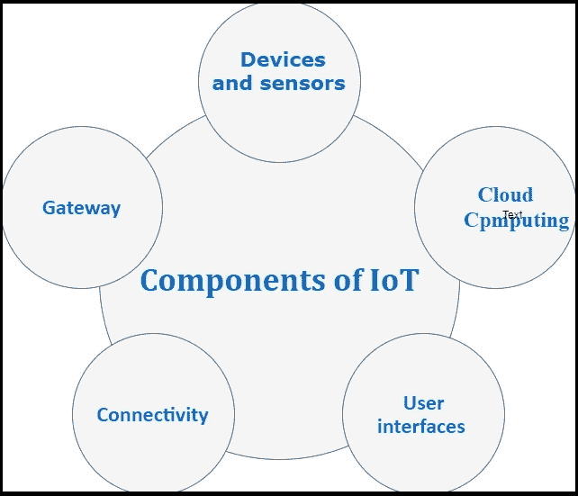

# 物联网组件

> 原文：<https://www.tutorialandexample.com/components-of-iot/>

物联网中使用了以下组件:

*   设备和传感器
*   云计算
*   用户界面
*   网络连接
*   门

### 设备和传感器

设备和传感器是连接层的组成部分。这些智能传感器不断从环境中收集数据，并将其传输到下一层。比如我们的手机就是一个带有 GPS、摄像头、动作等多个传感器的设备。

半导体技术中的最新技术使得能够生产用于各种应用的智能微传感器。

有一些常见的传感器如下:

*   温度和恒温器传感器
*   压力传感器
*   湿度/水分水平
*   光强检测器
*   湿度传感器
*   邻近检测
*   RFID 标签

### 云计算

物联网系统从设备发送大量数据，这些数据必须得到有效管理才能产生有意义的结果。物联网技术利用**云**存储大量数据。它提供了收集、处理和存储数据的工具。这些数据很容易获得，可以通过互联网远程访问。它还提供了一个分析平台。物联网云是高性能服务器的高级网络，用于高速处理大量数据。

### 用户界面

用户界面是用户可访问的物联网系统的物理和可见部分。用户界面设计在当今竞争激烈的市场中更为重要，因为它通常允许用户选择特定的设备或装置。如果新的智能设备使用起来毫不费力，并且兼容当前的无线标准，用户就会有兴趣购买。

现代技术提供了许多交互式设计，以便在简单的触摸屏控制中完成复杂的任务。多色触摸屏已经取代了我们设备上的硬件开关，几乎所有智能家居设备的趋势都在上升。

### 网络连接

通信需要互联网连接。互联网连接为每台设备提供一个 IP 地址。尽管依赖 IP 地址的地址越来越少。

但是由于在设备中的大量使用，这个 IP 地址不再足够。因此，研究人员找到了 IP 地址系统的替代品来代表每个物理设备。

### 门

物联网网关管理不同网络和协议之间的双向数据流量。网关的另一个功能是翻译不同的网络协议，并确保连接的设备和传感器的互操作性。

物联网网关通过高阶加密技术为网络和传输的数据提供一定程度的安全性。它充当设备和云之间的中间层，保护系统免受恶意攻击和未经授权的访问。

网关可以配置为在将数据转发到下一步之前，在本地预处理从数千个传感器收集的数据。在某些情况下，由于 TCP / IP 协议的兼容性，这是必要的。