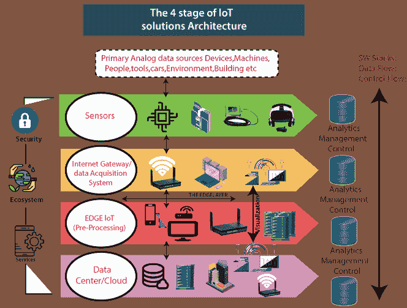

# 物联网架构

> 原文：<https://www.tutorialandexample.com/iot-architecture/>

我们的物联网架构方法反映在物联网架构图中，该图展示了物联网系统的图表，并解释了它如何连接以存储、收集和处理数据。

IoT Architecture

**感应/驱动** **:** “东西”是一个装备有收集数据的传感器的物体。通过网络和执行器传输的数据使事情得以执行。比如开灯或关灯，开门或关门，增减电机转速等。

**数据采集系统:**虽然物联网架构的这一阶段仍然意味着在传感器和执行器附近工作，但互联网出行和数据采集系统也出现在这里。具体来说，最新的传感器网络连接和一般输出，而互联网 getaways 通过 Wi-Fi，有线局域网运行，并执行额外的处理。

这一阶段的重要性在于处理前一阶段收集的大量信息，并将其缩减到最佳大小以供进一步分析。此外，时间和结构方面的必要转换也发生在这里。

**边缘分析:**在这个阶段，在物联网架构的各个阶段之间，准备好的数据被转移到 IT 世界。特别是，Edge IT 系统在这里执行改进的分析和预处理。例如，它涉及机器学习和可视化技术。同时，在数据中心进入阶段之前，可以在这里进行额外的处理。

**数据中心/云(数据的分析、管理和存储):**物联网架构最后阶段的主要流程发生在数据中心或云中。确切地说，它允许进行深入处理，以及对评论进行后续审查。这里需要 IT 专业人士的技能和职业技术。换句话说，这个阶段已经包括了数字和人类世界中最高水平的分析技能。因此，可以将其他来源的数据包括在内，以确保进行深入分析。