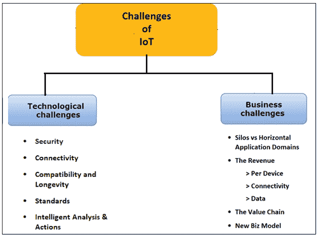

# 物联网的挑战

> 原文：<https://www.tutorialandexample.com/challenges-of-iot/>

**物联网的挑战**

物联网组织的发展需要克服两类挑战。不仅仅是物联网，所有的技术都接受它。

### 物联网的两大挑战:

1.  技术挑战
2.  业务挑战

### 技术挑战

物联网组件使用各种协议和技术来实现。因此，这些组件具有复杂的配置和糟糕的设计。

技术挑战可能反映了五个参数。

**安全:** 安全是互联网的根本支柱。ISOC 认为，对于物联网来说，这同样是必要的，也是“更重要的挑战”。

物联网引发了重大的安全问题，引起了全球多家公共和私营部门公司的关注。

增加联网设备的数量会增加利用安全漏洞的机会，设计糟糕的应用程序也是如此。它可能会通过留下不够安全的数据流来暴露对用户数据的操纵。在某些情况下，人类的健康和安全(植入的、支持互联网的医疗设备和黑客汽车)可能面临风险。

**连接:**物联网未来最关键的挑战是连接多种设备。这种交流最终会抵制当前的结构和与之相关的技术。

目前，集中式服务器/客户端模型用于认证、批准和链接几个终端到网络。这种范式只适合当前的情况，不适用于满足未来的需求。在这种情况下，数十亿设备将成为同一网络的一部分，这将使当前的集中式系统成为瓶颈。

维护云中的服务器集群需要大量的投资和费用，这些集群可以处理大量的信息交换。它缺乏服务器可用性会导致系统完全关闭。

**兼容性和寿命:**物联网正在以一种通用的方式发展。它融合了许多技术，并将很快进入大会。这将成为严重的问题，需要安装额外的软件和硬件来建立设备之间的通信。

缺乏标准化 M2M 协议、非统一云服务以及物联网设备之间的固件和操作系统变体是其他一些兼容性问题。使用这些技术的设备在未来将变得无关紧要，因为这些技术很快就会过时。

**标准:** **标准:**缺乏标准和记录在案的最佳实践的影响远不止限制物联网设备的潜力。正如 APNIC 的 Geoff Huston 之前指出的那样，标准的缺乏会导致物联网设备的愚蠢行为。

由于没有标准来指导制造商，开发人员有时会设计设备。它在互联网上是有害的，却没有真正担心它们的影响。如果设计和配置不当，这些设备可能会损害它们所连接的网络资源。

**智能分析&行动:**物联网实施的最后一个阶段是从数据中提取洞察力进行分析，其中分析数据取决于认知技术和相应的模型。它促进了认知技术的使用。

### 业务挑战

主要问题是启动、分配资源和管理任何业务的灵感的重要来源。这种模式必须满足所有类型的电子商务市场的所有先决条件。但是，这个类总是要经过行政和法律检查。物联网技术的使用在创造额外收入来源以减轻现有通信基础设施负担方面发挥着至关重要的作用。

根据使用情况和客户群，业务挑战分为三类:

1.  **消费物联网:**消费物联网包括智能汽车、电话、时钟、笔记本电脑、互联设备、娱乐系统等互联设备。
2.  **商业物联网**包括设备跟踪器、库存控制和医疗设备等。
3.  **工业物联网**涵盖联网电表、流量计、废水系统、管道监控器、机器人和其他种类的联网工业设备和系统。