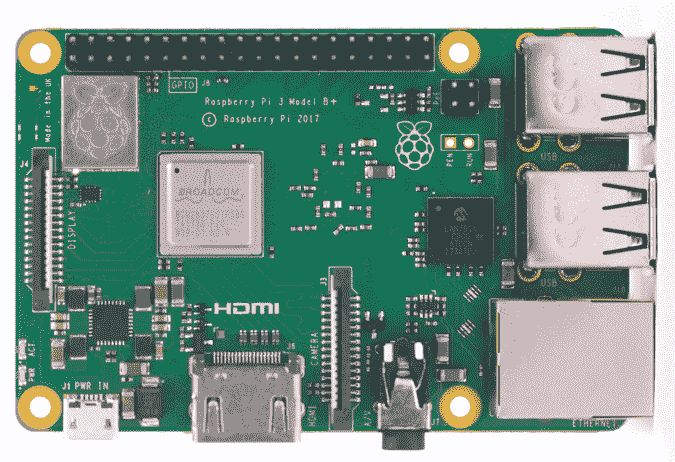
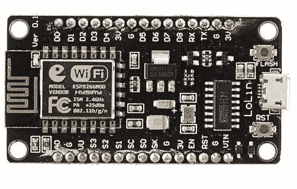
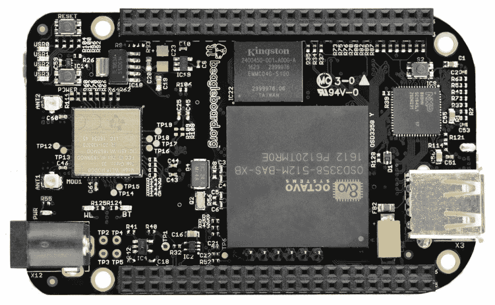
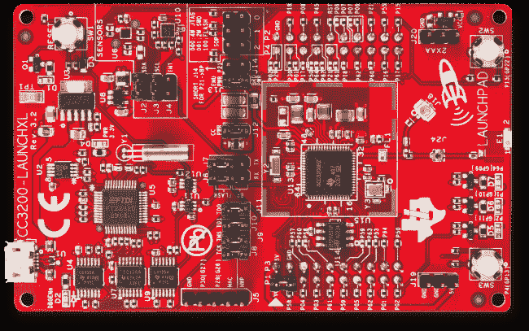

# 物联网的主要主板

> 原文：<https://www.tutorialandexample.com/major-boards-of-iot/>

**物联网主板**

Arduino: Arduino UNO 是基于易于使用的软件和硬件的流行开源电子平台。它面向艺术家、业余爱好者、设计师和任何对构建交互式对象感兴趣的人。它旨在尽可能灵活地满足您的项目需求。

它基于具有 **14 个数字 I/O 引脚**和**6 个模拟**输入的 **ATmega 328P** 。它配有 32kb 的闪存。它可以容纳处理复杂逻辑和操作的代码。Arduino 板需要一个带以太网的附加板，以便通过互联网进行通信。以太网板被称为**以太网屏蔽**。该设备可以在 **Arduino IDE** 中进行编程。

![Major Boards of IoT
Arduino:  Arduino UNO is the popular open-source electronics platform based on easy-to-use software and hardware. It is intended for artists, hobbyists, designers, and anyone interested in building interactive objects. It is designed to be as flexible as likely to meet the needs of your project.
It is based on the ATmega 328P that has 14 digital I/O pins and six analog inputs. It comes with 32-KB of Flash memory. It can accommodate code that deals with complicated logic and operations. The Arduino board needs an add-on board with Ethernet to communicate over the internet. The ethernet board is known as the Ethernet Shield. The device could be programmed in the Arduino IDE.

 Raspberry Pi: The Raspberry Pi is a credit card-sized computer that connects to a monitor or televisions and uses a standard keyboard and mouse. It is a small, capable     device that allows people to explore computing and learn to program. Raspberry Pi is usually programmed in Python language.
The recently launched Raspberry Pi 3 includes built-in Wi-Fi and Bluetooth technologies that make it the most compact and autonomous computer. Based on the Broadcom BCM 2837 SoC with a 1.2 GHz 64-bit quad-core ARM Cortex-A53 processor and 1 GB of RAM, the Raspberry Pi is a powerful platform. In addition to the 10/100 Ethernet port, the Raspberry Pi 3 is fitted with 2.4 GHz Wi-Fi 802.11n and Bluetooth 4.1\. The HDMI port makes the connection of A/V sources even easier. 

NodeMCU: NodeMCU is an open-source LUA based firmware developed for ESP8266 Wi-Fi chip. NodeMCU is similar to Arduino Hardware with an Input-Output ability built-in the board. It also has a built-in Wi-Fi to connect directly to the internet to control your things online. It greatly speeds up your internet of things application development process. It must be programmed with Arduino IDE and Lua.
 BeagleBone: BeagleBone is a single-board computer with a Linux-based operating system. It uses a more powerful ARM processor than Raspberry Pi.
BeagleBone Black is a low-cost, community-based development platform for hobbyists and developers. It starts Linux in shorter than 10 seconds and starts development in shorter than 5 minutes with a single USB cable.
You can write your code in any language such as C, C++, Python, Perl, Ruby, Java, or even a shell script.

CC3200: The CC3200 host driver is designed to support integrated applications. It uses low-power, low-cost microcontrollers with compressed board space.
The CC3200 is a programmable Wi-Fi MCU that enables accurate integrated internet of things development. The CC3200 device has the same Wi-Fi Network Processor (NWP) sub-system as the CC3100 device. The NWP integrates all protocols for Wi-Fi and the Internet, much minimizing MCU software requirements. With built-in security protocols, Simple Link Wi-Fi provides a robust and simple security experience. 

Major Boards of IoT
Arduino:  Arduino UNO is the popular open-source electronics platform based on easy-to-use software and hardware. It is intended for artists, hobbyists, designers, and anyone interested in building interactive objects. It is designed to be as flexible as likely to meet the needs of your project.
It is based on the ATmega 328P that has 14 digital I/O pins and six analog inputs. It comes with 32-KB of Flash memory. It can accommodate code that deals with complicated logic and operations. The Arduino board needs an add-on board with Ethernet to communicate over the internet. The ethernet board is known as the Ethernet Shield. The device could be programmed in the Arduino IDE.

 Raspberry Pi: The Raspberry Pi is a credit card-sized computer that connects to a monitor or televisions and uses a standard keyboard and mouse. It is a small, capable     device that allows people to explore computing and learn to program. Raspberry Pi is usually programmed in Python language.
The recently launched Raspberry Pi 3 includes built-in Wi-Fi and Bluetooth technologies that make it the most compact and autonomous computer. Based on the Broadcom BCM 2837 SoC with a 1.2 GHz 64-bit quad-core ARM Cortex-A53 processor and 1 GB of RAM, the Raspberry Pi is a powerful platform. In addition to the 10/100 Ethernet port, the Raspberry Pi 3 is fitted with 2.4 GHz Wi-Fi 802.11n and Bluetooth 4.1\. The HDMI port makes the connection of A/V sources even easier. 

NodeMCU: NodeMCU is an open-source LUA based firmware developed for ESP8266 Wi-Fi chip. NodeMCU is similar to Arduino Hardware with an Input-Output ability built-in the board. It also has a built-in Wi-Fi to connect directly to the internet to control your things online. It greatly speeds up your internet of things application development process. It must be programmed with Arduino IDE and Lua.
 BeagleBone: BeagleBone is a single-board computer with a Linux-based operating system. It uses a more powerful ARM processor than Raspberry Pi.
BeagleBone Black is a low-cost, community-based development platform for hobbyists and developers. It starts Linux in shorter than 10 seconds and starts development in shorter than 5 minutes with a single USB cable.
You can write your code in any language such as C, C++, Python, Perl, Ruby, Java, or even a shell script.

CC3200: The CC3200 host driver is designed to support integrated applications. It uses low-power, low-cost microcontrollers with compressed board space.
The CC3200 is a programmable Wi-Fi MCU that enables accurate integrated internet of things development. The CC3200 device has the same Wi-Fi Network Processor (NWP) sub-system as the CC3100 device. The NWP integrates all protocols for Wi-Fi and the Internet, much minimizing MCU software requirements. With built-in security protocols, Simple Link Wi-Fi provides a robust and simple security experience. 

Major Boards of IoT

](img/89916ca2e1b15b241d157c64601bcabd.png)

Raspberry Pi:Raspberry Pi 是一台信用卡大小的电脑，可以连接到显示器或电视，使用标准的键盘和鼠标。它是一个小巧、功能强大的设备，允许人们探索计算和学习编程。Raspberry Pi 通常是用 Python 语言编程的。

最近推出的 Raspberry Pi 3 包括内置的 Wi-Fi 和蓝牙技术，使其成为最紧凑和自主的计算机。树莓 Pi 基于博通 **BCM 2837 SoC** ，配有 **1.2 GHz 64 位四核 ARM Cortex-A53 处理器**和 **1 GB** 的 **RAM** ，是一个强大的平台。除了 10/100 以太网端口，树莓 Pi 3 还配备了 2.4 GHz Wi-Fi 802.11n 和蓝牙 4.1。HDMI 端口使 A/V 信号源的连接更加容易。

**NodeMCU:** NodeMCU 是为 **ESP8266 Wi-Fi 芯片**开发的基于开源 LUA 的固件。NodeMCU 类似于 Arduino 硬件，具有内置的输入输出功能。它还有一个内置的 Wi-Fi，可以直接连接到互联网，在线控制你的东西。它大大加快了您的物联网应用程序开发过程。必须用 **Arduino IDE** 和 **Lua** 编程。

**BeagleBone:** BeagleBone 是一台单板电脑，搭载**基于 Linux 的操作系统**。它使用了比树莓 Pi 更强大的 ARM 处理器。

BeagleBone Black 是一个面向**爱好者**和**开发者**的**低成本**基于社区的开发平台。它用一根 USB 线在不到 10 秒的时间内启动 Linux，在不到 5 分钟的时间内开始开发。

你可以用任何语言写你的代码，比如 C，C++，Python，Perl，Ruby，Java，甚至是 shell 脚本。

**cc 3200:**cc 3200 主机驱动程序旨在支持集成应用。它使用**低功率、低成本的微控制器**和压缩的电路板空间。

CC3200 是一款可编程 Wi-Fi MCU，支持精确集成的物联网开发。CC3200 设备具有与 CC3100 设备相同的 **Wi-Fi 网络处理器** (NWP)子系统。NWP 集成了 Wi-Fi 和互联网的所有协议，大大降低了对 MCU 软件的要求。凭借内置的安全协议，Simple Link Wi-Fi 提供了强大而简单的安全体验。

