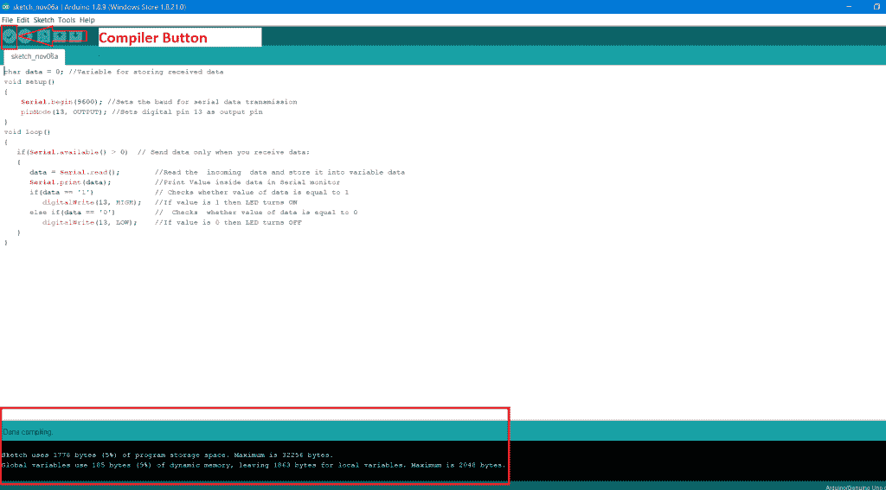
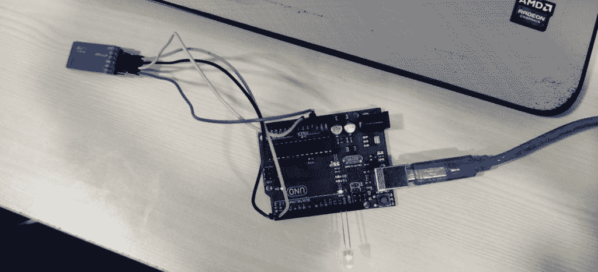

# Arduino UNO 蓝牙 LED 控制

> 原文：<https://www.tutorialandexample.com/arduino-uno-bluetooth-led-controls/>

### 如何使用 Arduino UNO 板构建蓝牙控制的 led 灯设置:

让我们使用 Arduino UNO 和蓝牙模块 HC-05 来控制 LED，构建一个物联网项目。在这个项目中，我们将使用 android 智能手机向蓝牙模块发送蓝牙信号。

### 本项目对硬件的要求:

1.  Arduino UNO 板
2.  用于 Arduino UNO 板连接器的 USB 电缆
3.  蓝牙模块 HC-05
4.  公母跨接线
5.  led 灯
6.  安卓手机

### 本项目对软件的要求:

1.  Arduino 软件(要对 Arduino 板进行编程，我们需要下载 Arduino 软件。)
2.  安卓工作室

### 本项目的工作原理:

使用了三个主要组件:

1.  安卓智能手机
2.  蓝牙收发器
3.  Arduino UNO 板

Android 应用程序设计为在蓝牙模块 HC-05 进行串行通信时，通过按下 on 按钮向蓝牙模块 HC-05 发送串行数据。接收应用数据，并通过蓝牙模块的 TX 引脚将其发送到 Arduino 板的 RX 引脚。Arduino 板内下载的代码验证收到的数据。如果接收到的数据为 1，LED 灯**亮**，如果接收到的数据为 0，LED 灯**灭**。

在 Arduino IDE 中编写以下程序:

保存程序并编译它。

通过 Arduino UNO USB 电缆将 Arduino UNO 板连接到笔记本电脑或台式电脑。移除与 Arduino UNO 板的所有其他连接，例如蓝牙模块和 led，然后将程序上传到 Arduino UNO 板。

在将代码上传到 Arduino UNO 板之前，确保选择了 **Arduino 串口**。否则，屏幕上显示错误消息**串口未选择**。

选择您的笔记本电脑或台式机的串行端口:

打开设备管理器->端口-> Arduino Uno，然后上传您的程序。

将程序上传到 Arduino UNO 板后，将所有模块与 Arduino UNO 板连接，例如蓝牙模块和 led。 ***数字电路图*** 图像如下所示:

将所有模块与 Arduino 板连接后，将蓝牙模块 HC-05 与智能手机连接。考虑下面的截图:

当你点击“on”按钮时，Android 应用程序向蓝牙模块发送数据 1。该数据从蓝牙模块 HC-05 传输到 Arduino UNO 板，LED 亮起。

当您单击关闭时，Android 应用程序会将 0 数据发送到蓝牙模块。该数据从蓝牙模块 HC-05 传输到 Arduino UNO 板。灯熄灭了。

