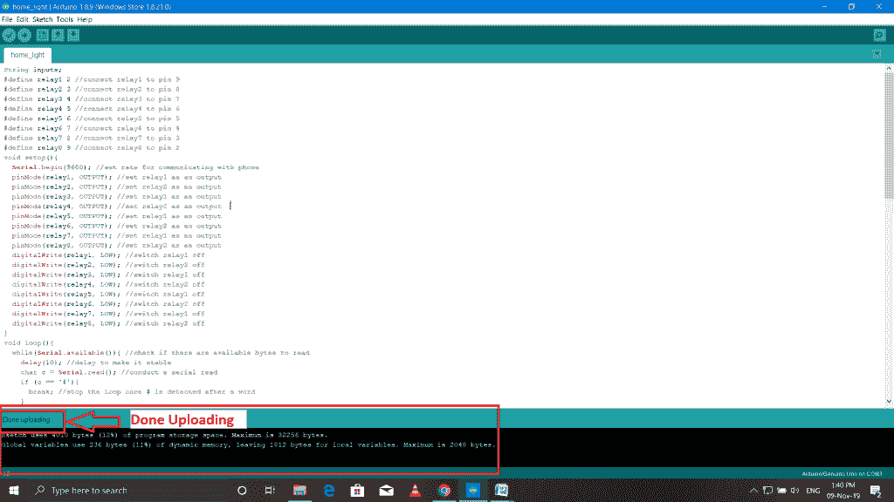
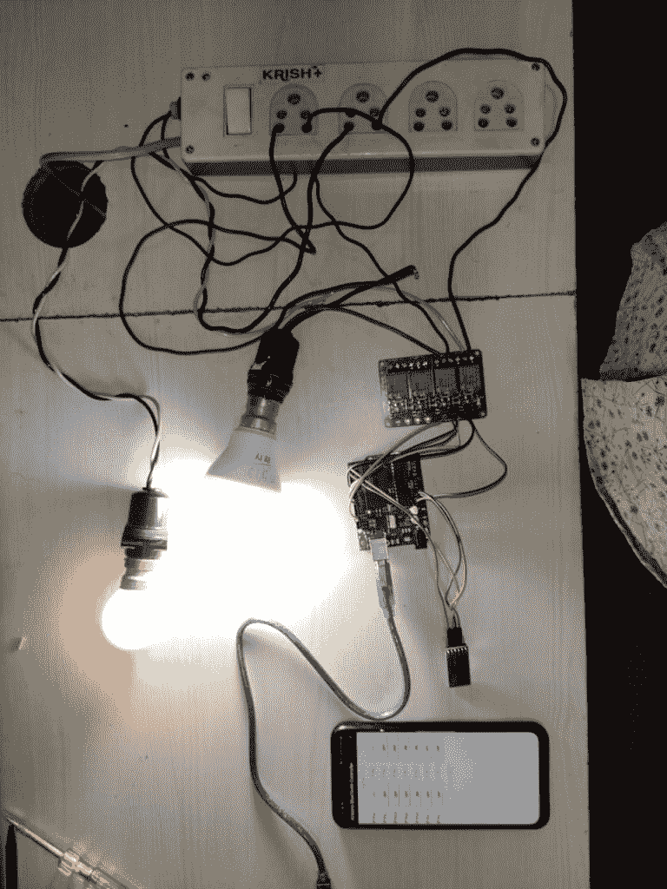
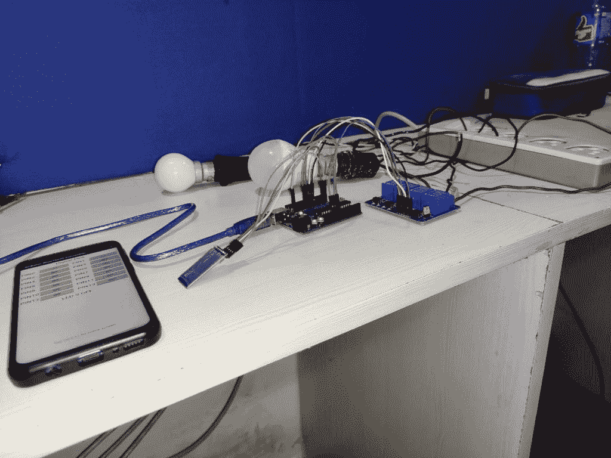

# Arduino UNO 家庭自动化

> 原文：<https://www.tutorialandexample.com/arduino-uno-home-automation/>

**使用 Arduino UNO 板和中继模块构建蓝牙控制的家庭自动化设置**

1.  你想让你的家自动化吗？
2.  你有没有想过通过刷手机屏幕来控制家里的电器？
3.  你想学习如何为自己建立一个自动化设备吗？

在这个项目中，我们将了解如何使用 Arduino 板控制家中的灯泡、风扇或其他电气设备。项目结束时，您可以通过智能手机控制连接的负载。

**本项目对硬件的要求:**

1.  Arduino UNO 板
2.  继电器模块(5V)
3.  蓝牙模块 HC-05
4.  公母跨接线
5.  电灯泡
6.  用于连接器 Arduino UNO 板的 USB 电缆
7.  安卓手机


**本项目软件需求:**

1.  Arduino IDE 软件(要对 Arduino 板进行编程，我们需要下载 Arduino 软件)
2.  Android (Arduino 蓝牙控制器应用程序)

**该项目的工作原理:**

**使用了四个主要部件:**

1.  安卓智能手机
2.  蓝牙模块
3.  Arduino UNO 板
4.  继电器模块

Android 应用程序通过点击“按钮上的“**”向连接的蓝牙模块 HC-05 串行发送数据。蓝牙模块接收应用数据，并通过蓝牙模块的 TX 引脚将其发送到 Arduino RX 引脚。Arduino 板读取输入数据，根据内部加载的程序进行处理，并向继电器模块生成输出。**

在 Arduino IDE 中编写一个程序。


**完整代码如下图所示:**

```
 String inputs;
 #define relay1 2 //connect relay1 to pin 9
 #define relay2 3 //connect relay2 to pin 8
 #define relay3 4 //connect relay3 to pin 7
 #define relay4 5 //connect relay4 to pin 6
 #define relay5 6 //connect relay5 to pin 5 
 #define relay6 7 //connect relay6 to pin 4
 #define relay7 8 //connect relay7 to pin 3
 #define relay8 9 //connect relay8 to pin 2
 void setup(){ 
Serial.begin(9600); //set rate for communicating with phone
pinMode(relay1, OUTPUT); //set relay1 as an output
pinMode(relay2, OUTPUT); //set relay2 as an output
pinMode(relay3, OUTPUT); //set relay1 as an output
pinMode(relay4, OUTPUT); //set relay2 as an output
pinMode(relay5, OUTPUT); //set relay1 as an output
pinMode(relay6, OUTPUT); //set relay2 as an output
pinMode(relay7, OUTPUT); //set relay1 as an output
pinMode(relay8, OUTPUT); //set relay2 as an output
digitalWrite(relay1, LOW); //switch relay1 off
digitalWrite(relay2, LOW); //switch relay2 off
digitalWrite(relay3, LOW); //switch relay1 off
digitalWrite(relay4, LOW); //switch relay2 off
digitalWrite(relay5, LOW); //switch relay1 off
digitalWrite(relay6, LOW); //switch relay2 off
digitalWrite(relay7, LOW); //switch relay1 off
digitalWrite(relay8, LOW); //switch relay2 off
}
void loop(){
while(Serial.available()){ //check if there are available bytes to read
delay(10); //delay to make it stable
char c = Serial.read(); //conduct a serial read
if (c == '#'){
break; //stop the loop once # is detected after a word
}
inputs += c; //means inputs = inputs + c
}
if (inputs.length() >0){
Serial.println(inputs);
if(inputs == "A"){
digitalWrite(relay1, LOW);
}
else if(inputs == "a"){
digitalWrite(relay1, HIGH);
}
else if(inputs == "B"){
digitalWrite(relay2, LOW);
}
else if(inputs == "b"){
digitalWrite(relay2, HIGH);
}
else if(inputs == "C"){
digitalWrite(relay3, LOW);
}
else if(inputs == "c"){
digitalWrite(relay3, HIGH);
}
else if(inputs == "D"){ 
digitalWrite(relay4, LOW);
}
else if(inputs == "d"){
digitalWrite(relay4, HIGH);
}
else if(inputs == "E"){
digitalWrite(relay5, LOW);
}
else if(inputs == "e"){
digitalWrite(relay5, HIGH);
}
else if(inputs == "F"){
digitalWrite(relay6, LOW);
}
else if(inputs == "f"){
digitalWrite(relay6, HIGH);
}
else if(inputs == "G"){
digitalWrite(relay7, LOW);
}
else if(inputs == "g"){
digitalWrite(relay7, HIGH);
}
else if(inputs == "H"){
digitalWrite(relay8, LOW);
}
else if(inputs == "h"){
digitalWrite(relay8, HIGH);
}
inputs="";
}
} 
```

**保存你的程序并编译，如下图**


通过 Arduino UNO USB 电缆将 Arduino UNO 板连接到笔记本电脑或台式电脑。移除与 Arduino UNO 板的所有其他连接，例如蓝牙模块和中继模块，然后**“将程序上传到 Arduino UNO 板”。**下图显示了 Arduino UNO 板和与之相连的电缆。




在将代码上传到 Arduino UNO 板之前，请确保选择了 Arduino 串行端口。否则，屏幕上会显示错误消息“未选择串行端口”。

要在笔记本电脑或台式机中选择串行端口:

打开设备管理器->端口(COM & LPT) ->Arduino Uno，然后上传你的程序。


将程序上传到 Arduino UNO 板后。将所有模块与 Arduino UNO 板连接，例如蓝牙模块和继电器模块。下图显示了***数字电路图*T3】**


**继电器模块、灯泡和输入电源之间的连接:**

1.  将继电器模块的公共点(com)与居家灯连接。
2.  接通继电器模块的常闭(nc)电源。
3.  将剩余的一根家用电灯线与电源连接。

**带灯泡的继电器模块电路图**


**用 Arduino UNO 板连接所有模块，用继电器连接灯泡。**

现在，将蓝牙模块 HC-05 与 Android 智能手机连接。考虑下面的截图:


> **注:通道继电器模块**只与**的第 6 针、第 7 针、第 8 针、**和**的第 9 针配合工作。**

当我们点击 PIN 6、PIN 7、PIN 8 和 PIN 的“开”按钮时，android 应用程序向蓝牙模块发送 1。数据从蓝牙模块传输到 Arduino 板。一旦 Arduino 板允许继电器模块供电，家用电器就会打开。




当我们点击**引脚 6、引脚 7、引脚 8、**和**引脚 9** 的 OFF 按钮时，Android 应用程序向蓝牙模块发送 0。数据从蓝牙模块传输到 Arduino 设备，家用电器关闭。



