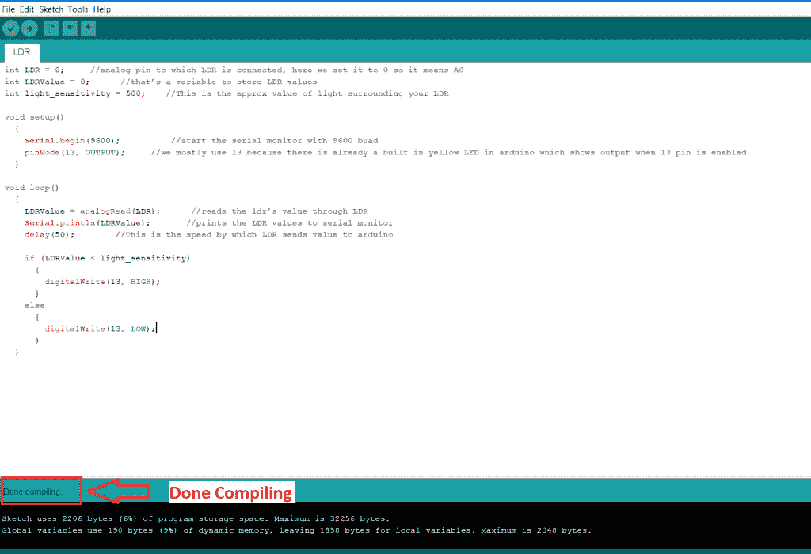
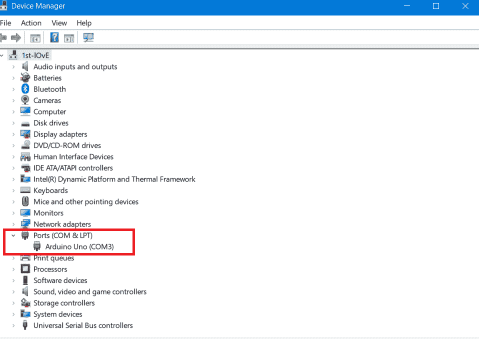

# 使用 Arduino 和 LDR 传感器检测黑暗

> 原文：<https://www.tutorialandexample.com/detect-darkness-using-arduino-and-ldr-sensor/>

**借助 Arduino 板和 LDR 传感器检测黑暗度**

在这个项目中，Arduino 和 LDR 传感器会自动打开灯，

当 LDR 传感器探测到黑暗时。

### **本项目对硬件的要求:**

1.  Arduino UNO 板
2.  用于连接器 Arduino UNO 板的 USB 电缆
3.  LDR 传感器
4.  公母跨接线
5.  led 灯


**本项目软件需求:**

1.  Arduino IDE(要对 Arduino 板进行编程，我们需要下载 Arduino 软件。)

**项目工作原理:**

Arduino UNO 板被编程为向 LDR 传感器发送数据。LDR 传感器探测到了黑暗。LDR 传感器向 Arduino UNO 板发送数据。Arduino 板内下载的代码验证接收到的数据，然后它打开或关闭 LED 灯。

为 Arduino IDE 编写一个程序。

**完整代码如下图所示:**

```
int LDR = 0;     
 int LDRValue = 0;      
 int light_sensitivity = 500;    

 void setup()
   {
     Serial.begin(9600);          
     pinMode(13, OUTPUT);     
   }

 void loop()
   {
     LDRValue = analogRead(LDR);       
     Serial.println(LDRValue);       
     delay(50);        

     if (LDRValue < light_sensitivity) 
       {
         digitalWrite(13, HIGH);
       }
     else
       {
         digitalWrite(13, LOW); 
```

**保存程序，编译代码，如下图:**




通过 Arduino UNO USB 电缆将 Arduino UNO 板连接到笔记本电脑或台式电脑。移除 Arduino UNO 板的所有其他连接，例如 LDR 传感器和 LED 灯泡。之后**将程序上传到 Arduino UNO 板上。**


在将代码上传到 Arduino UNO 板之前，请确保选择了 Arduino 串行端口。否则，屏幕上将显示错误消息“未选择串行端口”。

要在笔记本电脑或台式机中选择串行端口:

打开设备管理器->端口->Arduino Uno，然后上传您的代码。



将程序上传到 Arduino UNO 板后。将所有模块与 Arduino UNO 板连接，例如 LDR 传感器和 LED 灯泡。下图显示了数字电路图。


当 LDR 传感器进入黑暗区域时，LED 灯点亮。当 LDR 传感器没有进入黑暗区域时，LED 灯关闭，如下图所示。


