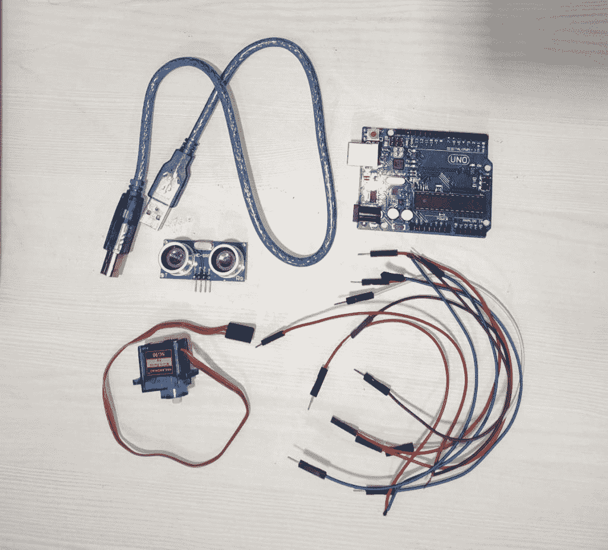
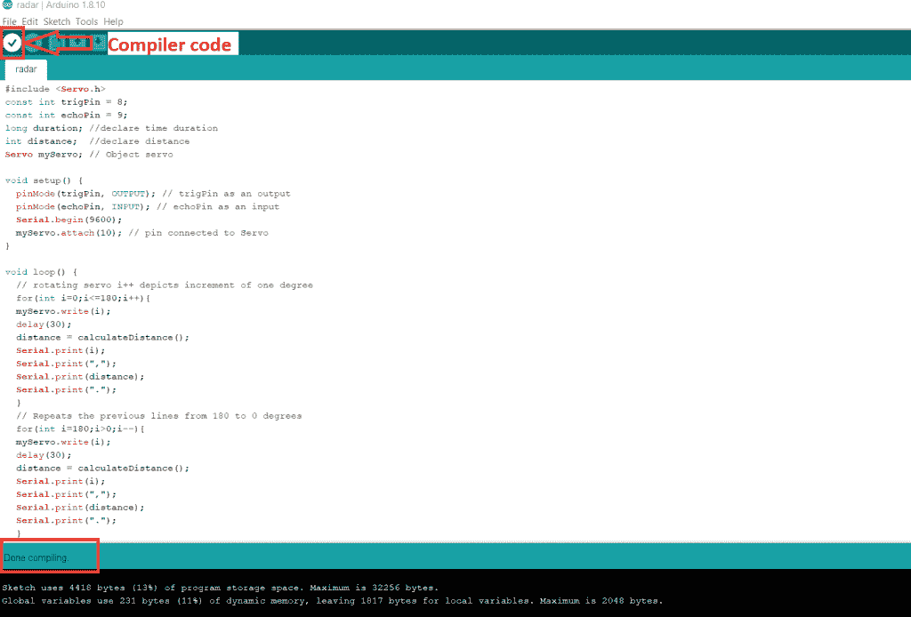
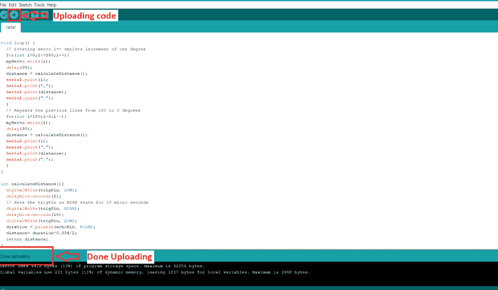
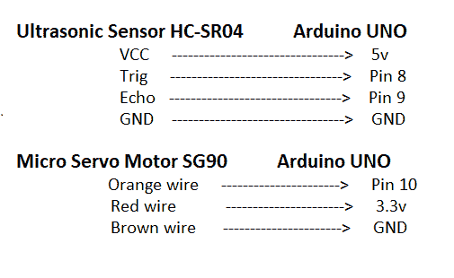
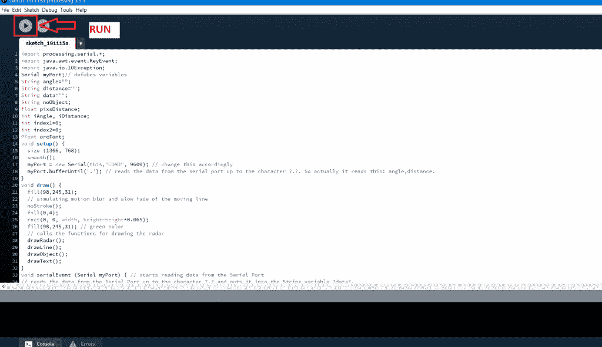
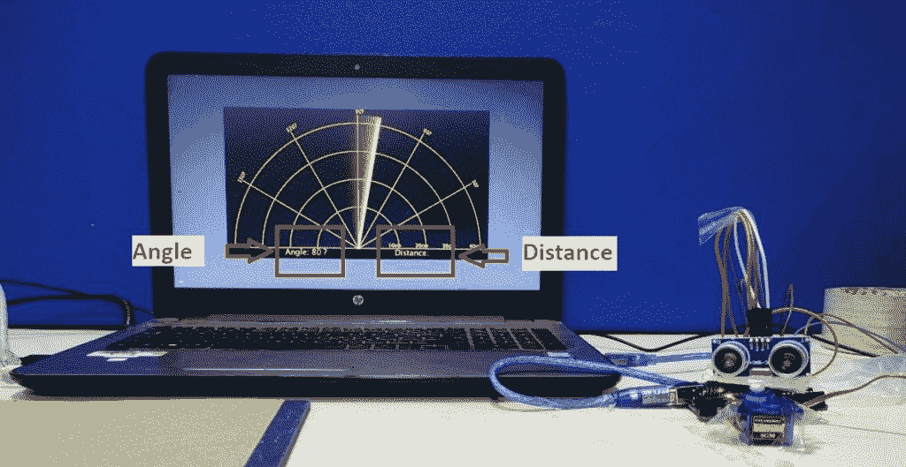
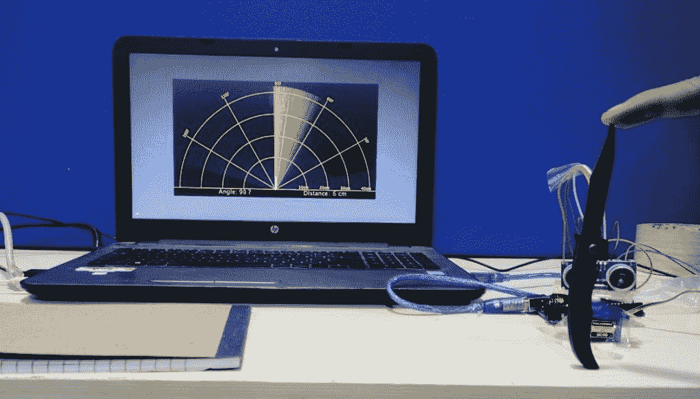

# Arduino UNO 雷达项目

> 原文：<https://www.tutorialandexample.com/arduino-uno-radar-project/>

Arduino 雷达项目

在这个项目中，我们将解释如何使用 Arduino 和处理 IDE 创建一个简单的雷达系统。Arduino 雷达项目是使用处理应用程序实现的。

雷达是一种远程物体探测系统，它使用无线电波来确定物体的特定参数，如距离和位置。雷达技术用于飞机、导弹、航海、天气预报和汽车。从技术上讲，该项目基于声纳技术，因为我们将使用超声波传感器来确定给定范围内任何物体的存在。

Arduino 雷达项目与其说是一个电路实现，不如说是一个视觉项目。当然，我们将使用不同的硬件，如 Arduino UNO、HC-SR04 超声波传感器和伺服电机。但主要方面是处理应用程序中的可视化表示。

**本项目对硬件的要求:**

1.  Arduino UNO 板
2.  Arduino UNO 的 USB 电缆连接器
3.  超声波 hc-sr04
4.  公母跨接线
5.  Tower Pro SG90 伺服电机



**本项目软件需求:**

1.  Arduino IDE
2.  处理 IDE

**该项目的工作原理:**

超声波传感器 HC-SR04 释放在空气中传播的 40，000Hz 的超声波。如果物体进入其范围，那么声波与物体碰撞并反弹回超声波模块。物体的角度和距离显示在监视器上。

打开 Arduino IDE 并编写以下代码

```
#include <Servo.h>  
 const int trigPin = 8;  
 const int echoPin = 9;  
 long duration; //declare time duration  
 int distance; //declare distance  
 Servo myServo; // Object servo  
 void setup() {   
 pinMode(trigPin, OUTPUT); // trigPin as an output  
 pinMode(echoPin, INPUT); // echoPin as an input  
 Serial.begin(9600);  
 myServo.attach(10); // pin connected to Servo  
 }   
 void loop() {  
 // rotating servo i++ depicts increment of one degree  
 for(int i=0;i<=180;i++){    
 myServo.write(i);  
 delay(30);   
 distance = calculateDistance();  
 Serial.print(i);   
 Serial.print(",");   
 Serial.print(distance);   
 Serial.print(".");  
 }  
 // Repeats the previous lines from 180 to 0 degrees   
 for(int i=180;i>0;i--){    
 myServo.write(i);  
 delay(30);  
 distance = calculateDistance();  
 Serial.print(i);  
 Serial.print(",");  
 Serial.print(distance);   
 Serial.print(".");  
 }  
 }  
 int calculateDistance(){   
 digitalWrite(trigPin, LOW);   
 delayMicroseconds(2);   
 // Sets the trigPin on HIGH state for 10 micro seconds  
 digitalWrite(trigPin, HIGH);   
 delayMicroseconds(10);  
 digitalWrite(trigPin, LOW);  
 duration = pulseIn(echoPin, HIGH);   
 distance= duration*0.034/2;  
 return distance;  
 }   
```

保存程序并编译代码。



通过 Arduino UNO USB 电缆将 Arduino UNO 板连接到笔记本电脑或台式机。移除 Arduino UNO 板的所有其他连接，例如超声波传感器模块和 Tower Pro SG90 伺服电机。现在把程序上传到 Arduino UNO 板上。



**注意:**在将代码上传到 Arduino UNO 板上之前，请确保选择了 **Arduino 串口**。否则，它会显示一条错误消息**“未选择串口”**

要选择笔记本电脑或台式机的串行端口，请执行以下操作:

打开设备管理器->端口->Arduino Uno ->上传你的代码。


将程序上传到 Arduino UNO 板后，将所有模块(超声波传感器模块和 Tower Pro SG90 伺服电机)与 Arduino UNO 板连接。下图显示了***数字电路图*T3】**



在处理 IDE 中编写以下代码并运行它。当物体进入超声波传感器的范围时，处理 IDE 显示物体的角度和距离。

**完整代码显示如下:**

```
import processing.serial.*;  
 import java.awt.event.KeyEvent;  
 import java.io.IOException;  
 Serial myPort;// defubes variables  
 String angle="";  
 String distance="";  
 String data="";  
 String noObject;  
 float pixsDistance;  
 int iAngle, iDistance;   
 int index1=0;  
 int index2=0;  
 PFont orcFont;  
 void setup() {  
   size (1366, 768);  
   smooth();  
   myPort = new Serial(this,"COM3", 9600); // change this accordingly  
   myPort.bufferUntil('.'); // reads the data from the serial port up to the character ?.?. So actually it reads this: angle,distance. 
 }   
 void draw() {  
   fill(98,245,31);  
   // simulating motion blur and slow fade of the moving line  
   noStroke();  
   fill(0,4);  
   rect(0, 0, width, height-height*0.065);  
   fill(98,245,31); // green color  
   // calls the functions for drawing the radar  
   drawRadar();  
   drawLine();   
   drawObject();  
   drawText();  
 }  
 void serialEvent (Serial myPort) { // starts reading data from the Serial Port  
 // reads the data from the Serial Port up to the character ?.? and puts it into the String variable ?data?.   
   data = myPort.readStringUntil('.');  
   data = data.substring(0,data.length()-1);  
   index1 = data.indexOf(","); // find the character ?,? and puts it into the variable ?index1?  
   angle= data.substring(0, index1); // read the data from position ?0? to position of the variable index1 or thats the value of the angle the Arduino Board sent into the Serial Port  
   distance= data.substring(index1+1, data.length()); // read the data from position ?index1? to the end of the data pr thats the value of the distance  
   // converts the String variables into Integer   
   iAngle = int(angle);  
   iDistance = int(distance);  
 }  
 void drawRadar() {  
   pushMatrix();  
   translate(width/2,height-height*0.074); // moves the starting coordinats to new location  
   noFill();  
   strokeWeight(2);  
   stroke(98,245,31);   
   // draws the arc lines  
   arc(0,0,(width-width*0.0625),(width-width*0.0625),PI,TWO_PI);  
   arc(0,0,(width-width*0.27),(width-width*0.27),PI,TWO_PI);  
   arc(0,0,(width-width*0.479),(width-width*0.479),PI,TWO_PI);  
   arc(0,0,(width-width*0.687),(width-width*0.687),PI,TWO_PI);  
   // draws the angle lines   
   line(-width/2,0,width/2,0);  
   line(0,0,(-width/2)*cos(radians(30)),(-width/2)*sin(radians(30)));  
   line(0,0,(-width/2)*cos(radians(60)),(-width/2)*sin(radians(60)));  
   line(0,0,(-width/2)*cos(radians(90)),(-width/2)*sin(radians(90)));  
   line(0,0,(-width/2)*cos(radians(120)),(-width/2)*sin(radians(120)));  
   line(0,0,(-width/2)*cos(radians(150)),(-width/2)*sin(radians(150)));  
   line((-width/2)*cos(radians(30)),0,width/2,0);   
   popMatrix();  
 }  
 void drawObject() {  
   pushMatrix();  
   translate(width/2,height-height*0.074); // moves the starting coordinats to new location  
   strokeWeight(9);   
   stroke(255,10,10); // red color  
   pixsDistance = iDistance*((height-height*0.1666)*0.025); // covers the distance from the sensor from cm to pixels  
   // limiting the range to 40 cms  
   if(iDistance<40){  
     // draws the object according to the angle and the distance  
     line(pixsDistance*cos(radians(iAngle)),-pixsDistance*sin(radians(iAngle)),(width-width*0.505)*cos(radians(iAngle)),-(width-width*0.505)*sin(radians(iAngle)));  
   }  
   popMatrix();  
 }  
 void drawLine() {  
   pushMatrix();   
   strokeWeight(9);  
   stroke(30,250,60);  
   translate(width/2,height-height*0.074); // moves the starting coordinats to new location  
   line(0,0,(height-height*0.12)*cos(radians(iAngle)),-(height-height*0.12)*sin(radians(iAngle))); // draws the line according to the angle  
   popMatrix();  
 }   
 void drawText() { // draws the texts on the screen  
   pushMatrix();  
   if(iDistance>40) {  
     noObject = "Out of Range";  
   }   
   else {  
     noObject = "In Range";  
   }  
   fill(0,0,0);  
   noStroke();  
   rect(0, height-height*0.0648, width, height);   
   fill(98,245,31);  
   textSize(25);  
   text("10cm",width-width*0.3854,height-height*0.0833);  
   text("20cm",width-width*0.281,height-height*0.0833);  
   text("30cm",width-width*0.177,height-height*0.0833);  
   text("40cm",width-width*0.0729,height-height*0.0833);  
   textSize(40);  
   text("Angle: " + iAngle +" ?", width-width*0.78, height-height*0.0277);  
   text("Distance: ", width-width*0.36, height-height*0.0277);  
   if(iDistance<40) {   
     text(" " + iDistance +" cm", width-width*0.225, height-height*0.0277);  
   }  
   textSize(25);  
   fill(98,245,60);  
   translate((width-width*0.4994)+width/2*cos(radians(30)),(height-height*0.0907)-width/2*sin(radians(30)));  
   rotate(-radians(-60));  
   text("30?",0,0);  
   resetMatrix();  
   translate((width-width*0.503)+width/2*cos(radians(60)),(height-height*0.0888)-width/2*sin(radians(60)));  
   rotate(-radians(-30));  
   text("60?",0,0);   
   resetMatrix();  
   translate((width-width*0.507)+width/2*cos(radians(90)),(height-height*0.0833)-width/2*sin(radians(90)));  
   rotate(radians(0));  
   text("90?",0,0);  
   resetMatrix();   
   translate(width-width*0.513+width/2*cos(radians(120)),(height-height*0.07129)-width/2*sin(radians(120)));  
   rotate(radians(-30));  
   text("120?",0,0);  
   resetMatrix();  
   translate((width-width*0.5104)+width/2*cos(radians(150)),(height-height*0.0574)-width/2*sin(radians(150)));  
   rotate(radians(-60));  
   text("150?",0,0);  
   popMatrix();  
 } 
```

保存并运行代码。



在超声波传感器前放置一个物体。当伺服电机旋转时，物体进入超声波传感器的范围。物体的外观出现在屏幕上。我们已经展示了带有红色标记的物体的存在。如果超声波传感器的加工应用范围内没有物体，则显示绿色标记。



