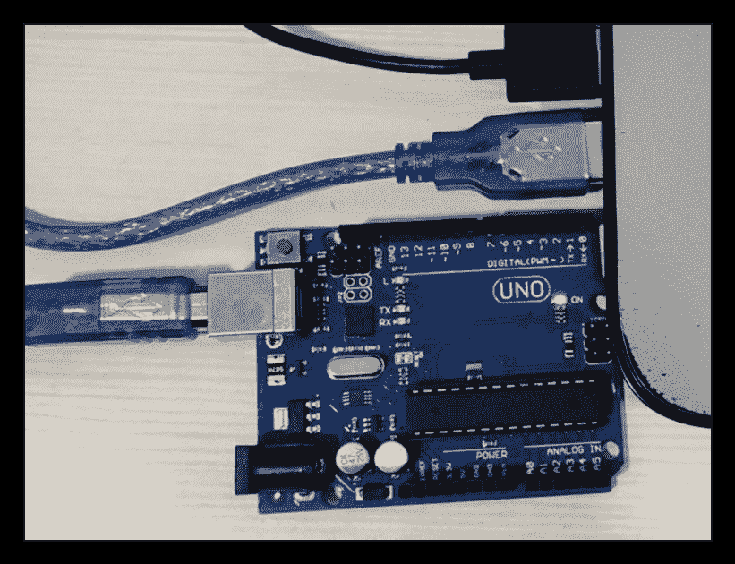
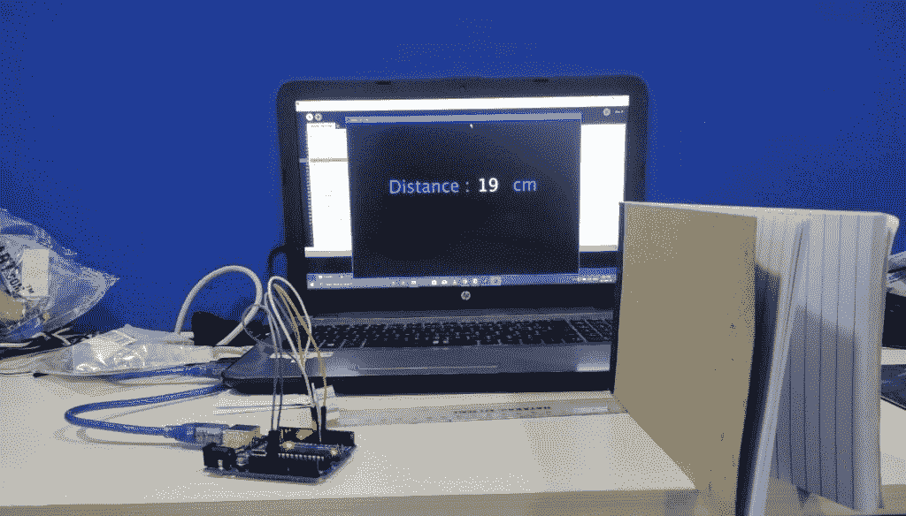

# Arduino UNO 远程项目

> 原文：<https://www.tutorialandexample.com/arduino-uno-distance-project/>

**超声波传感器 HC-SR04 和 Arduino 使用处理 App 进行距离计算:**

让我们使用超声波 HC-SR04 传感器和 Arduino UNO 来构建一个物联网项目，以计算超声波 HC-SR04 设备和一个对象之间的距离。我们将使用一个处理应用程序在笔记本电脑的屏幕(监视器)上显示超声波设备和物体之间的距离。

超声波传感器测距的基本原理是基于回波。当声波传播到环境中时，声波在撞击物体后作为回声返回。因此，计算两种声音的传播时间就足够了:撞击物体后的**出发时间**和**返回原点时间。**正如我们知道声速一样，经过一定的计算，我们可以计算出距离。

**本项目对硬件的要求:**

1.  Arduino UNO 板
2.  Arduino UNO 的 USB 电缆连接器
3.  超声波 HC-SR04
4.  公母跨接线


**本项目软件需求:**

1.  Arduino IDE
2.  处理 IDE

**打开 Arduino IDE，编写以下代码:**


```
#include <Mouse.h>    
const int trigpin= 8;  
const int echopin= 7;  
long duration;  
int distance;  
void setup(){  
  pinMode(trigpin,OUTPUT);  
  pinMode(echopin,INPUT);  
  Serial.begin(9600);  
}  
void loop(){  
  digitalWrite(trigpin,HIGH);  
  delayMicroseconds(10);  
  digitalWrite(trigpin,LOW);  
  duration=pulseIn(echopin,HIGH);  
  distance = duration*0.034/2;  
  Serial.println(distance);  
}  
```

保存你的程序并编译。


通过 Arduino UNO USB 电缆将 Arduino UNO 板连接到笔记本电脑或台式机。移除与 Arduino UNO 板的所有其他连接，例如超声波传感器，然后将程序上传到 Arduino UNO 板。



**记住:**在将代码上传到 Arduino UNO 设备之前，确保您的 Arduino 串口被选中，否则会显示一条错误消息**串口未选中**。

要选择你的串口打开**设备管理器- >端口- > Arduino Uno** ，然后上传你的代码。


**在 Arduino 设备中上传您的程序。**


**数字电路图:**


现在下载处理 IDE。

从[https://processing.org/download/](https://processing.org/download/)下载处理 IDE。

下载后，打开处理 IDE 并编写以下代码:


**完整代码如下所示:**

```
import processing.serial.*;    
Serial myPort;    
String data="" ;  
PFont  myFont;    
void setup(){  
  size(1366,900); // size of processing window  
  background(0);// setting background color to black  
  myPort = new Serial(this, "COM3", 9600);  
  myPort.bufferUntil('\n');  
}  
void draw(){  
  background(0);  
  textAlign(CENTER);  
  fill(255);  
  text(data,820,400);  
  textSize(100);  
  fill(#4B5DCE);  
  text("              Distance :        cm",450,400);  
  noFill();  
  stroke(#4B5DCE);  
}  
void serialEvent(Serial myPort){  
   data=myPort.readStringUntil('\n');  
}   
```

**运行代码**。

现在，连接您的超声波传感器模块和 Arduino UNO 设备。使用 Arduino USB 电缆或 220V 交流适配器将电源输入 Arduino 设备。

在超声波传感器模块前放置一个物体。它在处理 IDE 屏幕上显示该对象的距离。

在下图中，我们在超声波传感器前放置了一个物体。物体靠近超声波传感器，显示距离为 3 厘米。


