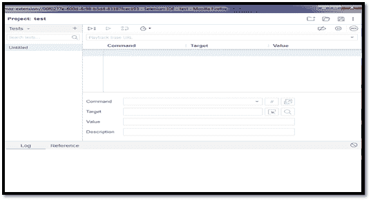

# 面向初学者的 Selenium IDE 教程

> 原文：<https://www.tutorialandexample.com/selenium-ide-tutorial/>

**硒 IDE 简介**

*   Selenium IDE 代表**集成开发环境**。硒 IDE 于 **2006** 发布，由 **SHINYA【日本】THOUGHTWORK** 公司开发。
*   Selenium IDE 是作为 Firefox 插件实现的，它允许记录、编辑和调试测试。Selenium IDE 包括整个 Selenium 核心，允许我们在执行测试的实际环境中轻松快速地记录和回放测试。
*   Selenium-Ide 不仅仅是一个记录工具，它还是一个完整的 Ide，我们可以在其中增强它的记录能力，或者我们可以手动编辑我们的脚本，或者自动完成支持和移动命令的能力。
*   无论我们喜欢哪种测试，Selenium IDE 都为创建 Selenium 测试用例提供了理想的环境。
*   Selenium IDE 是一个功能自动化工具，是作为 Firefox 浏览器的插件实现的，因此它不能用于其他浏览器。
*   Selenium IDE 是基于 UI、**录制**和**回放**的工具。
*   Selenium IDE 使用 **HTML 语言**开发测试脚本。
*   Selenium IDE 不需要任何编程语言知识来创建测试用例，同时使用像 Run Script 这样的**selenise**命令。我们应该对 JavaScript 有一个基本的了解，才能更清楚地知道概念。
*   为了更好的理解 JavaScript，你也可以参考 URL 下提供的教程:[https://www.tutorialandexample.com/javascript-tutorial](https://www.tutorialandexample.com/javascript-tutorial)。

下图显示了 Selenium 浏览器的界面:

**注意:** Selenium-IDE 只为 Mozilla Firefox 浏览器和 Google Chrome 插件设计，这意味着您不能在任何其他浏览器上记录或回放您的测试用例。记录的测试脚本被导出到编程语言，如 C#、Java、Ruby 或 Python。

### selenium–IDE 主题

*   [硒化物介绍](https://www.tutorialandexample.com/selenium-ide-tutorial/)
*   [安装/下载 Selenium–IDE(Firefox)](https://www.tutorialandexample.com/selenium-ide-installation/)
*   [安装/下载 Selenium–IDE(Google Chrome)](https://www.tutorialandexample.com/selenium-ide-installation-in-chrome/)
*   [硒化物的特性](https://www.tutorialandexample.com/characteristics-of-selenium-ide/)
*   [硒化物的第一个测试案例](https://www.tutorialandexample.com/first-test-case-of-selenium-ide/)
*   [Selenium-IDE 登录测试](https://www.tutorialandexample.com/selenium-ide-login-test/)
*   [Selenium-IDE 命令](https://www.tutorialandexample.com/selenium-ide-commands/)
*   [硒定位器](https://www.tutorialandexample.com/selenium-ide-locators/)
*   [Id 定位器](https://www.tutorialandexample.com/id-locators/)
*   [名称定位器](https://www.tutorialandexample.com/name-locators/)
*   [X 路径定位器](https://www.tutorialandexample.com/xpath-locator-in-selenium-ide/)
*   [CSS 选择器定位器](https://www.tutorialandexample.com/css-selector-locator/)
*   [通过 ID 定位](https://www.tutorialandexample.com/css-selector-id/)
*   [分类定位](https://www.tutorialandexample.com/css-selector-class/)
*   [按属性定位](https://www.tutorialandexample.com/css-selector-attribute/)
*   [通过 ID/类别定位&属性](https://www.tutorialandexample.com/css-selector-id-class-and-attribute/)
*   [通过子串定位](https://www.tutorialandexample.com/css-selector-sub-string/)
*   [通过内部文本定位](https://www.tutorialandexample.com/css-selector-inner-text/)
*   [链接文本定位器](https://www.tutorialandexample.com/link-text-locator/)
*   DOM 定位器
*   [硒化物的利与弊](https://www.tutorialandexample.com/advantages-and-disadvantages-of-selenium-ide/)