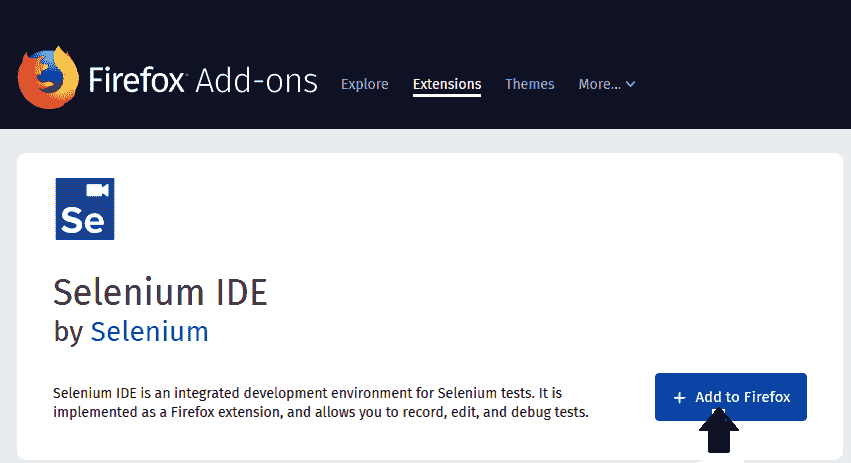
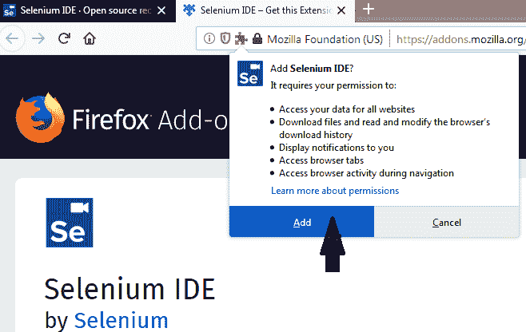
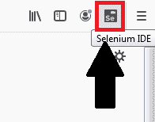
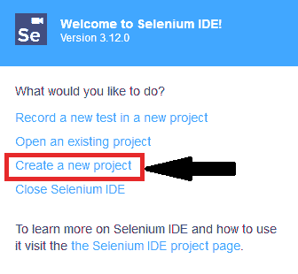
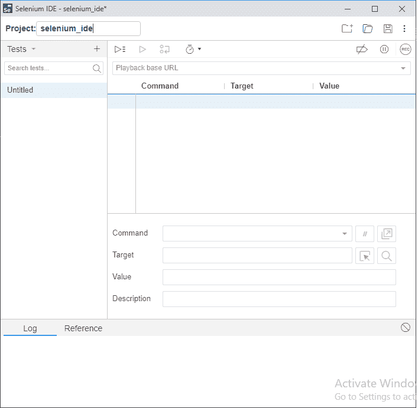

# 在 Mozilla Firefox 中安装 Selenium-IDE

> 原文：<https://www.tutorialandexample.com/selenium-ide-installation/>

**Selenium-IDE 安装初学者指南**

由于 Selenium IDE 只为 Firefox 和 Chrome 插件设计，我们假设您已经在系统中安装了 **Mozilla Firefox 浏览器**。然而，你可以通过他们的官方网站下载最新版本的火狐浏览器。

[https://www.mozilla.org/en-US/firefox/new/](https://www.mozilla.org/en-US/firefox/new/)

**下载 Selenium–IDE[Firefox]:**

*   启动火狐浏览器。
*   然后去 Google 搜索下载 selenium IDE。
*   点击[https://addons . Mozilla . org/en-GB/firefox/addon/selenium-ide/](https://addons.mozilla.org/en-GB/firefox/addon/selenium-ide/)链接，它会将你导航到 Firefox 附加组件。

之后，点击添加**到 Firefox** 按钮，然后点击安装。

*   将显示一个对话框，要求将 Selenium IDE 作为扩展添加到 Firefox 浏览器中。

*   点击**添加**按钮。
*   安装完成后，重新启动浏览器。
*   要打开 Selenium–IDE，请使用 Firefox 浏览器。
*   单击 Selenium IDE 图标。

*   selenium–IDE 浏览器启动，现在，点击 create a new project。

*   创建项目后，它将显示 Selenium–IDE 界面。

