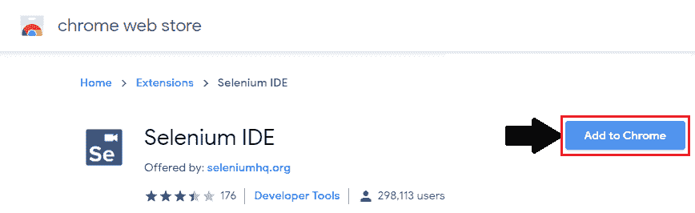
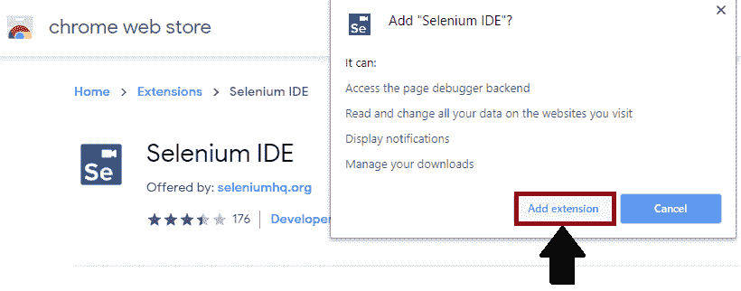
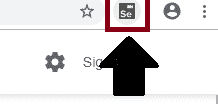
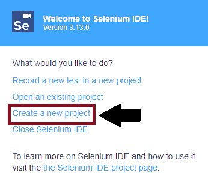
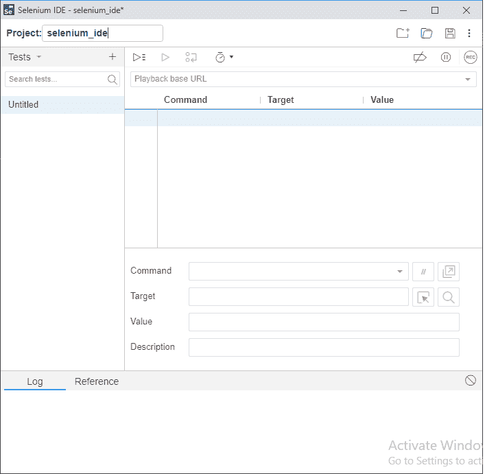

# 铬合金硒化物装置

> 原文：<https://www.tutorialandexample.com/selenium-ide-installation-in-chrome/>

**硒化物安装**

由于 Selenium IDE 只为 Firefox 和 Chrome 插件设计，我们假设您已经在系统中安装了 **Google Chrome** 浏览器。不过，你可以通过他们的官方网站下载最新版本的谷歌浏览器，该网站提供了下面的链接。

[https://www.google.com/chrome/#campaign-promo](https://www.google.com/chrome/#campaign-promo)

**下载 Selenium–IDE[Google Chrome]:**

*   启动 Chrome 浏览器。
*   然后去 Google 搜索下载 selenium IDE。
*   点击[https://chrome . Google . com/web store/detail/selenium-ide/mooikfkahbdckldjndioackbalphokd](https://chrome.google.com/webstore/detail/selenium-ide/mooikfkahbdckldjjndioackbalphokd)链接，它会将你导航到 chrome 网络商店。

在**之后，点击**上的**添加到 Chrome** 按钮，然后点击安装。

*   将显示一个对话框，要求将 Selenium IDE 作为扩展添加到您的 chrome 浏览器中。

*   点击**添加分机**按钮。
*   安装完成后，重新启动浏览器。
*   要打开 Selenium–IDE，请转到 chrome 浏览器。
*   单击 Selenium IDE 图标。

*   selenium–IDE 浏览器启动，现在点击 create a new project。

*   创建项目后，它将显示 Selenium–IDE 界面。

