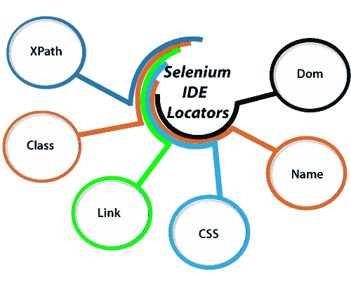

# 硒定位器

> 原文：<https://www.tutorialandexample.com/selenium-ide-locators/>

**Selenium-IDE 定位器**:在我们开始学习 Selenium-IDE 定位器之前，首先我们必须学习 UI 元素。

**UI 元素** -UI 元素是显示在 web 应用程序上的元素。一些 UI 元素如下——**复选框、单选按钮、段落文本、按钮、菜单、菜单选项、下拉字段、多选框、字段下拉字段、选项文本框字段、文本框字段标签、文本区域字段、图像、超链接、页面标题**等。

让我们看一个快照，从中我们可以清楚地了解 Web 应用程序的 UI 元素。

定位器是所有 selenium 工具中都有的一个概念或特性。

用于标识 GUI 中任何元素(文本框、按钮、复选框、图像、超链接等)的定位器。)基于他们的 html 源代码。

定位器是 k 敏感的。正确识别 GUI 元素比听起来更复杂。

这就是为什么 selenium 实现了多个定位器来在应用程序中找到正确的 GUI 元素。

用于查找 GUI 元素的一些定位器如下

*   [Id 定位器](https://www.tutorialandexample.com/id-locators/)
*   [名称定位器](https://www.tutorialandexample.com/name-locators/)
*   [Xpath 定位器](https://www.tutorialandexample.com/xpath-locator-in-selenium-ide/)
*   [Css 选择器定位器](https://www.tutorialandexample.com/css-selector-locator/)
*   [链接文本定位器](https://www.tutorialandexample.com/link-text-locator/)
*   Dom 定位器

在我们开始详细学习定位器之前，我们应该完全了解 **HTML** 和 **CSS** 来找到 GUI 元素。

要获得 HTML 和 CSS 教程的完整知识，你可以参考下面的链接:

完整的 HTML 教程:[https://www.tutorialandexample.com/html-tutorial/](https://www.tutorialandexample.com/html-tutorial/)

完整 CSS 教程:[https://www.tutorialandexample.com/css-tutorial](https://www.tutorialandexample.com/css-tutorial)