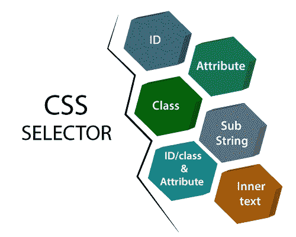

# Selenium IDE 中的 CSS 选择器定位器

> 原文：<https://www.tutorialandexample.com/css-selector-locator/>

它用于根据 HTML **标签、id、类、**和**属性来识别 web 元素。**

用标记语言来描述文档的外观和格式被称为 CSS [ **级联样式表**。

CSS 能够定位没有 ID、类或名称的元素，就像 Xpath 一样。

关于 CSS 选择器的更多信息，请访问:[https://www.tutorialandexample.com/css-selector](https://www.tutorialandexample.com/css-selector)

它在六种不同的场景中识别和定位 web 元素。

[通过 ID 定位](https://www.tutorialandexample.com/css-selector-id/)

[分类定位](https://www.tutorialandexample.com/css-selector-class/)

[按属性定位](https://www.tutorialandexample.com/css-selector-attribute/)

[通过 ID/类别定位&属性](https://www.tutorialandexample.com/css-selector-id-class-and-attribute/)

[通过子串定位](https://www.tutorialandexample.com/css-selector-sub-string/)

[通过内部文本定位](https://www.tutorialandexample.com/css-selector-inner-text/)

