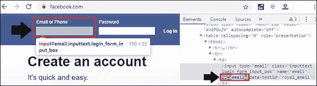
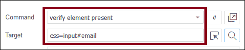
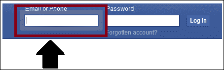

# CSS 选择器:Selenium IDE 中的 ID

> 原文：<https://www.tutorialandexample.com/css-selector-id/>

**CSS 选择器:ID**

id 属性用于在网页中唯一地标识 web 元素。

### ID 属性的语法:

```
[HTML tag][#][Value of ID attribute]
```

**散列符号(#):** 在使用 ID 属性创建 CSS 选择器时，它是必需的。

永远记住前缀' **css='** '用于在 Selenium IDE 的目标文本框中指定 css 选择器。

我们将以在 facbook.com 的登录表单中出现的**电子邮件文本框**为例

*   电子邮件文本框有一个 id 属性，其值定义为一个 **id=email** 。
*   ID 属性和值可以用来创建一个 CSS 选择器来访问电子邮件文本框。
*   启动火狐浏览器。
*   并在谷歌搜索框中输入 https://www.facebook.com；它会将您重定向到脸书登录页面。
*   当我们检查一个电子邮件文本框的 web 元素时，它的 html 标签值是输入的，id 属性的值是 email。



要验证定位器:

*   在 Selenium–IDE 中打开测试脚本编辑器框，并单击命令文本框。
*   并将命令写成:

**命令=验证元件存在**

**Value = css=input#Email**



*   点击**查找**按钮。
*   要验证定位器的值是否正确，还可以在浏览器中检查电子邮件文本框是否高亮显示。

