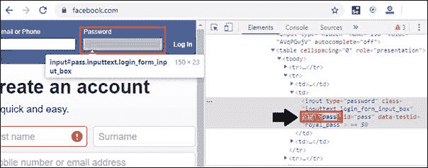
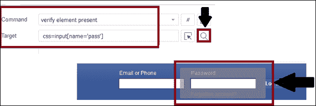

# CSS 选择器:Selenium IDE 中的属性

> 原文：<https://www.tutorialandexample.com/css-selector-attribute/>

**CSS 选择器:属性**

*   定位 CSS 选择器的属性，我们将访问**密码**文本框，它出现在脸书的登录表单中。
*   密码文本框有一个类型属性，其值定义为**传递**。
*   要创建 CSS 选择器属性，我们可以使用值、类型和名称。

### CSS 选择器属性的语法:

```
css=< [attribute=Value of attribute]>
```

*   **属性值:**表示使用属性时访问的值。

### 让我们看一个属性的例子:

我们通过为特定的 web 元素定义 CSS 选择器来定位 web 元素。

*   打开 Firefox 浏览器。
*   并在谷歌搜索框中输入 https://www.facebook.com；它会将您重定向到脸书登录页面。
*   您可以检查密码文本框的 web 元素，并注意到 html 标记值是 **input** ，name 属性的值是 **pass。**



**验证定位器值:**

*   在 selenium IDE 中打开测试脚本编辑器框，点击命令文本框，将命令写成:

**命令=验证元件存在**

**Value = CSS = input[name = ' pass ']**

*   要验证定位器的值是否正确，请在 selenium IDE 界面中单击**查找按钮**,并在浏览器中检查密码文本框是否高亮显示。

