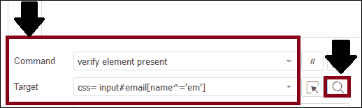
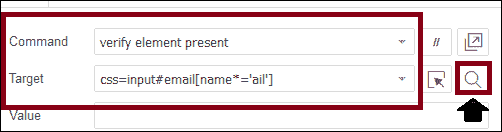
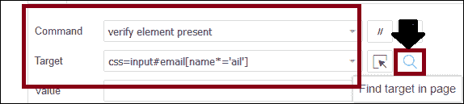

# CSS 选择器:Selenium IDE 中子字符串

> 原文：<https://www.tutorialandexample.com/css-selector-sub-string/>

**CSS 选择器:子字符串**

CSS 选择器**子字符串**用于匹配部分字符串以定位特定的 web 元素。

*   使用 CSS 选择器匹配子字符串有三种方法。
*   匹配前缀
*   匹配后缀
*   匹配子字符串

现在我们将通过一个例子来详细讨论它们，

**匹配一个前缀:**

*   它将使用与前缀匹配的**来访问特定的字符串。**

**前缀**的语法:

```
css= [HTML tag]{[attribute^=prefix of the string]}.
```

**【^]:**这是一种使用前缀匹配字符串的符号表示法。

**字符串的前缀**:基于字符串进行的匹配操作。

*   例如，我们将为 Facebook 登录页面的**电子邮件**文本框定义 CSS 选择器为**css=input#email[name^='em'】**



*   点击**查找按钮**,验证已定义的 CSS 选择器是否找到所需的元素。


### 匹配后缀:

*   它将使用一个与后缀匹配的**来访问一个特定的字符串。**

**后缀语法:**

```
css= [HTML tag]{[attribute$=suffix of the string]}
```

**[$]:** 这是使用后缀匹配字符串的符号表示法。

**字符串后缀**:基于字符串进行匹配操作。

*   例如，我们将为脸书登录页面的**电子邮件**文本框定义 CSS 选择器。

**CSS = input # email[name * = ' ail ']**



*   点击**查找按钮**,验证已定义的 CSS 选择器是否找到所需的元素。


### 匹配子字符串:

*   它将使用一个**匹配一个子串**来访问一个特定的字符串。

**子串语法:**

```
css=
```

**[*]:** 使用子串匹配字符串是符号表示法。

**子串:**根据字符串进行匹配操作

*   例如，我们将为脸书登录页面的**电子邮件**文本框定义 CSS 选择器为**CSS = input # Email[name * = ' ail ']**



*   点击**查找按钮**,验证已定义的 CSS 选择器是否找到所需的元素。

