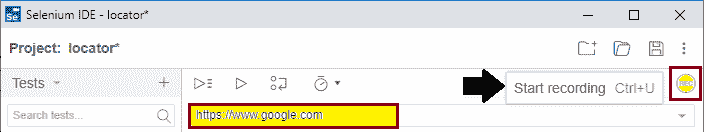
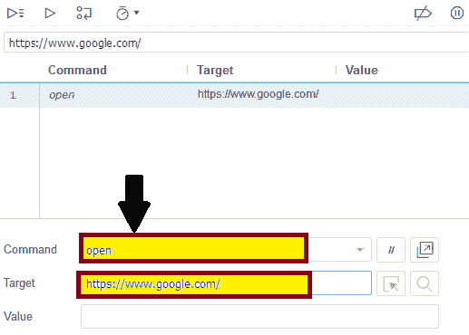
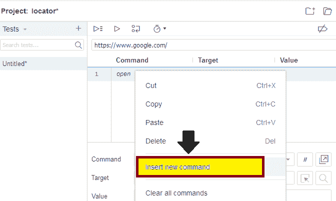
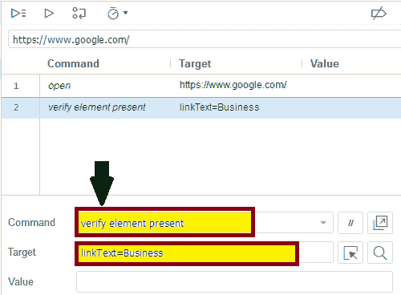
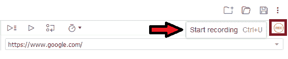
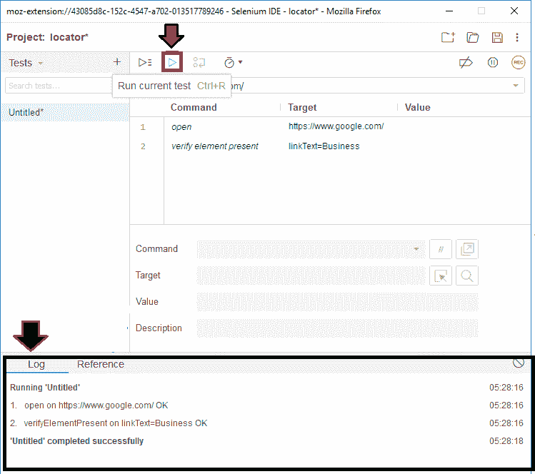
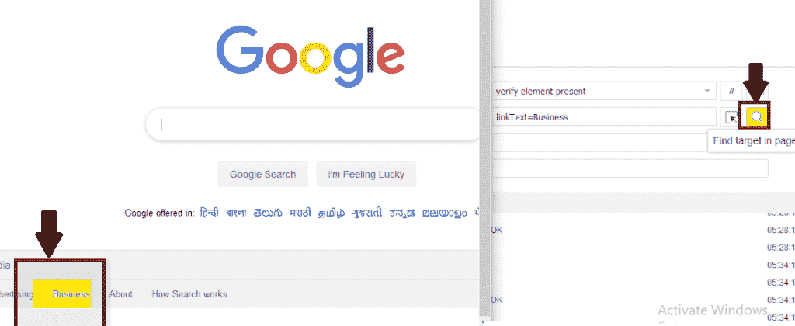

# Selenium IDE 中的链接文本定位器

> 原文：<https://www.tutorialandexample.com/link-text-locator/>

**链接文本**

Link textlocator 用于根据链接的名称仅标识 weblink 元素。

每当多个环节都在，就不行；它只适用于一个链接(当前页面 HTML 文档)。

*   对于非链接元素，链接文本无效。
*   当 UI 链接文本定位器中出现重复不正确时。

出于我们的测试目的，我们正在定位 Google 搜索页面中的**业务**链接

*   打开 Firefox 浏览器
*   单击 Selenium 图标，它将打开 Selenium IDE 界面。
*   点击明星录制按钮，输入基础网址为 **https:/ /www.google.com/** 。

*   单击命令文本框，将第一个命令写成:-

**命令:o 开**

**目标:**[**【https://www.google.com/】**T5】](https://www.google.com/)

*   这个命令在 Firefox 浏览器上加载 Google 页面。
*   之后，右键单击 selenium IDE 界面中的 insert new 命令，并将下一个命令编写为:

**命令:验证元素存在**

**Target: linkText=Business**

*   现在，点击**停止记录按钮**。

并点击**运行电流测试**按钮。

*   它将执行你在浏览器上插入的所有命令。
*   日志窗格显示了被执行的测试脚本的总体概要。

*   之后，点击**查找**按钮，验证该链接是否在浏览器中高亮显示。
*   您也可以在浏览器中看到结果。

