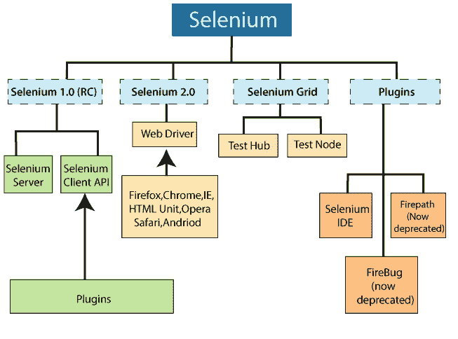
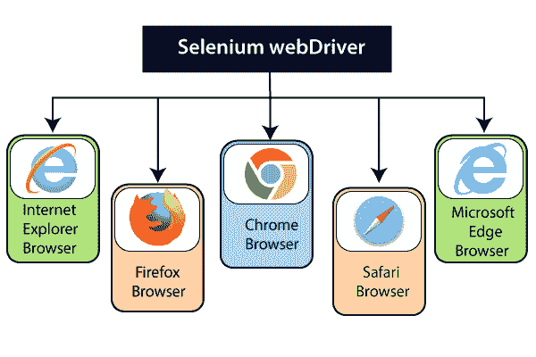
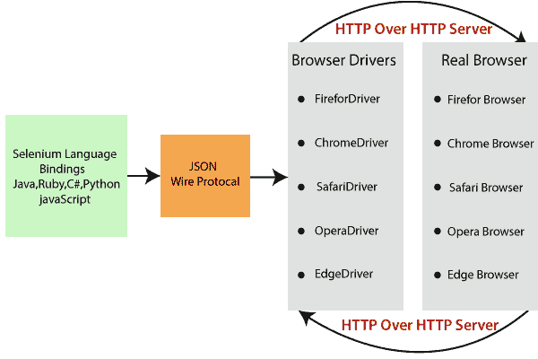

# Selenium WebDriver 教程

> 原文：<https://www.tutorialandexample.com/selenium-web-driver-tutorial/>

**Seleniun WebDriver 简介**

*   Selenium WebDriver 是 Selenium 工具套件必不可少的工具，因为它可以直接与浏览器通信，而无需任何服务器。
*   Selenium WebDriver 是一个**浏览器自动化框架**，它接受命令并将它们发送到浏览器。
*   它是由来自**谷歌公司的 **JSON Huggins** 和 **Simon Stewart** 于 2008 年**开发的。
*   网络驱动通过**浏览器专用驱动**实现。
*   Selenium WebDriver 属于 Selenium 版本 2，它提供了一个简单而简短的编程接口。
*   Selenium 2 = web driver+Selenium 1.0，其中 Selenium 1.0 版本包括 Selenium IDE、Selenium RC 和 Selenium Grid。
*   WebDriver 是核心 java 库和接口的集合。
*   Selenium WebDriver 测试脚本可以由任何支持的编程语言开发，并且可以直接在 web 浏览器中运行。
*   WebDriver 支持的编程语言包括 **C#、Java、Perl、PHP、Python 和 Ruby** 。

与 selenium RC 相比，WebDriver 的执行速度更快，因为 selenium RC 需要 Selenium 服务器来与浏览器交互，而 WebDriver 直接与 web 浏览器交互，不需要 Selenium 服务器。

在深入了解 Selenium WebDriver 的概念之前，我们应该了解任何支持的编程语言。目前，Selenium WebDriver 是 Java 和 C#的需求。

这里，我们用 java 编程语言执行 Selenium WebDriver。

要学习 java 和 C#编程语言的基本和高级概念，您可以参考以下链接:

Java 教程:[https://www.tutorialandexample.com/java-tutorial](https://www.tutorialandexample.com/java-tutorial)

C#教程:[https://www.tutorialandexample.com/csharp-tutorial](https://www.tutorialandexample.com/csharp-tutorial)

Firefox (Gecko Driver) WebDriver 有一个内置的实现。我们需要其他浏览器的插件，用于特定的驱动程序来通信和运行测试脚本。

WebDriver 支持的浏览器如下:

*   谷歌 Chrome 浏览器
*   Mozilla Firefox
*   Internet Explorer 浏览器
*   Safari 浏览器
*   微软 Edge 浏览器

### Selenium WebDriver 的架构

Selenium WebDriver 架构有四个必要的组件:

*   硒语言绑定
*   JSON 有线协议
*   浏览器驱动程序
*   真正的浏览器

### Selenium 语言绑定/客户端库:

Selenium 支持多种语言，如 Java、Ruby、Python 等。；开发人员已经开发了语言绑定，允许 Selenium 支持各种库。一旦你通过了我们写的测试(完整的 selenium 代码)，它就必须被转换成 JSON 格式。

我们可以在下面链接的帮助下下载支持的语言绑定。

[https://www.seleniumhq.org/download/#client-drivers](https://www.seleniumhq.org/download/#client-drivers)

### JSON 有线协议:

JSON 代表 **JavaScript 对象符号。**它用于在网络上交换数据**。** JSON 文件通过 HTTP 协议发送给浏览器驱动，也就是所谓的**服务器**。每个浏览器驱动程序，比如 Firefox 驱动程序、Chrome 驱动程序，都有自己的 HTTP 服务器。

注意:每个浏览器都包含一个单独的浏览器驱动程序。

 **### 浏览器驱动程序:

Selenium WebDriver 特定于每个浏览器，并与浏览器建立安全连接，而不公开浏览器的任何内部功能。

浏览器驱动程序与其各自的浏览器进行通信，并通过解释 JSON(浏览器上的接收器)来执行命令。响应将以 http 的形式返回。

在 WebDriver 的帮助下执行测试脚本时，内部执行了以下活动:

*   对于每个 Selenium 命令，都会生成 HTTP 请求并发送给浏览器驱动程序。
*   驱动程序在 HTTP 服务器的帮助下接收 HTTP 请求。
*   HTTP 服务器执行在浏览器上执行的所有步骤和指令。
*   在最后的活动中，执行状态被发送回 HTTP 服务器。

### 真实浏览器:

浏览器驱动程序接收来自浏览器的响应和对客户端的 JSON 响应。

Selenium WebDriver 支持的浏览器:

*   微软公司出品的 web 浏览器
*   Mozilla Firefox
*   谷歌浏览器
*   旅行队
*   微软 Edge

### Selenium Web 驱动程序主题

*   [Selenium WebDriver 简介](https://www.tutorialandexample.com/selenium-web-driver-tutorial/)
*   [Selenium web driver 的特点](https://www.tutorialandexample.com/selenium-web-driver-characteristics/)
*   【Selenium RC 和 web 驱动程序的区别
*   [Selenium web driver 的安装步骤](https://www.tutorialandexample.com/installation-steps-of-web-driver/)
*   [WebDriver 类图/架构](https://www.tutorialandexample.com/web-driver-interface-class-diagram/)
*   [网络驱动控制命令](https://www.tutorialandexample.com/selenium-web-driver-commands/)
*   [浏览器控件](https://www.tutorialandexample.com/selenium-web-driver-browser-controls-commands/)
*   [导航控制](https://www.tutorialandexample.com/navigation-controls-commands/)
*   [Web 元素控件](https://www.tutorialandexample.com/selenium-webdriver-web-element-controls/)
*   [操作控制](https://www.tutorialandexample.com/operational-controls-methods/)
*   [数据采集控制](https://www.tutorialandexample.com/data-capture-controls-methods/)
*   [验证控制](https://www.tutorialandexample.com/verification-controls-methods/)
*   使用多种浏览器的网络驱动程序
*   [使用 chrome 浏览器的网络驱动程序](https://www.tutorialandexample.com/selenium-web-driver-google-chrome-browser/)
*   [使用 Firefox 浏览器的网络驱动程序](https://www.tutorialandexample.com/selenium-web-driver-firefox-or-gecko-marionette-browser/)
*   [使用 internet explorer 浏览器的网络驱动程序](https://www.tutorialandexample.com/selenium-web-driver-ie-internet-explorer-browser/)
*   [使用微软 Edge 浏览器的网络驱动程序](https://www.tutorialandexample.com/selenium-web-driver-microsoft-edge-browser/)
*   [网络驱动定位器](https://www.tutorialandexample.com/selenium-web-driver-locators/)
*   [Id 定位器](https://www.tutorialandexample.com/web-driver-id-locator/)
*   [名称定位器](https://www.tutorialandexample.com/web-driver-name-locator/)
*   [类名定位器](https://www.tutorialandexample.com/web-driver-class-name-locator/)
*   [Xpath 定位器](https://www.tutorialandexample.com/selenium-web-driver-xpath-locator/)
*   XPath 函数
*   [XPath 轴](https://www.tutorialandexample.com/xpath-axes/)
*   [链接文本定位器](https://www.tutorialandexample.com/web-driver-link-text-locator/)
*   [部分链接文本定位器](https://www.tutorialandexample.com/web-driver-partial-link-text-locator/)
*   [标签名称定位器](https://www.tutorialandexample.com/web-driver-tag-name-locator/)
*   [Css 选择器](https://www.tutorialandexample.com/selenium-web-driver-css-selector-locator/)
*   [标签和 Id](https://www.tutorialandexample.com/selenium-web-driver-css-selector-tag-and-id/)
*   [标签和类别](https://www.tutorialandexample.com/selenium-web-driver-css-selector-tag-and-class/)
*   [标签和属性](https://www.tutorialandexample.com/selenium-web-driver-css-selector-tag-and-attribute/)
*   [标签、类别和属性](https://www.tutorialandexample.com/selenium-web-driver-css-selector-tag-class-and-attribute/)
*   [子串匹配](https://www.tutorialandexample.com/selenium-web-driver-css-selector-substring-matching/)
*   [网络驱动等待语句](https://www.tutorialandexample.com/selenium-web-driver-wait-statements/)
*   [下拉处理](https://www.tutorialandexample.com/selenium-web-driver-dropdown-handling/)
*   [鼠标和键盘控制](https://www.tutorialandexample.com/mouse-and-keyboard-controls-in-selenium-web-driver/)
*   [拖放事件处理](https://www.tutorialandexample.com/drag-and-drop-event-handling/)
*   [窗口处理:新标签/新窗口](https://www.tutorialandexample.com/selenium-web-driver-window-handling/)
*   [预警弹出处理](https://www.tutorialandexample.com/selenium-web-driver-alert-popup/)
*   [复选框处理](https://www.tutorialandexample.com/selenium-web-driver-checkbox-handling/)
*   [单选按钮处理](https://www.tutorialandexample.com/selenium-web-driver-radio-button-handling/)**