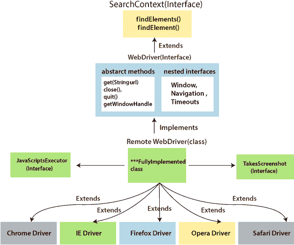
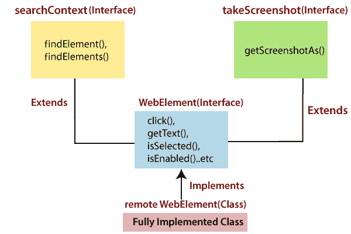

# WebDriver 接口|类图

> 原文：<https://www.tutorialandexample.com/web-driver-interface-class-diagram/>

**WebDriver 接口/类图:**

WebDriver 的接口包括以下几个阶段，具体如下:

*   **搜索上下文**
*   **网络驱动**
*   **远程网络驱动**
*   **驱动程序类**

**搜索上下文**

web 驱动类的第一个接口是 search Context，它包含两个抽象方法，分别是 **findElement()** 和 **findElements()** 。

这两种方法在搜索上下文接口中是抽象的。

**FindElement():**

*   findElement()用于导航，在 locator 的帮助下，它会找到 web 元素的源代码。
*   它用于标识 UI 中的单个元素。
*   即使找到多个匹配元素和单个匹配元素，它也总是返回单个 web 元素。
*   如果元素在 Html 中不可用，它将抛出 NoSuchElement 异常。

查找元素():

*   它用于标识 UI 中多个相似的元素。
*   它总是返回一个列表<web element="">。</web>
*   如果元素在 UI 中不可用，查找元素将返回 web 元素的空列表。
*   为了识别动态 web 表格中的特定颜色、数据或准确的行数据，我们使用 find Elements()方法。

**网络驱动程序:T1**

*   WebDriver 是一个扩展**搜索上下文**接口的接口，多个浏览器子类实现它。
*   WebDriver 有很多抽象方法，比如 **close()、quit()、get()、**等等。web 驱动也嵌套了类似**导航、窗口、超时、**等接口。
*   借助 **back()、refresh()、forward()、**等嵌套接口执行一些特定的操作。
*   并且整个 WebDriver 工具被转换成 jar 文件，由 selenium 社区上传。
*   要使用 WebDriver 工具，我们应该从 selenium 社区下载 web driver jar，并在开发测试脚本之前将 jar 导入 eclipse。
*   确保所有在 **lib** 文件夹中可用的 jar 和 jar 以及库都应该导入到 eclipse 中。

**远程** **网络驱动:**

*   这是一个完全实现的类，其中所有抽象方法如 **get()、close()、quit()、**和一个嵌套接口如 web 驱动程序的**窗口、超时、导航**。
*   搜索上下文接口的 **findElement()** 和 **findElements()** 方法在远程 WebDriver 类中实现。
*   它用来实现 **JavaScriptExecutor** 和**截图**接口。

**驱动程序类别:**

最后，我们在 selenium WebDriver 中提供了**特定于浏览器的驱动程序类**。

驱动类包括 **Firefox 驱动、Chrome 驱动、IE 驱动、Safari 驱动**等。

### WebElement 层次结构

Webelement 是一个扩展了 **SearchContext** 和 **TakeScreenShot** 接口的接口。

这些接口包含几个控件，如 **click()、sendKeys()、getText()** 等。可以在 findElement()方法之后使用。

**Search Context:**
Search Context 接口已经在类中描述过了，类中包含了 **findElement()和 findElements()** 方法。

**网页元素:**

要在 webelement 上执行任何操作，如 click()、isSelected()、getText()方法，我们将使用覆盖概念，因为 WebDriver 中所有可用的抽象方法都被覆盖了。

**远程网络元素:**

**remote webelement** 类是一个完全实现的 web 元素接口类。