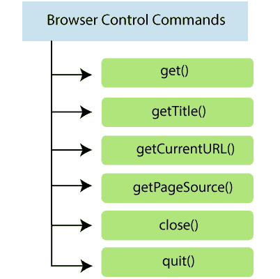
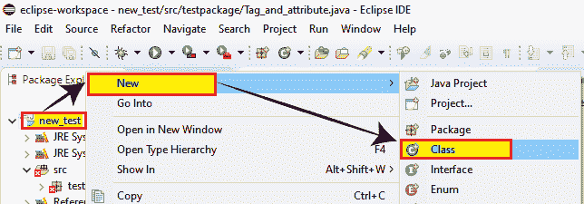
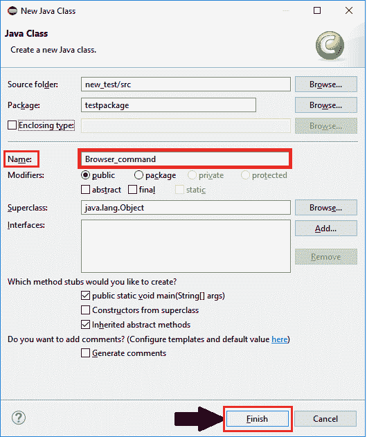
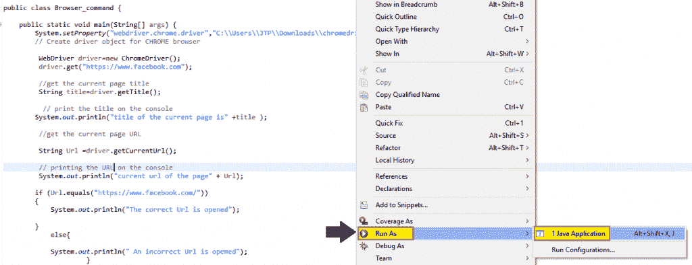
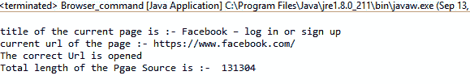

# Selenium WebDriver -浏览器控件命令

> 原文：<https://www.tutorialandexample.com/selenium-web-driver-browser-controls-commands/>

**Selenium WebDriver - Browser 控件命令**

WebDriver 包括**打开浏览器、获取标题、关闭浏览器等操作。**

Selenium WebDriver 的一些最常用的浏览器控件命令如下



*   **get()命令:**

get()方法用于导航任何 URL，但是 URL 应该以 http 开头，因为 web 驱动程序使用 Http 协议进行内部浏览器通信。

 ****语法:**

```
get(String arg0)void
```

get 命令的返回类型如下:

| **参数** | **返回类型** |
| 线 | 空的 |

为了使用 get 命令加载一个新的网页，我们正在加载 tutorialandexample.com**的官方网站**

```
driver.get(“URL”);
 driver.get("https://www.tutorialandexample.com")
or
String URL="URL";
driver.get(URL);
```

*   **getTitle()命令:**

getTitle()方法用于获取当前网页的标题。

 ****语法:**

```
getTitle(): String
```

getTitle()的返回类型:

| **参数** | **返回类型** |
| 没有参数用法 | 线 |

**抓取当前网页标题:**

```
driver.getTitle();
//or
StringTitle=driver.getTitle();
```

*   **getCurrentURL()命令:**

getCurrentUrl()方法用于获取当前网页的 Url。

 ****语法:**

```
getCurrentUrl(): String
```

getCurrentUrl()的返回类型:

| **参数** | **返回类型** |
| 没有参数用法 | 线 |

**获取网页的当前 URL:**

```
driver.getCurrentUrl();
//Or
String CurrentUrl = driver.getCurrentUrl();
```

*   **getPageSource()命令:**

getPageSource()命令用于从当前页面获取 HTML 源代码。

 ****语法:**

```
getPageSource(): String
```

getPgeSource()的返回类型:

| **参数** | **返回类型** |
| 没有参数用法 | 线 |

**获取当前网页的源代码:**

```
driver.getPageSource();
//or
String PageSource = driver.getPageSource();
```

*   **关闭()命令:**

关闭命令用于在当前时间终止当前浏览器窗口。

**语法:**

```
close():void 
```

| **参数** | **返回类型** |
| **无参数使用** | **作废** |

**终止浏览器窗口:**

```
driver.close();
```

*   **退出()命令:**

Quit 方法用于终止所有窗口。它将关闭所有打开的浏览器。

 ****语法:**

```
quit(): void 
```

| **参数** | **返回类型** |
| 没有参数用法 | 空的 |

**终止所有窗口:**

```
driver.quit();
```

让我们来看一个样本测试脚本，它将试图涵盖最常用的浏览器命令:

在此测试中，我们将自动化以下测试场景:

| **步骤** | **动作** | **使用的方法** | **预期结果** |
| **1。** | 调用谷歌 Chrome 浏览器 |   | Chrome 浏览器必须打开。 |
| **2。** | 打开网址:https://www.facebook.com | 获取() | 必须打开脸书登录页面。 |
| **3。** | **获取当前页面标题**名称。 | getCurrentTitle() | 必须显示当前页面标题名称。 |
| **4。** | 在 Eclipse IDE 控制台上打印**页面标题** |   | 标题应该打印在 eclipse 控制台上。 |
| **5。** | **获取当前页面 URL** 并验证是否为所需页面。 | getCurrentUrl() | 必须验证当前页面 URL。 |
| **6。** | **获取页面来源**和**页面来源长度。** | getPageSource() | 页面源代码必须显示源代码长度。 |
| 7 .**。** | 在 Eclipse IDE 控制台上打印页面长度。 |   | 页面长度应该打印在 eclipse 控制台上。 |
| **8。** | **关闭**浏览器。 | 关闭() | 浏览器应该关闭。 |

出于测试目的，我们将测试一个**脸书**应用程序的主页。

我们正在一步一步地创建我们的测试用例，以便让您完全理解 WebDriver 中的浏览器命令。

*   打开 Eclipse IDE，打开我们已经在 [WebDriver 教程](https://www.tutorialandexample.com/selenium-web-driver-tutorial/)的 [WebDriver 安装](https://www.tutorialandexample.com/installation-steps-of-web-driver/)部分创建的现有测试套件 **new_test** 。

*   然后，右击 **src** 文件夹，从 **New** **à Class** 创建一个新的类文件。



*   并且，给你的类名命名为 **Browser_Command** 并点击 **Finish** 按钮。



**第一步:**

为了自动化测试场景，首先，我们需要学习“如何在 WebDriver 中启动 web 浏览器？”

注意:要在 Selenium 中访问浏览器，我们必须下载一个特定于该浏览器的可执行文件。

例如，Chrome 浏览器使用一个名为【ChromeDriver.exe】的可执行文件来执行网络驱动协议。

这些可执行文件在我们的系统上启动一个服务器，它负责在 Selenium 中运行我们的测试脚本。

要启动谷歌 Chrome 浏览器，我们需要下载 ChromeDriver.exe 文件，并将系统属性设置为 ChromeDriver.exe 文件的路径。

也可以参考 Chrome 浏览器上的 [Web 驱动，了解 Chrome 驱动如何下载，如何设置系统属性。](https://www.tutorialandexample.com/selenium-web-driver-google-chrome-browser/)

因此，下面是设置 google chrome 系统属性的代码:

```
//set the system property of Google Chrome
System.setProperty("webdriver.chrome.driver","C:\\Users\\JTP\\Downloads\\chromedriver_win32\\chromedriver.exe"); 
```

**使用 Chrome driver 类初始化 Chrome 驱动程序:**

```
// create driver object for CHROME browser
 WebDriver driver=new ChromeDriver(); 
```

**第二步:**

**启动网站:**

```
driver.get("https://www.facebook.com");
```

**第三步:**

现在，我们正在自动化第三个测试场景，即**获取页面标题名称**，

```
//get the current page title
String title=driver.getTitle(); 
```

**第四步:**

**要在控制台中打印页面标题名称，请遵循给定的代码:**

```
// print the title on the console
System.out.println("title of the current page is :- " + title );
```

**第五步:**

下一个测试场景是获取 URL 并根据实际的 URL 进行验证。

首先，我们将存储当前的 URL:

```
//get the current page URL
String Url =driver.getCurrentUrl(); 
```

**在这里，我们正在验证 URL :**

```
if (Url.equals("https://www.facebook.com/")) 
{ 
System.out.println("The correct Url is opened");
}
else{
System.out.println(" An incorrect Url is opened"); 
 }
```

**第六步:**

为了自动化我们的下一个测试场景，即**获取页面源和页面源长度**，首先，我们将分别在字符串和 **int** 变量中获取当前页面源和页面源长度。

```
// get the current page source code
 String Sourcecode = driver.getPageSource(); 
 // getting Source code length in Int variable 
 int SourcecodeLength = Sourcecode.length();  
```

**第七步:**

要在输出控制台窗口中打印页面源代码的长度:

```
// Print the length of a Page Source code on the console
 System.out.println("length of the Page Source is :- " + SourcecodeLength);
```

**step 8:****T3】**

最后，我们终止进程并关闭浏览器。

```
//Closing the browser
 driver.close();
```

现在，我们正在组合上述所有代码块，最终的测试脚本将如下所示:

```
package testpackage;
import org.openqa.selenium.WebDriver;
import org.openqa.selenium.chrome.ChromeDriver;
public class Browser_command {
public static void main(String[] args) {
System.setProperty("webdriver.chrome.driver","C:\\Users\\JTP\\Downloads\\chromedriver_win32\\chromedriver.exe");
// create driver object for CHROME browser
WebDriver driver=new ChromeDriver();
driver.get("https://www.facebook.com");
//get the current page title
String title=driver.getTitle();
// print the title in the eclipse console
System.out.println("title of the current page is " + title );
//get the current page URL
String Url =driver.getCurrentUrl();
// printing the URL in the console
System.out.println("current url of the page " + Url);
if (Url.equals("https://www.facebook.com/"))
{
System.out.println("The correct Url is opened");
}
else {
System.out.println(" An incorrect Url is opened");
}
// get the current page source code
String Sourcecode = driver.getPageSource();
// getting the Source code length in int variable
int SourcecodeLength = Sourcecode.length();
// Printing the length of the Page Source
 System.out.println("Total length of the page" + SourcecodeLength);
//Closing the browser
driver.close();
}
}
```

*   现在，右击窗口，点击**运行为> Java 应用**



*   测试脚本将在 chrome 浏览器中启动，并自动执行所有测试场景。
*   测试脚本的输出将显示所有打印命令的结果。

**********