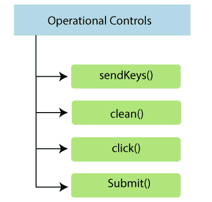
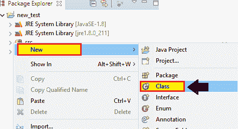
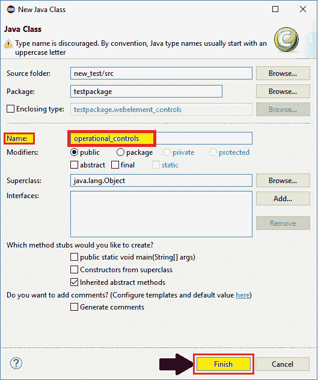
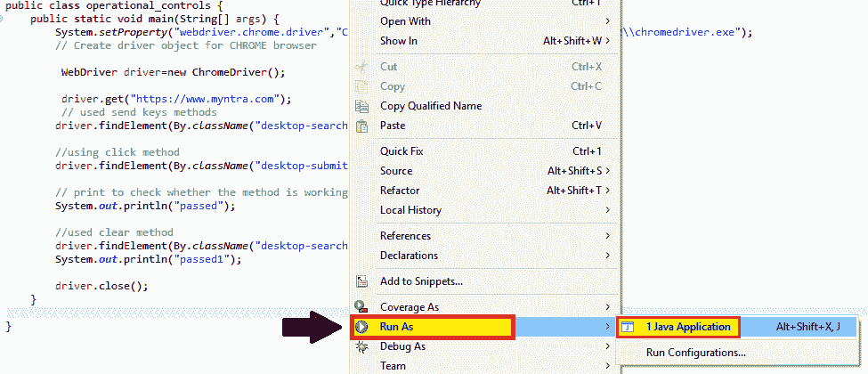

# Selenium WebDriver 中的操作控制方法

> 原文：<https://www.tutorialandexample.com/operational-controls-methods/>

**操作控制方法**

操作控件用于执行 web 元素上的所有操作，如**点击按钮**、**传递文本框**中的值、**点击提交按钮**等。



一些最常用的操作控制如下:

| **操作控制** | **描述** | **语法** | **命令** |
| **sendKeys()** | 用于将数据传递到**文本框或文本区**。 | **sendKeys(String) : void** | element . sendkeys(" text ")； |
| **点击()** | 用于对链接、复选框、单选按钮、图像元素进行左键点击操作**。** | **点击() :作废** | element . click()； |
| **清除()** | 用于**清除或重置编辑框中的**现有数据。 | **clear() :void** | element . clear()； |
| **提交()** | 仅用于在**提交**按钮上执行点击操作。 | **提交():作废** | element . submit()； |

让我们来看一个样本测试脚本，其中将尝试涵盖最常用的 **operational_controls** 命令:

出于测试目的，我们使用一个电子商务网站 **Myntra，**来执行 web 元素控件的操作命令。

在此测试中，我们将自动化以下测试场景:

| **步骤** | **动作** | **使用的方法** | **输入** | **预期结果** |
| **1。** | 调用谷歌浏览器。 | System.setProperty() |   | Chrome 浏览器必须打开。 |
| **2。** | 导航到 Myntra 主页。 | 获取() | [www.myntra.com](http://www.myntra.com) | 必须显示 Myntra 主页。 |
| **3。** | 使用搜索框中的 **send keys 方法**传递日期。 | 发送键() | 彪马鞋页 | 传递的数据应该用特定的页面打开。 |
| **4。** | 使用**点击方法**点击搜索键按钮。 | 单击() |   | 搜索键按钮应该是点击了的**。** |
| **5。** | 使用**清除方法**清除搜索框上的日期。 | 清除() |   | 文本框中的数据应该被**清除**。 |
| **6。** | 关闭浏览器 | 关闭() |   | 浏览器应该**关闭。** |

打开 Eclipse IDE 和现有的测试套件 **new_test** ，这是我们在 WebDriver 教程的 [WebDriver 安装](https://www.tutorialandexample.com/installation-steps-of-web-driver/)部分创建的。

然后，右击 src 文件夹，从 **New > Class** 创建一个新的 Class 文件。



*   将类名命名为 **operational_controls** 并点击 **Finish** 按钮。



我们正在一步一步地创建我们的测试用例，以便让您完全理解 WebDriver 中的 **Operational_controls** 命令。

**第一步:**

要启动谷歌 Chrome 浏览器，我们需要下载 ChromeDriver.exe 文件，并将系统属性设置为 ChromeDriver.exe 文件的路径。

以下是为谷歌浏览器设置系统属性的代码:

```
//set the system property of Google Chrome
System.setProperty("webdriver.chrome.driver","C:\\Users\\JTP\\Downloads\\chromedriver_win32\\chromedriver.exe");  
```

使用 Chrome driver 类初始化 Chrome 驱动程序:

```
// create driver object for CHROME browser
WebDriver driver=new ChromeDriver(); 
```

**第二步:**

使用 **get()** 方法启动网站。

```
//navigate to myntra home page
driver.get("https://www.myntra.com"); 
```

**第三步:**

在搜索框中使用 **sendkeys()** 方法传递日期。

```
// using a send keys method to pass the data into the search box
driver.findElement(By.className("desktop-searchBar")).sendKeys(" puma shoes");
//or can also be written like this:
WebElement wb=driver.findElement(By.*className*("desktop-searchBar"));
wb.sendKeys("puma shoes");
```

**第四步:**

使用 **click()** 方法点击搜索键按钮。

```
//using click method to click on the particular button driver.findElement(By.className("desktop-submit")).click();
 //or written like this
WebElement wb1=driver.findElement(By.*className*("desktop-submit"));
wb1.click();
// print to check whether the method is working fine or not
System.out.println("passed"); 
```

**第五步:**

使用 **clear()** 方法清除搜索框中的日期。

```
//using the clear method to clear the search box data.
driver.findElement(By.className("desktop-searchBar")).clear();
System.out.println("passed1"); 
```

**第六步:**

最后，我们终止进程并关闭浏览器。

```
//Close the browser  
driver.close();   
```

之后，我们最终的测试脚本将会是这样的:

```
package testpackage;
import org.openqa.selenium.By;
import org.openqa.selenium.WebDriver;
import org.openqa.selenium.WebElement;
import org.openqa.selenium.chrome.ChromeDriver;
public class webelement_controls {
public static void main(String[] args) { 
System.setProperty("webdriver.chrome.driver","C:\\Users\\JTP\\Downloads\\chromedriver_win32\\chromedriver.exe");
 // create driver object for CHROME browser
 WebDriver driver=new ChromeDriver();
 //open the URL 
driver.get("https://www.myntra.com");
// using send keys method to pass the date into the textbox
driver.findElement(By.className("desktop-searchBar")).sendKeys(" puma shoes"); 
//using click method to act on left-click operation
driver.findElement(By.className("desktop-submit")).click();
// print to check whether the method is working fine or not
System.out.println("passed");   
//used clear method to clear the data from the textbox
driver.findElement(By.className("desktop-searchBar")).clear();
System.out.println("passed1");
//close the existing browser
driver.close();
}         
} 
```

*   要在 Eclipse 中运行测试脚本，右键单击窗口，然后单击**作为> Java 应用程序运行。**



*   测试脚本将在 chrome 浏览器中启动，并自动执行所有测试场景。