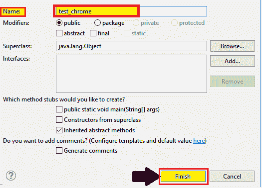
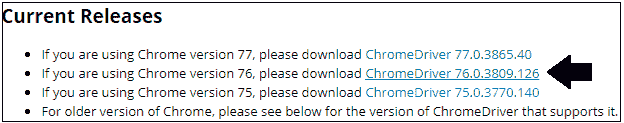
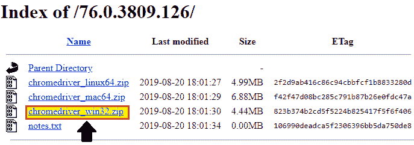
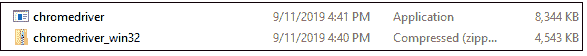
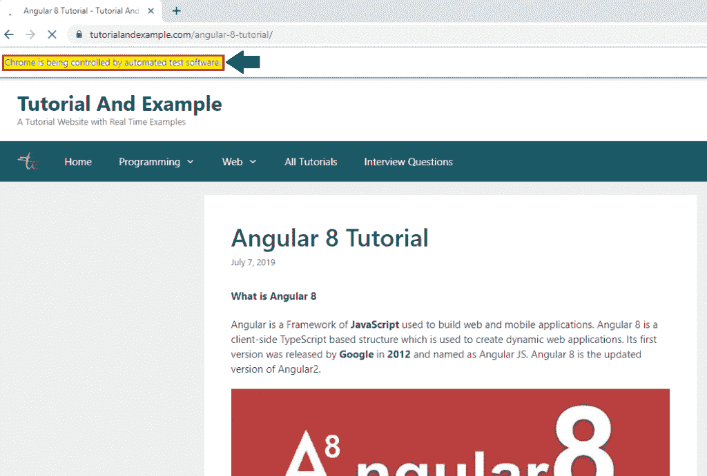
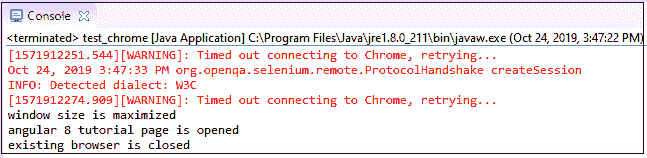

# Selenium WebDriver -谷歌 Chrome 浏览器

> 原文：<https://www.tutorialandexample.com/selenium-web-driver-google-chrome-browser/>

**Selenium WebDriver -谷歌 Chrome 浏览器**

在本教程中，我们将学习如何在 Google Chrome 浏览器中运行 Selenium 测试脚本。

借助一个可执行文件来实现 WebDriver 协议，这个可执行文件叫做**ChromeDriver.exe**。

上面的可执行文件启动了我们系统中的服务器，它负责在 Selenium WebDriver 中运行我们的测试脚本。

我们将在同一个测试套件( **new_test** )中创建一个样本测试用例，这是我们在前面的教程中创建的。

**第一步**:

*   首先，右击 **src** 文件夹，从 **New** 创建一个新的类文件？**级**。


*   并将我们的类名命名为 **test_chrome** 并点击 **Finish** 按钮。



**第二步:**

现在，去 selenium 社区下载 Chrome 驱动服务器。在 Selenium 社区中，我们会找到第三方驱动程序部门。然后点击谷歌 Chrome 驱动旁边的链接。

**或**

直接打开下面的链接，它会在你的浏览器中导航到 Chrome 驱动程序的下载页面。

[https://sites . Google . com/a/chromium . org/chrome driver/downloads](https://sites.google.com/a/chromium.org/chromedriver/downloads)

第三步:

如果您点击上面的链接，它会将您重定向到**当前版本**页面，在那里您可以下载您当前正在使用的操作系统。



*   点击 **chromedriver_win32.zip** 链接，为 Windows 平台下载。



*   将 zip 文件下载到您的本地系统，并解压文件夹，它会自动生成**chromedriver.exe**文件。



**第四步:**

在启动 Chrome 浏览器之前运行服务器，借助 **System.property，**

**语法:**

```
System.SetProperty(“key”, ”value”);
```

实时设置 Chrome 驱动程序的系统属性，其中

```
Key = “webdriver.chrome.driver”
```

以及我们的**ChromeDriver.exe**文件调用 **ChromeDriver** 类的路径。

```
Value=”C:\\Users\\JTP\\Downloads\\chromedriver_win32\\chromedriver.exe"
```

> **注意:**确保在复制 chroedriver.exe 文件的路径时，它应该总是在双斜线(//)中。

**系统属性示例代码:**

```
// System Property for Chrome Driver
System.setProperty("webdriver.chrome.driver","C:\\Users\\JTP\\Downloads\\chromedriver_win32\\chromedriver.exe");  
// create an object for ChromeDriver class
WebDriver driver=new ChromeDriver();   
```

让我们来看一个例子，在这个例子中，我们将尝试在 Google Chrome 浏览器中实现以下场景的自动化。

| **步骤** | **动作** | **使用的方法** | **输入** | **预期结果** |
| **1。** | 打开谷歌 Chrome 浏览器。 | System.setProperty() |   | 谷歌 Chrome 浏览器必须打开。 |
| **2。** | 导航到网站的给定 URL。 | 获取() | [https://www.tutorialandexample.com](https://www.tutorialandexample.com/) | 必须显示主页窗口。 |
| **3。** | 最大化浏览器。 |   |   | 浏览器窗口应该最大化。 |
| **4。** | 识别最新教程部分的 Angular 8 教程。 |  |   | angular 8 教程应该在最新的教程部分确定。 |
| **5。** | 关闭浏览器。 | 关闭() |   | 浏览器应该被终止。 |

以下是上述示例的示例代码。

```
package testpackage;
import org.openqa.selenium.By;
import org.openqa.selenium.WebDriver;
import org.openqa.selenium.chrome.ChromeDriver;
public class test_chrome {
public static void main(String[] args) {
System.setProperty("webdriver.chrome.driver","C:\\Users\\JTP\\Downloads\\chromedriver_wi32\\chromedriver.exe");
// create driver object for Chrome browser
WebDriver driver=new ChromeDriver();
// Launch the Website
driver.navigate().to("https://www.tutorialandexample.com");  
//Maximize the browser window
driver.manage().window().maximize();  
 System.out.println("window size is maximized");
// Click on the angular 8 tutorial link
driver.findElement(By.xpath("//a[contains(text(),'Angular 8 Tutorial')]")).click();
System.out.println("angular 8 tutorial page is opened");
//close the browser
driver.close();
System.out.println("existing browser is closed");
}
}
```

现在，右击 Eclipse 代码并选择**运行为** **？Java 应用程序。**

上述测试脚本的输出将显示在 Google Chrome 浏览器中。

上述测试脚本的所有打印命令的输出将显示在 Eclipse 控制台窗口中。



上述测试脚本的所有打印命令的输出将显示在 Eclipse 控制台窗口中。

