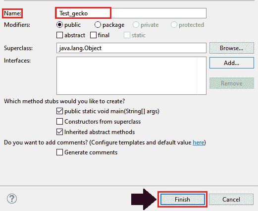
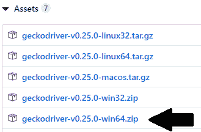
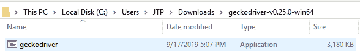
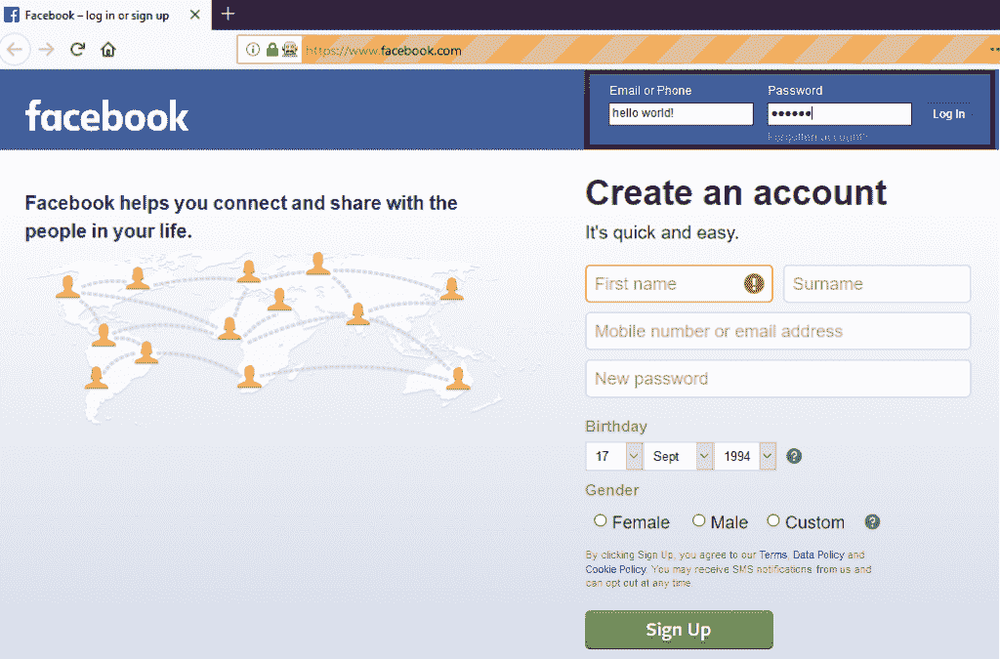
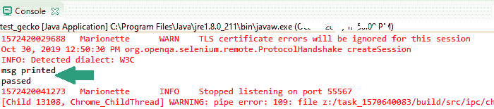

# Selenium WebDriver - Firefox 或 Gecko(牵线木偶)浏览器

> 原文：<https://www.tutorialandexample.com/selenium-web-driver-firefox-or-gecko-marionette-browser/>

**Selenium web 驱动程序——Firefox 或 Gecko(牵线木偶)浏览器**

在本教程中，我们将学习如何使用 Gecko 驱动程序在 Firefox 浏览器中运行 [Selenium WebDriver](https://www.tutorialandexample.com/selenium-web-driver-tutorial/) 测试脚本。

在继续这一部分之前，让我们首先了解壁虎驱动器的基础知识。

### 壁虎驱动是什么？

gecko 驱动程序是一个 web 浏览器，在 Mozilla Firefox 浏览器开发的应用程序中使用。并且是由 **[Mozilla 公司](https://www.mozilla.org/en-US/foundation/moco/)** 和 **Mozilla 基金会**制作。

Gecko 驱动程序作为一个链接位于我们在 Selenium 中的测试脚本和 Firefox 浏览器之间。

它是兼容 W3C WebDriver 的客户机(如 Eclipse、NetBeans 等)之间的替代品。与基于 Gecko 的浏览器(Mozilla Firefox)进行交互。

从 Selenium 3 开始，木偶(下一代 Firefox 驱动程序)默认是打开的。

Selenium 使用 W3C Web 驱动程序协议向 Gecko 驱动程序发送请求，Gecko 驱动程序将请求翻译成一个名为 Marionette 的协议。

即使您使用的是旧版本的 Firefox 浏览器，Selenium 3 也希望您设置由 **webdriver.gecko.driver** 执行的驱动程序的路径。

> **注意**:要打开 Firefox 驱动，我们将使用牵线木偶驱动，而不是默认的初始化，这是早期支持的。

我们将在同一个测试套件( **new_test** )中创建一个测试用例，这个测试套件是我们在 selenium WebDriver 之前的教程中创建的。

**第一步**:

*   首先，右击 **src** 文件夹，从 **New** 创建一个新的类文件？**级**。


*   将您的类名命名为 **Test_gecko** 并点击**完成**按钮。



**第二步:**

*   点击下面的链接，它会在你的浏览器中导航到 Gecko 驱动程序的下载页面。

[https://github.com/mozilla/geckodriver/releases](https://github.com/mozilla/geckodriver/releases)

*   在这里，您可以下载 Gecko 驱动程序的最新版本，并根据您当前使用的操作系统安装它。

因此，我们正在为用于 windows 的 Gecko 驱动程序的 **v0.25.0** 版本下载**64 位**版本。



*   将 zip 文件下载到您的本地系统并解压文件夹，它将自动生成**geckodriver.exe**文件。



我们有三种方法在 selenium WebDriver 中使用 Gecko 驱动程序:

**1。为 gecko 驱动程序设置系统属性:-**

在启动 Firefox 浏览器之前，借助 **System.property.** 运行服务器

**语法:**

```
System.SetProperty(“key”, ”value”);
```

在哪里，

```
Key = webdriver.gecko.driver
```

我们的 GeckoDriver 文件调用 GeckoDriver 类的路径如下所示，

```
Value= C:\\Users\\JTP\\Downloads\\geckodriver-v0.25.0-win64\\geckodriver.exe
```

下面是设置系统属性的示例代码，

```
// System Property for the gecko Driver
System.setProperty("webdriver.gecko.driver","C:\\Users\\JTP\\Downloads\\geckodriver-v0.25.0-win64\\geckodriver.exe");
// create an object for Firefox Driver class.
WebDriver driver=new FirefoxDriver();
```

**或**

**使用期望的功能:-**

下面是使用所需功能类设置 Gecko 驱动程序的代码:

```
DesiredCapabilities cap = DesiredCapabilities.firefox();
cap.setCapability("marionette",true);
```

所需功能的示例代码:

```
System.setProperty("webdriver.gecko.driver"," C:\\Users\\JTP\\Downloads\\geckodriver-v0.25.0-win64\\geckodriver.exe " );
DesiredCapabilities cap = DesiredCapabilities.firefox();
cap.setCapability("marionette",true);
WebDriver driver= new FirefoxDriver(cap);
```

**2。使用木偶属性:-**

它也可以使用木偶属性进行初始化。

```
System.setProperty("webdriver.firefox.marionette","
C:\\Users\\JTP\\Downloads\\geckodriver-v0.25.0-win64\\geckodriver.exe ");
```

*   对于牵线木偶方法，所需功能的代码不是强制性的。

**3。使用 Firefox 选项:-**

牵线木偶驱动程序是 Firefox 47 或更高版本的遗留系统。而且，可以使用 Firefox 选项调用木偶驱动程序，如下所示，

```
FirefoxOptions options = new FirefoxOptions();
options.setLegacy(true); 
```

现在，让我们来看一个样本测试用例，我们将尝试在 Firefox 浏览器中自动化以下场景。

| **步骤** | **动作** | **使用的方法** | **输入** | **预期结果** |
| **1。** | 打开 Firefox 浏览器。 | System.setProperty() |   | 必须打开 Firefox 浏览器。 |
| **2。** | 导航到网站的给定 URL。 | 获取() | [https://www.facebook.com/](https://www.facebook.com/) | 必须显示脸书应用程序的主页窗口。 |
| **3。** | 识别用户名文本框并为其传递值。 |   |   | 应该标识用户名文本框，并且应该传递值。 |
| **4。** | 识别密码文本框并为其传递值。 |  |   | 应该标识密码文本框，并且应该传递值。 |
| **5。** | 关闭浏览器。 | 关闭() |   | 浏览器应该被终止。 |

以下是上述示例的示例代码，

```
package testpackage;
import org.openqa.selenium.By;
import org.openqa.selenium.WebDriver;
import org.openqa.selenium.firefox.FirefoxDriver;
public class test_gecko {
public static void main(String[] args) throws InterruptedException {
// set the system property for gecko driver
System.setProperty("webdriver.gecko.driver","C:\\Users\\JTP\\Downloads\\geckodriver-v0.25.0-win64\\geckodriver.exe");
// create driver object for gecko browser
WebDriver driver=new FirefoxDriver();
 // Launch the Website  
driver.navigate().to("https://www.facebook.com/"); 
// pass the value to the email text box
driver.findElement(By.id("email")).sendKeys("hello world!");
Thread.sleep(2000);
System.out.println("msg printed");
// pass the value to the password text box
driver.findElement(By.name("pass")).sendKeys("123456"); 
Thread.sleep(2000);
System.out.println("passed");
//close the browser
 driver.close();
}
} 
```

*   现在，右键单击 Eclipse 代码并选择 **Run as** ？ **Java 应用**。

上述测试脚本的输出将显示在 Firefox 浏览器中。



*   上述测试脚本的所有打印命令的输出将显示在 Eclipse 控制台窗口中。

