# Selenium WebDriver - IE 浏览器

> 原文：<https://www.tutorialandexample.com/selenium-web-driver-ie-internet-explorer-browser/>

**Selenium web driver-IE【Internet Explorer】浏览器**

在这一部分，我们将了解如何在 IE (Internet Explorer)浏览器的帮助下运行测试脚本。

它是一个独立的服务器，用于实现 WebDriver 的有线协议。它是我们在 Selenium 中的测试和 Internet Explorer 浏览器之间的链接。

我们需要一个**IEDriverServer.exe**可执行文件来在 IE 浏览器中运行我们的测试脚本。

上面的可执行文件启动本地系统中的一个服务器来运行 Selenium WebDriver 测试脚本。

我们将在同一个测试套件( **new_test** )中创建一个测试用例，它是我们在前面的教程中创建的。

#### **第一步**:

*   首先，我们将右键单击 **src** 文件夹，并在 Eclipse IDE 中从 **New** → **Class** 创建一个新的类文件。


*   并将您的类名命名为 **Test_IE** 并点击**完成**按钮。

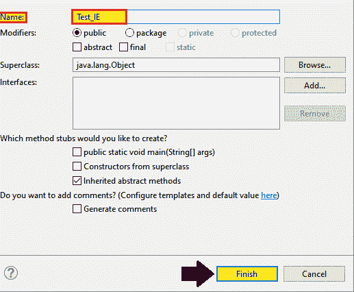

**第一步:**

*   去 selenium 社区下载 IE 驱动服务器。

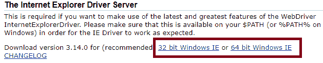

*   将文件夹下载到您的本地系统。解压缩文件夹，并确保您下载了指定版本的 IE 驱动程序，如 64 位或 32 位。

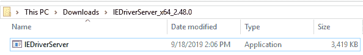

*   在启动 IE 浏览器之前，借助 **System.property** 运行服务器。

**语法:**

```
 System.SetProperty(“key”,”value”);
```

在哪里，

```
Key = “webdriver.ie.driver” 
```

然后复制 IE 驱动服务器的路径来调用 I driver 类。

```
Value= “C:\\Users\\JTP\\Downloads\\IEDriverServer_x64_2.48.0\\IEDriverServer.exe”
```

下面是设置系统属性的示例代码，

```
// System Property for IE Driver   
System.setProperty("webdriver.ie.driver","C:\\Users\\JTP\\Downloads\\IEDriverServer_x64_2.480\\IEDriverServer.exe");
// Instantiate the IEDriver class
WebDriver driver=new InternetExplorerDriver();   
```

现在，让我们看一个样本测试用例，我们将尝试在 IE 浏览器中自动化以下场景。

| **步骤** | **动作** | **使用的方法** | **输入** | **预期结果** |
| **1。** | 打开 IE 浏览器。 | System.setProperty() |   | 必须打开 IE 浏览器。 |
| **2。** | 导航到网站的给定 URL。 | 获取() | [https://www.google.com/](https://www.google.com/) | 必须显示主页窗口。 |
| **3。** | 最大化浏览器。 |   |   | 浏览器窗口应该最大化。 |
| **4。** | 识别谷歌搜索按钮并输入 Gmail，然后点击搜索按钮。 |  |   | 应该标识搜索按钮，并且应该输入值。 |
| **5。** | 关闭浏览器。 | 关闭() |   | 浏览器应该被终止。 |

以下是上述示例的示例代码，

```
package testpackage;
import org.openqa.selenium.By;
import org.openqa.selenium.WebDriver; 
import org.openqa.selenium.ie.InternetExplorerDriver; 
public class Test_IE {
public static void main(String[] args) throws InterruptedException { 
// System Property for IEDriver
System.setProperty("webdriver.ie.driver", "C:\\Users\\JTP\\Downloads\\IEDriverServer_x64_2.48.0\\IEDriverServer.exe");
// Instantiate an IEDriver class.
WebDriver driver=new InternetExplorerDriver();
// invoke the URL
driver.get("http://www.google.com/"); 
//Maximize the window browser 
driver.manage().window().maximize(); 
// Click on the search text box and pass the value 
driver.findElement(By.name("q")).sendKeys("gmail"); 
Thread.sleep(2000); 
System.out.println("value is passed");
// Click on the search button  
driver.findElement(By.name("btnK")).click(); 
System.out.println("button is clicked");
//close the browser
driver.close(); 
}  
} 
```

*   现在，右击 Eclipse 代码，并选择**运行为** **？Java 应用**。

*   当我们将这段代码运行到 IE 服务器时，我们可能会面临一些挑战，并显示出 **NoSuchSessionException** 异常。

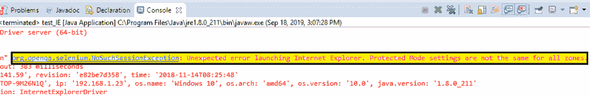

为了解决上述异常，我们做了一些更改。

在运行 web 驱动程序代码之前，应在 IE 浏览器中完成以下设置:

**浏览器缩放级别应为 100%:-**

*   点击浏览器右上角的**设置按钮**。
*   然后将光标移动到**缩放选项卡**并将缩放级别设置为 **100%。**

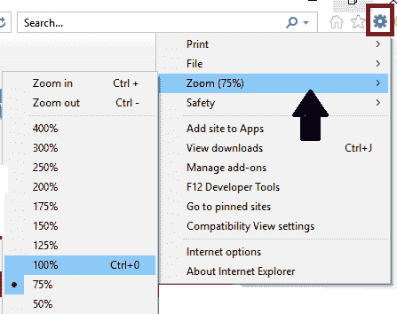

**所有区域的安全级别应该相同:-**

*   转到工具，然后选择**互联网选项**并转到**安全**。

**工具** **？** **互联网选项** **？** **安全**

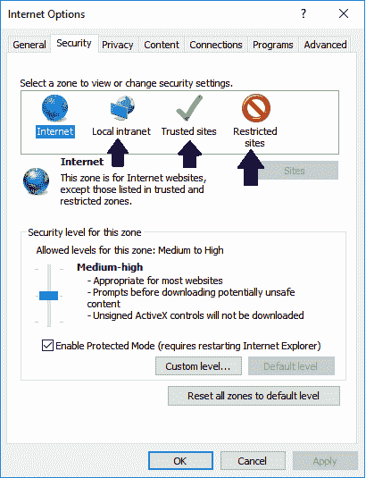

*   为此，我们应该启用为所有区域选择的**保护模式复选框**。

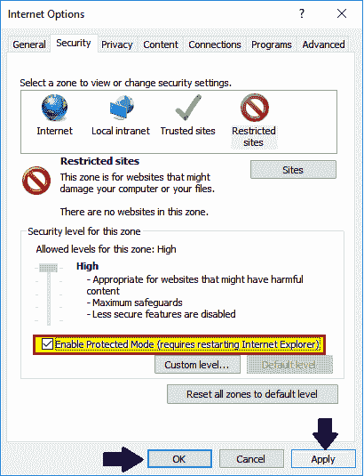

*   现在重新运行测试脚本，并在 IE 浏览器中查看输出。

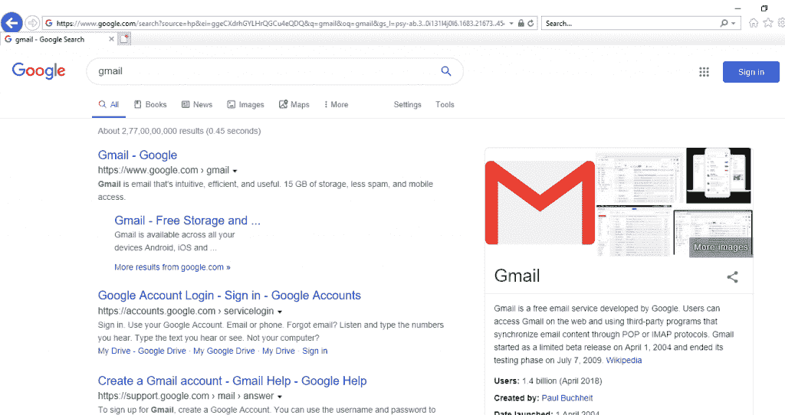

还有一个问题，

**在 64 位窗口平台中运行测试脚本时:-**

*   搜索框里传值的速度是一个一个的敲字母表。
*   在 IE 浏览器中没有进一步的速度问题，我们将在 **32 位**窗口平台中运行我们的测试脚本。
*   要在 **32 位版本**中运行测试脚本，遵循相同的过程，下载 **32 位版本**而不是 64 位。

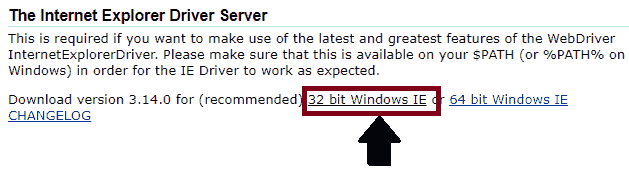

*   然后，将该文件夹下载到您的本地系统，并解压缩该文件夹。

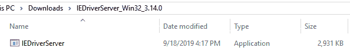

*   并在上面的代码中修改 IE 服务器的系统属性的**值**部分。

**值**= " C:\ \用户\ \ JTP \ \下载\ \**IEDriverServer _ Win32 _ 3 . 14 . 0**\ \ IEDriverServer . exe "

新系统属性将如下所示:

```
// System Property for IE Driver (32-bit)
System.*setProperty*("webdriver.ie.driver","C:\\Users\\JTP\\Downloads\\IEDriverServer_Win32_3.14.0\\IEDriverServer.exe"); 
```

上述测试脚本的所有打印命令的输出将显示在 Eclipse 控制台窗口中。

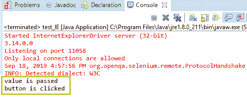