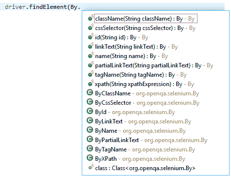
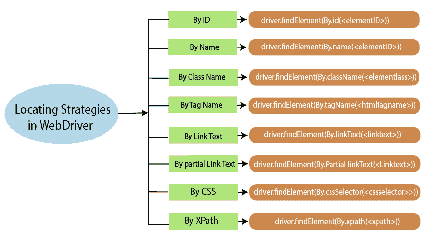

# Selenium 驱动程序-定位器

> 原文：<https://www.tutorialandexample.com/selenium-web-driver-locators/>

**Selenium web driver-Locators**

WebDriver 使用与 selenium -IDE 相同的定位策略来指定 web 元素的位置。

每个定位策略在 Java 中都有定位 web 元素的命令，就像我们在 Java 中使用 WebDriver 一样。

我们将使用 **findElement()** 和 **findElements()** 方法来识别 selenium WebDriver 中的 webelement。

其中 **findElement()** 用于导航< HTML >标签，在定位器的帮助下，它会找到源代码并用来识别单个元素。

如果元素在 Html 源代码中不可用，findElement()将抛出 **NoSuchElement** 异常。

并且， **findElements()** 用于识别多个相似的元素，即使找到单个和多个匹配的元素，它也总是返回 web 元素的列表。

**findElement(由。*定位器*()；**

**注:** **所有的定位器都是以小写开头的方法，这些也是静态方法。**

以下是 Selenium WebDriver 中使用的定位器:

*   **Id 定位器**
*   **名称定位器**
*   **类名定位器**
*   **标签名称定位器**
*   **链接文本定位器**
*   **部分链接文本定位器**
*   **XPath 定位器**
*   **CSS 选择器定位器**

