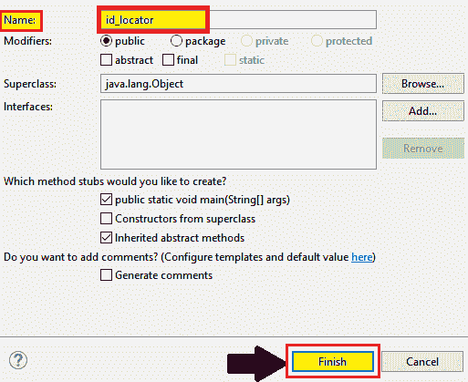
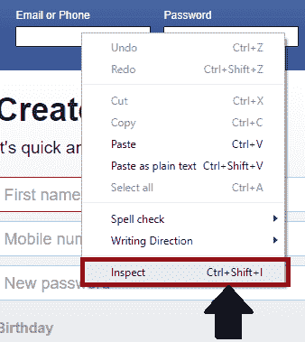
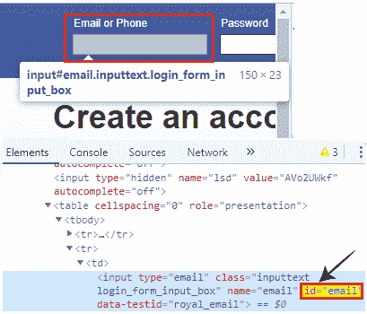
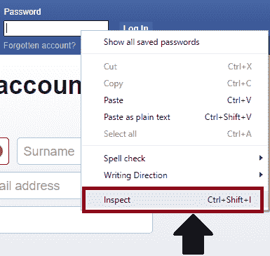
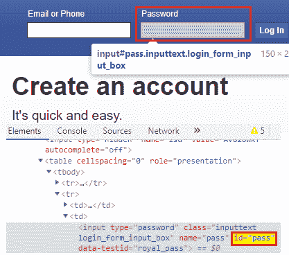
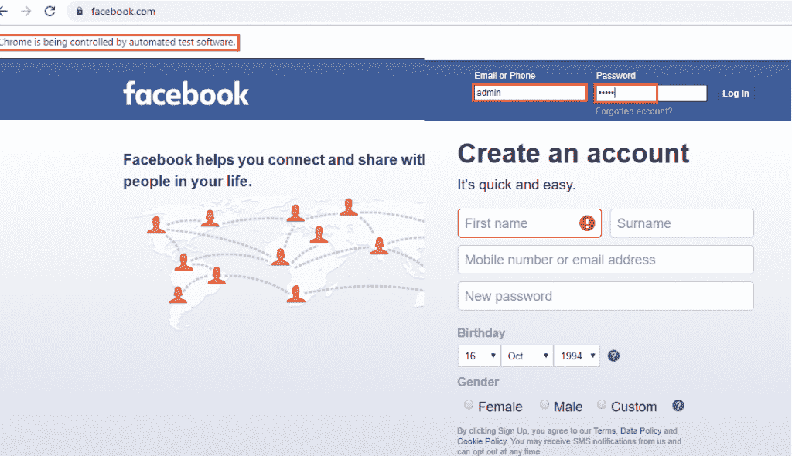

# WebDriver-Id 定位器

> 原文：<https://www.tutorialandexample.com/web-driver-id-locator/>

**网络驱动 Id 定位器:**

ID 定位器用于在 Id 属性的帮助下识别 UI 中的任何 web 元素。

第一个首选项是在检查 web 元素时始终转到 ID 定位器，因为它是唯一的。

**Id 属性的语法如下:**

```
driver.findElement(By.id (“value of id attribute”));
```

让我们看一个样本测试案例，在这个案例中，我们将尝试借助 ID 定位器来识别 web 元素:

| **步骤** | **动作** | **输入** | **预期结果** |
| **1。** | 打开谷歌 Chrome 浏览器。 |   | 应该会打开 Google Chrome 浏览器。 |
| **2。** | 导航至脸书登录页面。 | www.facebook.com | 必须显示脸书登录页面。 |
| **3。** | 识别用户名文本框并传递值。 | 用户名=管理员 | 该值应输入到用户名文本框中。 |
| **4。** | 识别密码文本框并传递值。 | 密码=管理员 | 该值应输入到密码文本框中。 |
| **5。** | 关闭浏览器。 |   | 浏览器应该关闭。 |

*   首先，我们必须启动 Eclipse 并打开现有的测试套件 **new_test，**，这是我们在 [WebDriver 教程](https://www.tutorialandexample.com/selenium-web-driver-tutorial/)的早期会话中创建的。
*   然后，右击 **src** 文件夹，从 **New 创建一个新的类文件？类别**。


*   并将您的类名命名为 **id_locator** 并点击**完成**按钮。



我们正在一步一步地创建我们的测试脚本，让您完全理解如何使用 **ID 定位器**来识别特定的 web 元素。

**第一步:**

 ***   要访问 Google Chrome 浏览器，首先，我们需要下载 Google Chrome 驱动程序，并为 Chrome 驱动程序设置系统属性。
*   我们已经在教程的前几节讨论过这个问题。
*   你也可以参考给定的链接“[使用 Chrome 浏览器](https://www.tutorialandexample.com/selenium-web-driver-google-chrome-browser/)”，以更好地了解我们如何下载它并为 Chrome 驱动程序设置系统属性。

```
// set the system property for chrome browser
System.setProperty("webdriver.chrome.driver", "C:\\Users\\JTP\\Downloads\\chromedriver_win32\\chromedriver.exe");
//create the object for chrome driver
WebDriver driver = new ChromeDriver();
```

**第二步:**

 **之后，我们将导航到给定的 URL

导航所需 URL 的示例代码:

```
//navigate to the URL
driver.get("https://www.facebook.com/");
```

**第三步:**

 **现在，我们试图通过使用 web 元素的 **id 属性**的值来定位所需的 web 元素。

*   首先，右击**用户名**文本框并选择**检查元素**字段。



*   将启动开发者工具窗口，其中包含开发**用户名文本框**按钮时使用的所有特定代码。



*   复制 id 属性的值，即 **email** 。

下面是示例代码:

```
// identify the username text box and pass the value.
driver.findElement(By.id("email")).sendKeys("admin");
Thread.sleep(2000);
System.out.println("user name entered successfully"); 
```

**第四步:**

 ***   要检查我们的下一个 web 元素，请遵循与前面相同的过程。
*   右击**密码文本框**并检查元素选项卡。



*   将启动开发者工具窗口，其中包含开发**密码文本框**按钮时使用的所有特定代码。
*   然后复制其 id 属性的值，即**传**。



下面是示例代码:

```
// identify the password text box and pass the value.
driver.findElement(By.id("pass")).sendKeys("admin");
Thread.sleep(2000);
System.out.println("password entered successfully ");  
```

**第五步:**

 **在样本测试脚本的最后一步，我们将关闭现有的浏览器。

这里是关闭浏览器的示例代码，

```
//Close the browser
driver.close();
```

我们最终的测试脚本将如下所示:

```
packagetestpackage;
 import org.openqa.selenium.By;
 import org.openqa.selenium.WebDriver;
 import org.openqa.selenium.chrome.ChromeDriver;
 public class id_locator {
 public static voidmain(String[] args) throws InterruptedException {
 //set the system property for chrome browser
System.setProperty("webdriver.chrome.driver","C:\\Users\\JTP\\Downloads\\chromedriver_win32\\chromedriver.exe"); 
//create object for chrome driver
WebDriver driver = new ChromeDriver();
// navigate to the url
driver.get("https://www.facebook.com/");
// identify the username text box and pass the value.
driver.findElement(By.id("email")).sendKeys("admin");
Thread.sleep(2000); 
System.out.println("user name entered successfully");
// identify the password text box and pass the value.
driver.findElement(By.id("pass")).sendKeys("admin");
Thread.sleep(2000);
System.out.println("password entered successfully ");
//close the browser
 driver.close();
}
}
```

*   要在 Eclipse 中运行测试脚本，右键单击代码，然后选择 **Run as？Java 应用**。
*   上面的测试脚本将启动 Google Chrome 浏览器，并自动化所有的测试场景。

**********