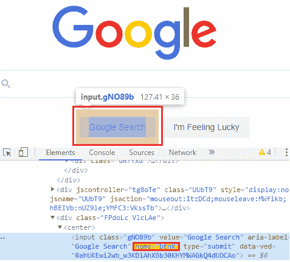

# web 驱动程序名称定位器:

> 原文：<https://www.tutorialandexample.com/web-driver-name-locator/>

**网络驱动程序名称定位器:**

名称定位器用于在**名称**后端属性的帮助下识别 UI 中的任何元素。

**名称属性的语法如下:**

**driver . find element(by . name(" name 属性的值"))；**

让我们看一个示例测试用例，在这个用例中，我们将尝试使用名称定位器来定位 web 元素:

| **步骤** | **动作** | **输入** | **预期结果** |
| **1。** | 打开谷歌 Chrome 浏览器。 |   | 应该会打开 Google Chrome 浏览器。 |
| **2。** | 导航到谷歌主页。 | [www.google.com](https://www.google.com) | 谷歌主页必须显示。 |
| **3。** | 识别搜索文本框并传递值。 | 图图利亚示例 | 该值应输入到搜索文本框中。 |
| **4。** | 点击谷歌搜索按钮。 |   | 应该点击谷歌搜索按钮。 |
| **5。** | 关闭浏览器。 |   | 浏览器应该关闭。 |

*   首先，我们必须启动 Eclipse 并打开现有的测试套件 **new_test，**，这是我们在 [WebDriver 教程](https://www.tutorialandexample.com/selenium-web-driver-tutorial/)的早期会话中创建的。
*   然后右击 **src** 文件夹，从 **New 创建一个新的类文件？类别**。


*   给你的类名命名为 **name_locator** 并点击 **Finish** 按钮。


我们一步一步地创建我们的测试用例，让你完全理解如何使用**名称定位器**来识别一个特定的 web 元素。

**第一步:**

 ***   访问谷歌浏览器。首先，我们需要下载 Google Chrome 驱动程序，并为 Chrome 驱动程序设置系统属性。
*   我们已经在教程的前几节讨论过这个问题。
*   你也可以参考给定的链接“[使用 Chrome 浏览器](https://www.tutorialandexample.com/selenium-web-driver-google-chrome-browser/)”，以更好地了解我们如何下载它并为 Chrome 驱动程序设置系统属性。

```
// set the system property for chrome browser
System.setProperty("webdriver.chrome.driver", "C:\\Users\\JTP\\Downloads\\chromedriver_win32\\chromedriver.exe");
//create the object for chrome driver
WebDriver driver = new ChromeDriver();   
```

**第二步:**

 **之后，我们将导航到给定的 URL。

这里是示例代码，

```
//navigate to the URL
driver.get("https://www.google.com"); 
```

**第三步:**

 **现在，我们试图通过使用其 name 属性的值来定位 Google 搜索文本框。

*   右键单击**谷歌搜索**文本框，并选择检查元素选项卡。


*   开发者工具窗口将被启动，显示所有在开发**谷歌搜索**文本框中使用的特定代码。


*   复制其**名称**属性的值，即“**q .”**

下面是示例代码:

```
//Identify the search text box and pass the value.
 driver.findElement(By.name("q")).sendKeys("tutorialsandexample");
  Thread.sleep(2000);
 System.out.println("user name entered successfully"); 
```

**第四步:**

 ***   右键点击**谷歌搜索**按钮，选择**检查元素**选项卡。


*   开发者工具窗口将被启动，其中包含所有用于开发**谷歌搜索**按钮的特定代码。



*   然后，复制其名称属性的值，即“ **btnK** ”

下面是示例代码:

```
// Click on the Google Search button.
  driver.findElement(By.name("btnK")).click();
 Thread.sleep(2000);
 System.out.println("button is clicked");  
```

**第五步:**

 **在我们的样本测试用例的最后一步，我们将关闭浏览器。

这里是关闭浏览器的示例代码，

```
//Close the browser
 driver.close();   
```

我们最终的测试脚本将如下所示:

```
package testpackage; 
import java.util.concurrent.TimeUnit; 
import org.openqa.selenium.By; 
import org.openqa.selenium.WebDriver; 
import org.openqa.selenium.chrome.ChromeDriver; 
public class name_locator { 
public static void main(String[] args) throws InterruptedException { 
//set the system property  
System.
setProperty("webdriver.chrome.driver","C:\\Users\\JTP\\Downloads\\chromedriver_win32\\chromedriver.exe"); //creating the object for chrome driver  WebDriver driver = new ChromeDriver(); //Navigate to google home page.  driver.get("https://www.google.com"); // identify the search text box and pass the value.
driver.findElement(By.
name("q")).sendKeys("tutorialsandexample"); 
Thread.sleep(2000);
System.out.println("value entered successfully ");
// Click on the google search button.
driver.findElement(By.name("btnK")).click();
Thread.sleep(2000);
System.out.println(" button is clicked");  
//Close the browserdriver.close();
}
} 
```

*   要在 Eclipse 中运行代码，我们必须右键单击代码，然后选择 **Run As？Java 应用程序。**


*   上面的测试脚本将启动 Google Chrome 浏览器，并自动化所有的测试场景。

**********