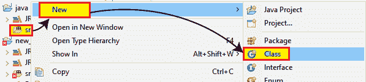
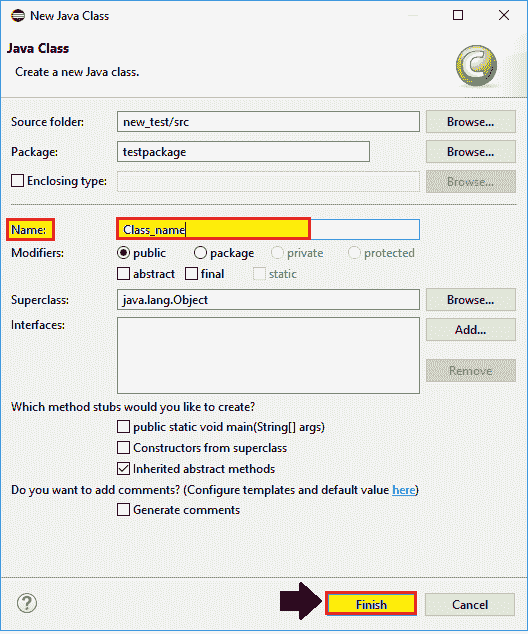
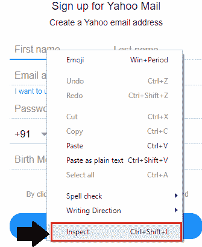
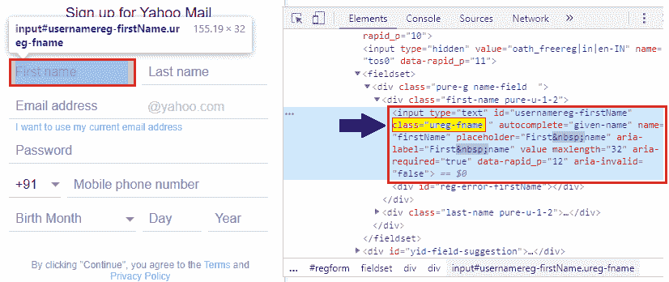
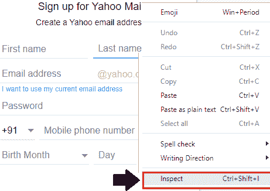
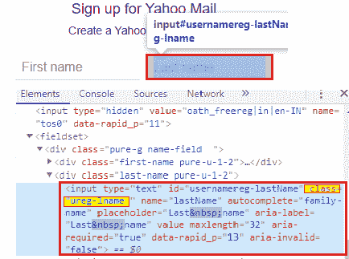
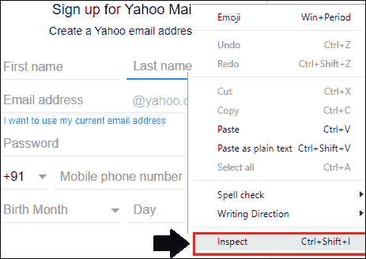

# web driver-类名定位器

> 原文：<https://www.tutorialandexample.com/web-driver-class-name-locator/>

**网络驱动-类名定位器**

在本教程中，我们将学习 selenium WebDriver 的类名定位器。

**类名**定位器用于根据**类**后端属性识别 UI 中的任何元素。

**类名定位器的语法如下:**

**driver . find element(by . class name("类属性的值"))；**

让我们看一个样本测试案例，在这个案例中，我们将尝试在类名定位器的帮助下识别 web 元素，并自动化以下场景:

| **步骤** | **动作** | **输入** | **预期结果** |
| **1。** | 打开谷歌 Chrome 浏览器。 |   | 应该会打开 Google Chrome 浏览器。 |
| **2。** | 导航到雅虎注册页面。 | [https://login.yahoo.com/account/create?done](https://login.yahoo.com/account/create?done)[= https % 3A % 2F % 2 弗洛金。](https://odc.officeapps.live.com/odc/emailhrd?lcid=1033&syslcid=1033&uilcid=1033&app=0&ver=15&build=15.0.4535&p=0&a=1&hm=1&sp=0&fpEnabled=1)[Yahoo . com % 2 faccount % 2 fpersonalinfo&specId = yidReg](https://odc.officeapps.live.com/odc/emailhrd?lcid=1033&syslcid=1033&uilcid=1033&app=0&ver=15&build=15.0.4535&p=0&a=1&hm=1&sp=0&fpEnabled=1) | 必须显示雅虎注册页面。 |
| **3。** | 识别**名字**文本框并传递值。 | 名字=管理员 | 应该标识名字文本框，并且应该传递值。 |
| **4。** | 识别**姓氏**文本框并传递值。 | 姓氏=管理员 | 应该标识姓氏文本框，并且应该传递值。 |
| **5。** | 关闭浏览器。 |   | 浏览器应该关闭。 |

*   首先，我们必须启动 Eclipse 并打开现有的测试套件 **new_test，**，这是我们在[Web](https://www.tutorialandexample.com/selenium-web-driver-tutorial/)D[river tutorial](https://www.tutorialandexample.com/selenium-web-driver-tutorial/)的早期会话中创建的。
*   然后右击 **src** 文件夹，从 **New 创建一个新的类文件？类别**。



*   并给出你的类名为 **Class_name** 并点击 **Finish** 按钮。



**第一步:**

 ***   要访问 Google Chrome 浏览器，首先，我们需要下载 Google Chrome 驱动程序，并为 Chrome 驱动程序设置系统属性。
*   我们已经在教程的前几节讨论过这个问题。
*   你也可以参考给定的链接“[使用 Chrome 浏览器](https://www.tutorialandexample.com/selenium-web-driver-google-chrome-browser/)”，以更好地了解我们如何下载它并为 Chrome 驱动程序设置系统属性。

```
// set the system property for chrome browser
System.setProperty("webdriver.chrome.driver", "C:\\Users\\JTP\\Downloads\\chromedriver_win32\\chromedriver.exe");
//create the object for chrome driver
WebDriver driver = new ChromeDriver();   
```

**第二步:**

 **之后，我们将进入第二步，导航到给定的 URL。

这里是示例代码，

```
//navigate to the URL
 driver.get("https://login.yahoo.com/account/create?done=https%3A%2F%2Flogin.yahoo.com%2Faccount%2Fpersonalinfo&specId=yidReg"); 
```

**第三步:**

 **现在我们试图通过使用名字 web 元素的**类名**属性的值来定位名字 web 元素。

 ***   右键单击**名字**文本框字段，选择**检查元素**来识别 web 元素，如下图所示:



*   看到 Html 代码属于突出显示的**名字**文本框字段，如下图所示:



*   注意上面突出显示的 Html 代码有一个**类属性**。
*   我们使用 class 值作为类名定位器值来标识特定网页上的名字文本框字段。

以下是名字文本框的示例代码:

```
//identify the first-name text box using class name locator and pass the value
driver.findElement(By.className("ureg-fname")).sendKeys("admin");
Thread.sleep(2000);
System.out.println("first name is entered"); 
```

**第四步:**

 ***   要定位我们的下一个 web 元素，右键单击**姓氏**文本框字段，并选择 Inspect 选项以识别 web 元素，如下所示:



*   请注意，Html 代码属于高亮显示的**姓氏**文本框字段，如下图所示:



*   注意上面突出显示的 Html 代码有一个**类**属性
*   我们使用 class 值作为类名定位器来标识特定网页上的姓文本框字段。

下面是示例代码:

```
//identify the last-name text box using class name locator and pass the value
 driver.findElement(By.className("ureg-lname")).sendKeys("admin");
 Thread.sleep(2000);
 System.out.println("last name value is entered"); 
```

**第五步:**

 **在我们的样本测试用例的最后一步，我们将关闭现有的浏览器，

关闭浏览器的示例代码，

```
//Close the browser
driver.close();
```

我们最终的测试脚本将如下所示:

```
package testpackage;
import java.util.concurrent.TimeUnit;
import org.openqa.selenium.By;
import org.openqa.selenium.WebDriver;
import org.openqa.selenium.chrome.ChromeDriver;
public class Class_name {
public static void main(String[] args) throws InterruptedException { 
 //set the system property
System.setProperty("webdriver.chrome.driver","C:\\Users\\JTP\\Downloads\\chromedriver_win32\\chromedriver.exe");
 //creating the object for Chrome driver
 WebDriver driver = new ChromeDriver();
 driver.manage().timeouts().implicitlyWait(20, TimeUnit.SECONDS);
 driver.manage().window().maximize(); 
 //Navigate to Yahoo sign-up page driver.get("https://login.yahoo.com/account/create?done=https%3A%2F%2Flogin.yahoo.com%2Faccount%2Fpersonalinfo&specId=yidReg");
 //identify the first-name text box using class name locator and pass the value
 driver.findElement(By.className("ureg-fname")).sendKeys("admin");
 Thread.sleep(2000);
 System.out.println("first name value is entered");
 //identify the last-name text box using class name locator and pass the value 
 driver.findElement(By.className("ureg-lname")).sendKeys("admin");
 Thread.sleep(2000);
 System.out.println("last name value is entered");
  //closing the browser 
 driver.close();
 }
 } 
```

*   要在 Eclipse 中运行代码，我们必须右键单击代码，然后选择 **Run as？Java 应用程序。**
*   上面的测试脚本将启动 Google Chrome 浏览器，并自动化所有的测试场景。

************