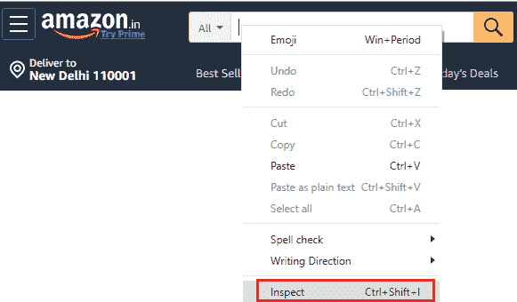

# XPath Axes Selenium WebDriver

> 原文：<https://www.tutorialandexample.com/xpath-axes/>

**XPath 轴**

XPath 轴是用于从当前节点上下文中搜索 XML 文档中的多个节点的轴。

这些方法主要用在没有借助 ID、名称、类名、链接文本、CSS 选择器和 XPath 等来识别 web 元素的时候。定位器。

因为 XPath 轴用于标识在刷新或动态操作时动态变化的 web 元素。

【XPath 轴的语法:

```
//tagname/axes::target elements
```


下面给出了一些通常用于通过 XPath 识别 web 元素的 XPath 轴:

| **XPath 轴** | **描述** | **语法** |
| **孩子** | 遍历**当前 html 标签**的所有**子元素** | //*[attribute = ' value ']/child::tagname |
| **父** | 遍历**当前 html 标签**的所有父元素 | //*[attribute = ' value ']/parent::tagname |
| **跟随** | 遍历当前标签之后**出现的**所有元素**** | //*[属性= '值']/following::标记名 |
| **在**之前 | 遍历当前 html 标签之前**的所有节点**。 | //*[attribute = ' value ']/preceding::tagname |
| **跟随-兄弟姐妹** | 从**当前 Html 标签**遍历到**下一个同辈 Html 标签**。 | //当前 html 标记[@attribute ='value']/following-sibling::sibling 标记[@ attribute = ' value '] |
| **前一个兄弟姐妹** | 从**当前 Html 标签**遍历到**前一个同辈 Html 标签。** | //当前 html 标记[@attribute ='value']/preceding-sibling::previous 标记[@ attribute = ' value '] |
| **祖先** | 遍历所有的**祖先元素**(祖父母、父母等)。)的**当前 html 标签**。 | //*[attribute = ' value ']/祖先::标记名 |
| **后裔** | 遍历所有的**后代元素**(子节点、孙节点等)。)的**当前 Html 标签**。 | //*[attribute = ' value ']/后裔::标记名 |

现在，我们将逐一讨论所有的 XPath，以便让您对该主题有一个完整的理解。

**子节点:**

子 XPath 轴用于定位或识别当前 html 标签的子标签。

**子 XPath 轴的语法:**

```
//*[attribute=’value’]/child::tagname
```

让我们举一个实时例子，我们将尝试识别**子** web 元素。

对于子 XPath 轴，我们从**脸书**应用程序中的注册表单中找到了**注册按钮**。

我们将尝试采取完整的形式，并通过子项目将来到注册按钮。

遵循以下步骤:

*   在你的谷歌浏览器中打开[https://www.facebook.com](https://www.facebook.com/)网址。
*   首先，**检查**的**注册表**，并为其定制 XPath。


然后使用子 XPath 轴，我们将定位**注册按钮，**，如下所示。


然后，您可以复制 XPath 并在其中粘贴您的 java 代码，我们最终的测试脚本将如下所示:

```
package testpackage;
import org.openqa.selenium.By;
import org.openqa.selenium.WebDriver;
import org.openqa.selenium.chrome.ChromeDriver;
public class Child_xpath_axes {
public static void main(String[] args) throws InterruptedException { 
//set the system property            
System.setProperty("webdriver.chrome.driver","C:\\Users\\JTP\\Downloads\\chromedriver_win32\\chromedriver.exe");
//creating the object for Chrome driver  
WebDriver driver = new ChromeDriver();
//Navigate to Facebook application 
driver.get("https://www.facebook.com");
driver.manage().window().maximize(); 
 //using the child XPath axes
driver.findElement(By.xpath("//div[@id='reg_form_box']/child::div[10]")).click();
Thread.sleep(3000);
System.out.println("child axes is clicked");
//closing the browser               
driver.close();
}
} 
```

*   要在 Eclipse 中运行上面的代码，我们必须右键单击代码，然后选择 **Run As？Java 应用程序。**
*   上面的测试脚本将启动 Google Chrome 浏览器，并自动化所有的测试场景。


**父**

父 XPath 轴用于定位或识别当前 html 标签的父标签。

**父 XPath 轴的语法:**

```
//*[attribute=’value’]/parent::tagname
```

让我们举一个实时的例子，在这个例子中，我们将尝试识别**父** web 元素。

对于父 XPath 轴，我们从出现在**谷歌搜索主页的**谷歌搜索按钮**中识别出**搜索文本框**。**

首先，我们将尝试定位 Google 搜索按钮，并通过父轴转到搜索文本框。

遵循以下步骤:

*   在你的谷歌浏览器中打开[https://www.google.com](https://www.google.com/)网址。
*   首先，检查**谷歌搜索按钮**。


然后单击 chropath 并复制 Google Search 按钮的相对 XPath。


现在，我们正在编写 XPath 来使用父 XPath 轴定位 Google 搜索文本框。


然后，您可以复制 XPath 并在其中粘贴您的 java 代码，我们最终的测试脚本将如下所示:

```
package testpackage;
import org.openqa.selenium.By;
import org.openqa.selenium.WebDriver;
import org.openqa.selenium.chrome.ChromeDriver;
public class parent_xpath_axes {
public static void main(String[] args) throws InterruptedException {
//set the system property            
System.setProperty("webdriver.chrome.driver","C:\\Users\\JTP\\Downloads\\chromedriver_win32\\chromedriver.exe"); 
//creating the object for chrome driver  
WebDriver driver = new ChromeDriver();
//Navigate to Google search page
driver.get("https://www.google.com");
driver.manage().window().maximize(); 
//using the parent XPath axes 
driver.findElement(By.xpath("//div[@class='FPdoLcVlcLAe']//input[@name='btnK']/parent::*/parent::*/parent::div[1]//input[@name='q']")).click();
Thread.sleep(3000);
System.out.println("parent axes is clicked");
//closing the browser                                    
driver.close();
}
} 
```

*   要在 Eclipse 中运行上面的代码，我们必须右键单击代码，然后选择 **Run As？Java 应用程序。**
*   上面的测试脚本将启动 Google chrome 浏览器，并自动化所有的测试场景。


**跟随**

在 XPath 之后，轴用于返回当前标记之后的所有元素。

**以下 XPath 轴的语法:**

```
//*[attribute=’value’]/following::tagname
```

让我们举一个实时的例子，在这个例子中，我们将尝试识别跟在之后的**web 元素。**

对于下面的 XPath 轴，我们从出现在**亚马逊主页的**亚马逊搜索文本框**中识别出**畅销书链接**。**

首先，我们将尝试定位畅销书链接，并通过以下坐标轴。

遵循以下步骤:

*   在你的谷歌 Chrome 浏览器中打开 [https://www.amazon.in](https://www.amazon.in/) 网址。
*   首先，检查**亚马逊搜索文本框**。


*   然后单击 chropath 并复制 Amazon Search 按钮的相对 XPath。


现在，我们正在编写 XPath 来使用父 XPath 轴定位 Google 搜索文本框。


然后，您可以复制 XPath 并在其中粘贴您的 java 代码，我们最终的测试脚本将如下所示:

```
package testpackage;
import org.openqa.selenium.By;
import org.openqa.selenium.WebDriver;
import org.openqa.selenium.chrome.ChromeDriver;
public class following_xpath_axes {
public static void main(String[] args) throws InterruptedException {
//set the system property  
System.setProperty("webdriver.chrome.driver","C:\\Users\\JTP\\Downloads\\chromedriver_win32\\chromedriver.exe");
//creating the object for Chrome driver  
WebDriver driver = new ChromeDriver();                                                                              
//Navigate to amazon home page
driver.get("https://www.amazon.in");
driver.manage().window().maximize(); 
//using following XPath axes                  driver.findElement(By.xpath("//input[@id='twotabsearchtextbox']/following::a[contains(text(),'Best Sellers')]")).click();
Thread.sleep(3000);
System.*out*.println("following axes is clicked");
//closing the browser 
driver.close();
}
} 
```

*   要在 Eclipse 中运行上面的代码，我们必须右键单击代码，然后选择 **Run As？Java 应用程序。**
*   上面的测试脚本将启动 Google Chrome 浏览器，并自动化所有的测试场景。


**在**之前

前面的 XPath 轴用于遍历当前 html 标记之前的所有节点。

**前面 XPath 轴的语法:**

```
//*[attribute=’value’]/preceding::tagname
```

让我们举一个实时的例子，在这个例子中，我们将尝试借助前面的轴来识别 web 元素。

对于下面的 XPath 轴，我们从出现在**亚马逊主页的**亚马逊搜索文本框**中识别出 **hello 登录**链接。**

首先，我们将尝试通过前面的轴定位 **hello 登录**链接。

遵循以下步骤:

*   在你的谷歌 Chrome 浏览器中打开 [https://www.amazon.in](https://www.amazon.in/) 网址。
*   首先，**检查****亚马逊搜索文本框**。



*   然后单击 chropath 并复制 amazon Search 按钮的相对 XPath。


现在，我们正在编写 XPath 来使用父 XPath 轴定位 Google 搜索文本框。


然后，您可以复制 XPath 并粘贴您的 java 代码，我们最终的测试脚本将如下所示:

```
package testpackage;
import org.openqa.selenium.By;
import org.openqa.selenium.WebDriver;
import org.openqa.selenium.chrome.ChromeDriver;
public class preceding_xpath_axes {
public static void main(String[] args) throws InterruptedException {
//set the system property            
System.setProperty("webdriver.chrome.driver","C:\\Users\\JTP\\Downloads\\chromedriver_win32\\chromedriver.exe"); 
//creating the object for Chrome driver  
WebDriver driver = new ChromeDriver();
//Navigate to amazon home page
driver.get("https://www.amazon.in");
driver.manage().window().maximize();            
//using preceding XPath axes              driver.findElement(By.xpath("//input[@id='twotabsearchtextbox']/preceding::span[contains(text(),'Hello. Sign in')]")).click();
Thread.sleep(3000); 
System.out.println("preceding axes is clicked");
//closing the browser 
driver.close();
 }
 } 
```

*   要在 Eclipse 中运行上面的代码，我们必须右击代码，然后选择 **Run As** **？** **Java 应用。**
*   上面的测试脚本将启动 Google Chrome 浏览器，并自动化所有的测试场景。


**跟随-兄弟:**

为了使用兄弟元素作为引用来标识元素，我们将从下面的兄弟 XPath 轴中获得帮助。

每当元素不能使用一个或多个属性、父 html 标签和祖父 html 标签来识别时

在这种情况下，我们可以使用 sibling 关键字来唯一地标识元素。

**Following-sibling 关键字**将用于从**当前 html 标签**遍历到**下一个直接 html 标签**。

**跟随兄弟的语法**

```
//current html tag[@attribute =’value’]/following-sibling::sibling tag[@attribute =’value’]
```

让我们考虑上面的例子，我们将尝试识别 UI 中的一个兄弟 web 元素。


我们可以将 Java 代码和动态 XPath 位置一起写成:


**driver.findElement(由。*XPath*("//img[@ src = ' img 1 . png ']/following-sibling::input[@ value = '添加到购物车']")；**

让我们看一个实时的例子来进一步阐明下面的兄弟姐妹的情况:

遵循以下给出的步骤:

*   在你的谷歌 Chrome 浏览器中打开网址: [https://www.amazon.in](https://www.amazon.in/) 。
*   然后转到导航栏，将一个元素作为当前 html 标签，
*   在我们的例子中，我们将**新版本**作为**当前 html 标签，**并在 follow-sibling 的帮助下检查**即时 html 标签，**即特定网页中的**今天的交易**。


同时为跟在兄弟后面的**编写定制的 XPath，以便在控制台窗口中定位元素。**

控制台窗口将突出显示，如您在下面的快照中所见。


然后，您可以复制 XPath 并在其中粘贴您的 java 代码，我们最终的测试脚本将如下所示:

```
package testpackage;
import org.openqa.selenium.By;
import org.openqa.selenium.WebDriver;
import org.openqa.selenium.chrome.ChromeDriver;
public class Following_sibling_xapth_axes {
public static void main(String[] args) throws InterruptedException {
//set the system property System.setProperty("webdriver.chrome.driver","C:\\Users\\JTP\\Downloads\\chromedriver_win32\\chromedriver.exe");
//creating the object for Chrome driver   
WebDriver driver = new ChromeDriver();
//Navigate to amazon home page
driver.get("https://www.amazon.in");
driver.manage().window().maximize();
//using following-sibling XPath axes
driver.findElement(By.xpath("//a[contains(text(),'New Releases')]/following-sibling::a[1]")).click();
Thread.sleep(3000); 
System.out.println("following-sibiling axes is clicked");
//closing the browser 
driver.close();
}
} 
```

*   要在 Eclipse 中运行上面的代码，我们必须右击代码，然后选择 **Run As** **？Java 应用程序。**
*   上面的测试脚本将启动 Google Chrome 浏览器，并自动化所有的测试场景。


**前面的兄弟:**

每当元素不能使用一个或多个属性、父 html 标签和祖父 html 标签来标识时，在这种情况下，我们可以借助前面的兄弟关键字来唯一地标识元素。

**previous-sibling 关键字**将用于从**当前 html 标签**遍历到**前一个 html 标签**。

**前面兄弟的语法:**

```
//current html tag[@attribute =’value’]/preceding-sibling::previous tag[@attribute =’value’]
```

让我们考虑上面的例子，我们将尝试使用 UI 中出现的**前面的兄弟**来识别 web 元素。


遵循以下给出的步骤:

*   在你的谷歌 Chrome 浏览器中打开网址: [https://www.amazon.in](https://www.amazon.in/) 。
*   然后转到导航栏，将一个元素作为当前 html 标签，
*   在我们的例子中，我们将**新发布的**作为**当前的 html 标签，**并检查**以前的 html 标签，**也就是这个特殊的网页示例中的**礼物想法**在前面的兄弟姐妹的帮助下。

同时为**前面的兄弟**编写定制的 XPath 以在控制台窗口中定位元素。

控制台窗口将突出显示，如您在下面的快照中所见。


然后，您可以复制 XPath 并在其中粘贴您的 java 代码，我们最终的测试脚本将如下所示:

```
package testpackage;
import org.openqa.selenium.By;
import org.openqa.selenium.WebDriver;
import org.openqa.selenium.chrome.ChromeDriver;
public class preceding_sibling_Xpath_axes {
public static void main(String[] args) throws InterruptedException {
//set the system property            
System.setProperty("webdriver.chrome.driver","C:\\Users\\JTP\\Downloads\\chromedriver_win32\\chromedriver.exe"); 
//creating the object for Chrome driver  
WebDriver driver = new ChromeDriver();
//Navigate to google search page
driver.get("https://www.amazon.in");
driver.manage().window().maximize(); 
//using preceding-sibling XPath axes
driver.findElement(By.xpath("//a[contains(text(),'New Releases')]/preceding-sibling::a[1]")).click();
Thread.sleep(3000); 
System.out.println("preceding-sibling axes is clicked");
//closing the browser 
driver.close();
}
} 
```

*   要在 Eclipse 中运行上面的代码，我们必须右击代码，然后选择 **Run As** **？Java 应用程序。**
*   上面的测试脚本将启动 Google Chrome 浏览器，并自动化所有的测试场景。


**祖先:**

祖先 XPath 轴用于标识网页中当前 html 标签的**父**和**祖父**标签。

**派生 XPath 轴的语法:**

```
//*[attribute=’value’]/ancestor::tagname
```

让我们举一个实时例子，我们将尝试识别**祖先** web 元素。

对于祖先 XPath 轴，我们找到了第二个字段**，**，它是来自**女性单选按钮**的**姓氏文本框**，出现在**脸书注册表单**应用程序中。

为了定位第二个字段，

首先，我们将识别女性单选按钮，然后寻找祖先，最后定位 web 元素的 XPath。

遵循以下步骤:

*   在你的谷歌浏览器中打开[https://www.facebook.com](https://www.facebook.com/)网址。
*   首先检查**母单选按钮**。


并为其编写定制的 XPath。


现在，我们将从上面的 XPath 中定位祖先，这里显示了 **16 个匹配节点**。


现在，我们正在检查我们的需求在哪个 **div** 下匹配，并完成我们的 XPath。


然后，您可以复制 XPath 并在其中粘贴您的 java 代码，我们最终的测试脚本如下所示:

```
package testpackage;
import org.openqa.selenium.By;
import org.openqa.selenium.WebDriver;
import org.openqa.selenium.chrome.ChromeDriver;
public class Ancestor_xpath_Axes {
public static void main(String[] args) throws InterruptedException {
//set the system property            
System.setProperty("webdriver.chrome.driver","C:\\Users\\JTP\\Downloads\\chromedriver_win32\\chromedriver.exe"); 
//creating the object for Chrome driver  
WebDriver driver = new ChromeDriver();
//Navigate to Facebook search page
driver.get("https://www.facebook.com");
driver.manage().window().maximize(); 
//using ancestor XPath axes                                  driver.findElement(By.xpath("//input[@id='u_0_9']/ancestor::div[2]//input[@name='lastname']")).click();
Thread.sleep(3000); 
System.out.println("Ancestor axes is clicked");
//closing the browser 
driver.close();
}
} 
```

*   要在 Eclipse 中运行上面的代码，我们必须右击代码，然后选择 **Run As** **？Java 应用程序。**
*   上面的测试脚本将启动 Google Chrome 浏览器，并自动化所有的测试场景。


**后裔:**

接下来的 XPath 轴是 descendant，用于标识网页中当前 html 标签的**子标签**和**孙标签**。

**后代 XPath 轴的语法:**

```
//*[attribute=’value’]/descendant::tagname
```

让我们举一个例子，在后代 XPath 轴的帮助下，我们将尝试识别**优惠券**链接。

按照以下步骤概述后代轴:

*   在你的谷歌 Chrome 浏览器中打开 [https://www.amazon.in](https://www.amazon.in/) 网址。
*   以及**查看**亚马逊主页的**导航栏**，


让我们使用相对 XPath 来标识页面的第一个 div 标签:**//div[@ id = ' nav-xshop-container '**

并且，在 chropath 中执行上面的 XPath，注意到 **div 标签**位于开发人员工具控制台窗口上。


之后定制这个 XPath 表达式，借助**后代**轴为**优惠券**编写 XPath。

将 XPath 写入控制台后，它只显示一个匹配的节点，

这意味着我们为特定的 web 元素编写了正确的 XPath，如下面的 snapsort 所示:


然后，您可以复制 XPath 并粘贴您的 java 代码，我们的最终测试脚本如下所示:

```
package testpackage;
import org.openqa.selenium.By;
import org.openqa.selenium.WebDriver;
import org.openqa.selenium.chrome.ChromeDriver;
public class descendant_xpath_axes {
public static void main(String[] args) throws InterruptedException {
//set the system property            
System.setProperty("webdriver.chrome.driver","C:\\Users\\JTP\\Downloads\\chromedriver_win32\\chromedriver.exe"); 
//creating the object for Chrome driver  
WebDriver driver = new ChromeDriver();
//Navigate to Amazon home page
driver.get("https://www.amazon.in");
driver.manage().window().maximize();                                              
//using descendant XPath axes
driver.findElement(By.xpath("//div[@id='nav-xshop-container']/descendant::a[5]")).click();
Thread.sleep(3000); 
System.out.println("descendant axes is clicked");
//closing the browser 
driver.close();
}
} 
```

注:我们也可以根据需要改变索引值，如[1]、[2]和[4]

*   要在 Eclipse 中运行上面的代码，我们必须右击代码，然后选择 **Run As** **？Java 应用程序。**
*   上面的测试脚本将启动 Google Chrome 浏览器，并自动化所有的测试场景。

