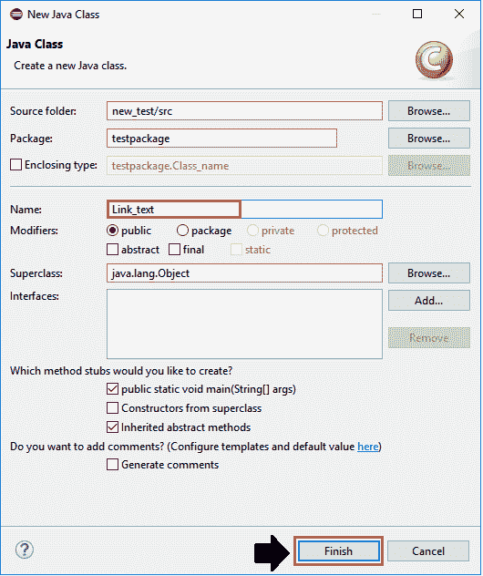
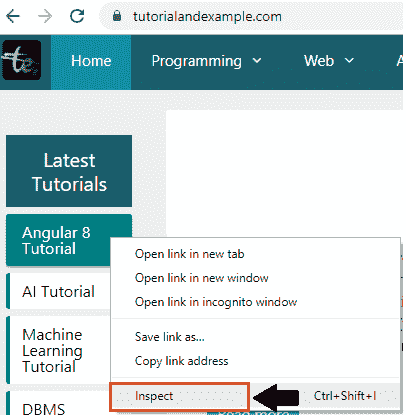
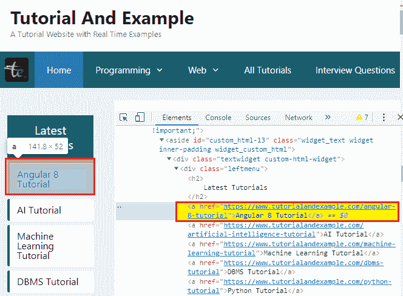
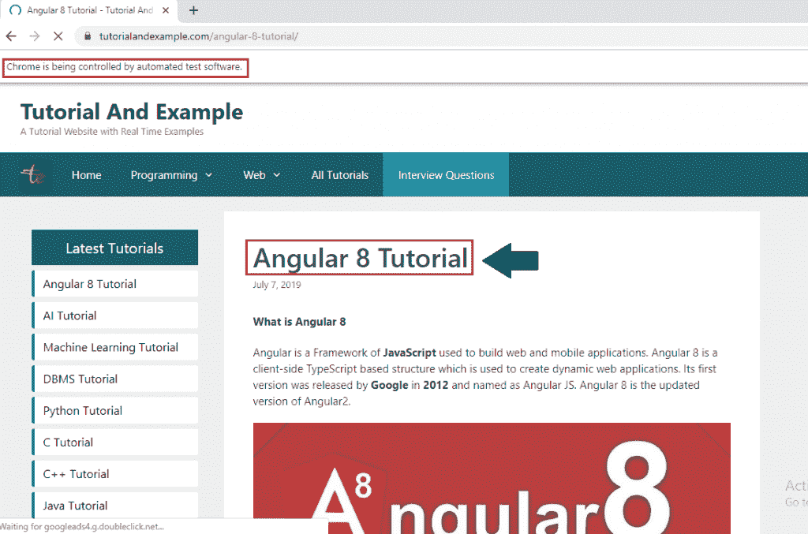

# web 驱动程序-链接文本定位器

> 原文：<https://www.tutorialandexample.com/web-driver-link-text-locator/>

**网络驱动-链接文本定位器**

链接文本定位器用于根据链接的值仅识别 web 链接元素。

链接文本定位器不能用于 Link 元素之外的其他元素。

**链接文本定位器的语法如下:**

```
driver.findElement(By.linkText(“value of the link text attribute”));
```

注意:当有多个链接时，链接文本将优先选择第一个。

让我们看一个样本测试案例，在这个案例中，我们将尝试在**链接文本定位器**的帮助下检查 web 元素，并自动执行以下场景:

| **步骤** | **动作** | **输入** | **预期结果** |
| **1。** | 打开谷歌 chrome 浏览器。 |   | 应该会打开 Google chrome 浏览器。 |
| **2。** | 导航到教程和示例。 | [https://www.tutorialandexample.com](https://www.tutorialandexample.com/) | 教程和例子主页必须显示。 |
| **3。** | 识别 angular 8 教程链接。 |   | 必须打开 angular 8 教程页面。 |
| **4。** | 关闭浏览器。 |   | 浏览器应该关闭。 |

*   在启动 Eclipse 之后，我们将打开现有的测试套件 **new_test** ，它是我们在 WebDriver 教程的早期会话中创建的。
*   然后，右击 **src** 文件夹，从 **New 创建一个新的类文件？类别**。


*   现在，我们将该类保存为 **Link_text** ，并单击**完成**按钮。



现在，我们将一步一步地创建我们的测试用例，以了解如何使用链接文本定位器来识别特定的 web 元素。

**第一步:**

 ***   要首先访问谷歌 Chrome 浏览器，我们需要下载谷歌 Chrome 驱动程序，并为 Chrome 驱动程序设置系统属性。
*   我们已经在教程的前几节讨论过这个问题。
*   您也可以参考给定的链接“ **[使用 Chrome 浏览器](https://www.tutorialandexample.com/selenium-web-driver-google-chrome-browser/)** ”，以便更好地了解我们如何下载它并为 Chrome 驱动程序设置**系统属性**。

```
// set the system property for chrome browser
 System.*setProperty*("webdriver.chrome.driver",
"C:\\Users\\JTP\\Downloads\\chromedriver_win32\\chromedriver.exe");
 //create the object for chrome driver
 WebDriver driver = new ChromeDriver();
```

**第二步:**

 **之后，我们将导航到给定的 URL。

这里是示例代码，

```
//navigate to the URL
driver.get("https://www.tutorialandexample.com");
```

**第三步:**

 **现在我们试图通过使用 link 属性的值来定位**[【angular 8】教程](https://www.tutorialandexample.com/angular-8-tutorial/)** 网页链接。

*   右键单击超链接字段，并选择**检查**选项，以识别网络链接，如下所示。



*   注意，Html 代码属于高亮显示的**超链接**，如下图所示:



*   注意，上面突出显示的 Html 代码在标签之间有一个文本。
*   我们使用链接文本定位器的文本值来定位网页上的超链接。
*   复制出现在标签。

以下是名字超链接的示例代码:

```
//identify the link
driver.findElement(By.linkText("Angular 8 Tutorial")).click();
Thread.sleep(2000);
System.out.println("first name value is entered"); 
```

**第四步:**

 **在我们的样本测试用例的最后一步，我们关闭了 Chrome 浏览器，

关闭浏览器的示例代码，

```
//Closing the browser
 driver.close();
```

我们最终的测试脚本将如下所示:

```
package testpackage;
import java.util.concurrent.TimeUnit;
import org.openqa.selenium.By;
import org.openqa.selenium.WebDriver;
import org.openqa.selenium.chrome.ChromeDriver;
public class Link_text {
public static void main(String[] args) throws InterruptedException {
//set the system property
System.setProperty("webdriver.chrome.driver","C:\\Users\\JTP\\Downloads\\chromedriver_win32\\chromedriver.exe");
 //creating the object for Chrome driver
 WebDriver driver = new ChromeDriver();
 driver.manage().timeouts().implicitlyWait(20, TimeUnit.SECONDS);
 driver.manage().window().maximize();
 //Navigate to tutorial and example home page
 driver.get("https://www.tutorialandexample.com");                                        
//identify the link
 driver.findElement(By.linkText("Angular 8 Tutorial")).click();
 Thread.sleep(2000);
 System.out.println("first name value is entered");
 //closing the browser 
 driver.close();
 }
 } 
```

*   要在 Eclipse 中运行代码，我们必须右键单击代码，然后选择 **Run As？Java 应用程序。**
*   上面的测试脚本将启动 Google chrome 浏览器，并自动化所有的测试场景。

********