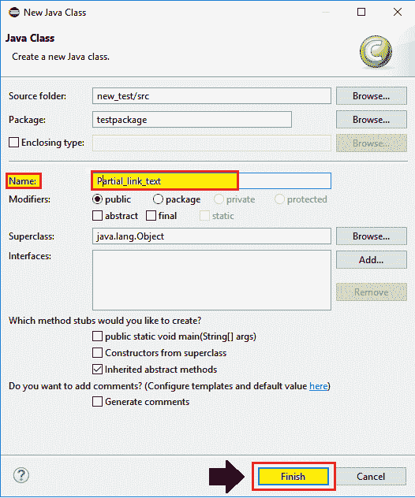
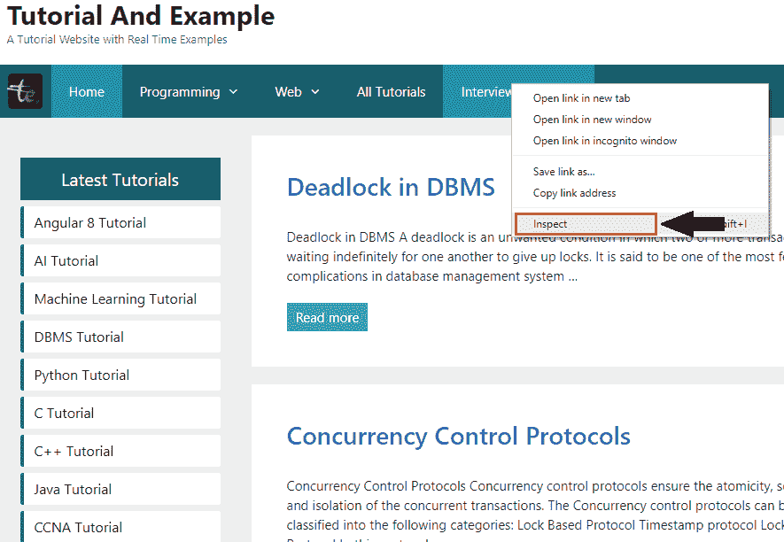
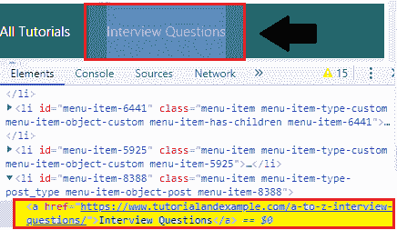
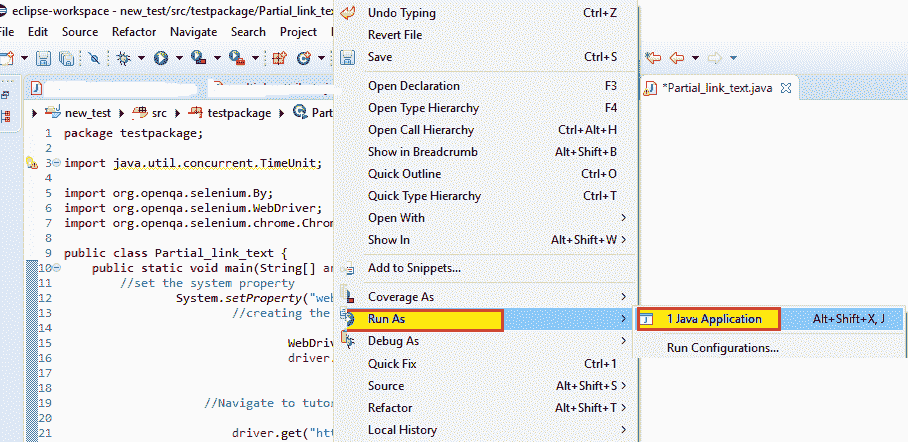
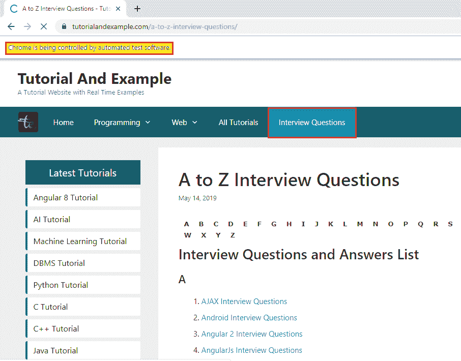

# web driver-部分链接文本定位器

> 原文：<https://www.tutorialandexample.com/web-driver-partial-link-text-locator/>

**网页** D **河流-部分链接文字定位器**

在 selenium WebDriver 中，有一种额外的方法可以在部分链接文本定位器的帮助下找到 web 链接元素。

部分链接文本仅用于根据链接文本的部分来标识 web 链接元素。

部分链接文本定位器不能用于链接元素以外的其他元素。

**部分链接文本定位器的语法如下:**

```
driver.findElement(By.partialLinkText(“value of partial link text”)) ;
```

**注:**部分链接文本和链接文本都用于标识 web 应用上的 web 链接元素。链接文本和部分链接文本之间的区别在于，链接文本用于文本值的精确匹配，而部分链接文本用于 web 链接的长文本值的某个部分。

**必须记住的要点:**

*   每当多个链接有相似的文本时，链接文本和部分链接文本将会得到其他定位器的帮助，比如 XPath 和 CSS 选择器。
*   部分文本和链接文本都区分大小写。
*   部分文本和链接文本也可以用在元素块的内部和外部。

让我们看一个示例测试用例，在这个用例中，我们将尝试使用**部分链接文本**定位器来定位 web 链接元素，并自动执行以下场景:

| **步骤** | **动作** | **输入** | **预期结果** |
| **1。** | 打开谷歌 Chrome 浏览器。 |   | 应该会打开 Google Chrome 浏览器。 |
| **2。** | 导航到教程和示例网站。 | [https://www.tutorialandexample.com](https://www.tutorialandexample.com/) | 必须显示教程和示例主页。 |
| **3。** | 识别面试问题教程链接。 |   | 必须打开面试问题页面。 |
| **4。** | 关闭浏览器。 |   | 浏览器应该关闭。 |

*   在启动 Eclipse 之后，我们将打开现有的测试套件 **new_test** ，这是我们在 [Web](https://www.tutorialandexample.com/selenium-web-driver-tutorial/) D [river 教程](https://www.tutorialandexample.com/selenium-web-driver-tutorial/)的早期会话中创建的。
*   然后，右击 **src** 文件夹，从 **New 创建一个新的类文件？类别**。


*   现在，我们将保存类名为 **partial_Link_text** 并点击**完成**按钮。



现在，我们将一步一步地创建我们的测试用例，以了解如何使用部分链接文本定位器来识别特定的 web 元素。

**第一步:**

 ***   要首先访问谷歌 Chrome 浏览器，我们需要下载谷歌 Chrome 驱动程序，并为 Chrome 驱动程序设置系统属性。

我们已经在教程的前几节讨论过这个问题。你也可以参考给定的链接“[使用 Chrome 浏览器](https://www.tutorialandexample.com/selenium-web-driver-google-chrome-browser/)”，以更好地了解我们如何下载它并为 Chrome 驱动程序设置系统属性。

```
// set the system property for chrome browser
System.*setProperty*("webdriver.chrome.driver", "C:\\Users\\JTP\\Downloads\\chromedriver_win32\\chromedriver.exe");
//create the object for chrome driver
WebDriver driver = new ChromeDriver();   
```

**第二步:**

 **之后，我们将进入第二步，导航到所需的 URL，

下面是示例代码:

```
//navigate to the URL
 driver.get("https://www.tutorialandexample.com"); 
```

**第三步:**

 **现在，我们试图通过使用其部分链接文本属性的值来定位**面试问题** web 链接。

 ***   右键单击超链接字段并选择**检查**选项来识别网页链接，如下所示。



*   请注意，Html 代码属于高亮显示的**超链接**，如下图所示:



*   注意，上面突出显示的 Html 代码在标签之间有一个文本。我们使用这个文本值作为链接文本定位器来定位网页上的超链接。

*   复制出现在 标签。

以下是名字超链接的示例代码:

```
//identify the partial linktext
driver.findElement(By.partialLinkText("Interview")).click();
Thread.sleep(2000);
System.out.println("first name value is entered"); 
```

**第四步:**

 **在我们的样本测试用例的最后一步，我们将关闭 Chrome 浏览器，

关闭浏览器的示例代码，

```
//Closing the browser
driver.close();   
```

我们最终的测试脚本将如下所示:

```
package testpackage;
 import java.util.concurrent.TimeUnit;
 import org.openqa.selenium.By;
 import org.openqa.selenium.WebDriver;
 import org.openqa.selenium.chrome.ChromeDriver;
 public class Partial_link_text {
 public static void main(String[] args) throws InterruptedException {
 //set the system property 
System.setProperty("webdriver.chrome.driver","C:\\Users\\JTP\\Downloads\\chromedriver_win32\\chromedriver.exe");
 //creating the object for Chrome driver  
  WebDriver driver = new ChromeDriver();
 driver.manage().window().maximize(); 
 //Navigate to tutorial and example home page
 driver.get("https://www.tutorialandexample.com");
 //identify the web link using partial link text 
 driver.findElement(By.partialLinkText("Interview")).click();
 Thread.sleep(2000);
 System.out.println("first name value is entered");
 //closing the browser 
 driver.close();
 }
 } 
```

*   要在 Eclipse 中运行测试脚本，右键单击代码，然后选择 **Run as？Java 应用程序。**



*   上面的测试脚本将启动 Google Chrome 浏览器，并自动化所有的测试场景。

**********