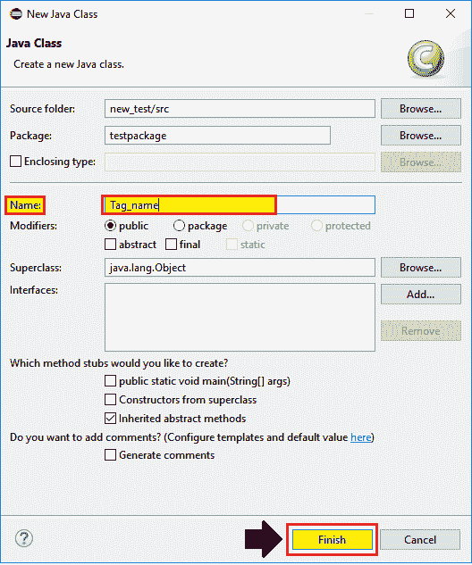
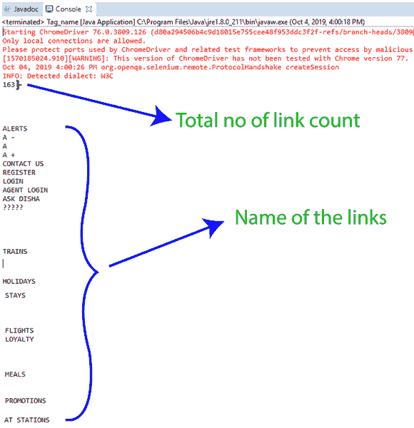

# web driver-标签名称定位器

> 原文：<https://www.tutorialandexample.com/web-driver-tag-name-locator/>

**Selenium WebDriver-Tag 名称定位器**

标记名定位器与 findElements()方法一起使用，以标识 UI 中的多个相似元素。

用于借助标签名定位 web 元素，如**输入标签**、**锚标签**、**按钮标签、**等。在网页上。

**标签名定位器的语法如下:**

```
driver.findElement(By.tagName(“value of tag name”));
```

让我们看一个样本测试案例，在这个案例中，我们将尝试使用**标签名称定位器**来识别标签元素，以自动化以下场景:

| **步骤** | **动作** | **输入** | **预期结果** |
| **1。** | 打开谷歌 Chrome 浏览器。 |  | 应该会打开 Google Chrome 浏览器。 |
| **2。** | 导航到 **Irctc** 应用程序主页。 | [https://www.irctc.co.in/](https://www.irctc.co.in/) | 必须显示 irctc 主页。 |
| **3。** | 打印文本值的**大小**和名称。 |  | 应该显示文本值的大小和名称。 |
| **4。** | 关闭浏览器。 |  | 浏览器应该关闭。 |

*   启动 Eclipse 之后，我们将打开现有的测试套件 **new_test** ，它是我们在 WebDriver 教程的早期创建的。
*   然后，右击 **src** 文件夹，从 **New 创建一个新的类文件？类别**。


*   现在，我们将保存类名为 **Tag_name** 并点击 **Finish** 按钮。



现在，我们将一步一步地创建我们的测试用例，以便对如何使用**标签名**定位器来识别 web 元素有一个总体的了解。

**第一步:**

 ***   要首先访问谷歌 Chrome 浏览器，我们需要下载谷歌 Chrome 驱动程序，并为 Chrome 驱动程序设置系统属性。
*   我们已经在之前的 [Selenium WebDriver 教程](https://www.tutorialandexample.com/selenium-web-driver-tutorial/)中讨论过这个问题。你也可以参考给定的链接“[使用 Chrome 浏览器](https://www.tutorialandexample.com/selenium-web-driver-google-chrome-browser/)”，以更好地了解我们如何下载它并为 Chrome 驱动程序设置系统属性。

```
// set the system property for chrome browser
System.*setProperty*("webdriver.chrome.driver","C:\\Users\\JTP\\Downloads\\chromedriver_win32\\chromedriver.exe");
//create the object for chrome driver
WebDriver driver = new ChromeDriver();    
```

**第二步:**

 **之后，我们将进入第二步，导航到给定的 URL。

这里是示例代码，

```
//navigate to the URL
driver.get("https://www.irctc.co.in/nget/train-search "); 
```

**第三步:**

 **现在，我们试图通过使用标签名称定位器，使用**锚标签**来定位 web 链接计数和链接名称。

 **```
//locating the number of links using anchor tag
List<WebElement> lst= driver.findElements(By.tagName("a"));
//print the link count
System.out.println(lst.size());
//display all the link names
 for(int i=0; i<lst.size();i++)
 {
String linkname=lst.get(i).getText(); 
// print the link name
System.out.println(linkname);
}
```

**第四步:**

 ***   在我们的样本测试用例的最后一步，我们将终止现有的浏览器，

关闭浏览器的示例代码，

```
//Close the browser
 driver.close(); 
```

我们最终的测试脚本将如下所示:

```
package testpackage;
import java.util.List;
import org.openqa.selenium.By;
import org.openqa.selenium.WebDriver;
import org.openqa.selenium.WebElement;
import org.openqa.selenium.chrome.ChromeDriver;
public class Tag_name { 
public static void main(String[] args) throws InterruptedException {
//set the system property            
System.setProperty("webdriver.chrome.driver","C:\\Users\\JTP\\Downloads\\chromedriver_win32\\chromedriver.exe");
//creating the object for Chrome driver  
WebDriver driver = new ChromeDriver(); 
driver.manage().window().maximize(); 
//Navigate to the home page irctc application
driver.get("https://www.irctc.co.in");
//locating the number of links 
 List<WebElement> lst= driver.findElements(By.*tagName*("a"));
//print the link count
System.out.println(lst.size()); 
//display all the link names
for(int i=0; i<lst.size();i++)
{
 String linkname=lst.get(i).getText();
// print the link name
 System.out.println(linkname); 
 }
//close the driver
driver.close();
}
} 
```

*   要在 Eclipse 中运行测试脚本，右键单击代码，然后选择 **Run as？Java 应用程序。**
*   在自动化所有测试场景之后，我们可以在 Eclipse 控制台窗口中看到打印命令的输出，如下图所示。

**********