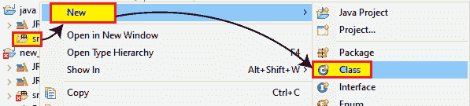

# Selenium WebDriver-CSS 选择器:标签和类

> 原文：<https://www.tutorialandexample.com/selenium-web-driver-css-selector-tag-and-class/>

**Selenium WebDriver-CSS 选择器:标签和类**

在本节教程中，我们将借助**标签和类** CSS 选择器来定位 web 元素

其中**标签和类**用于通过标签名使用**来查找 web 元素。]** 符号来定位类属性。

**标签和类属性的语法如下:**

```
“tag.class”
Or
“.class” 
```

其中**标签**= web 元素的 html 标签。

**【的。]**=当 CSS 选择器包含其 Class 属性时，使用点符号。

**Class** =表示其 Class 属性的值。

让我们举一个例子，其中将执行 CSS 选择器的标签和类属性:

| **步骤** | **动作** | **输入** | **预期结果** |
| **1。** | 打开 Firefox 浏览器。 |   | Firefox 浏览器应该会打开。 |
| **2。** | 导航到雅虎登录页面。 | [www.yahoo.com](http://www.yahoo.com) | 必须显示雅虎登录页面。 |
| **3。** | 识别**用户名文本框**并传递值。 | [【电子邮件保护】](/cdn-cgi/l/email-protection) | 应该输入该值。 |
| **4。** | 关闭浏览器。 |   | 浏览器应该关闭。 |

*   首先，我们必须启动 Eclipse 并打开现有的测试套件 **new_test** ，这是我们在 WebDriver 教程的早期会话中创建的。
*   然后右击 **src** 文件夹，从 **New** 创建一个新的类文件？**级**。



*   给你的类名命名为 **Tag_and_class** 并点击 **Finish** 按钮。


我们正在一步一步地创建我们的测试用例，让你完全理解如何使用**标签和**类定位器来识别一个特定的 web 元素。

**第一步:**

 ***   要首先访问 Firefox 浏览器，我们需要下载 gecko 驱动程序，并为 gecko 驱动程序设置系统属性。
*   我们已经在教程的前几节讨论过这个问题。你也可以参考给定的链接[“使用 Firefox 浏览器”](https://www.javatpoint.com/selenium-webdriver-running-test-on-firefox-browser-gecko-driver)来更好地了解我们如何下载它并为 Chrome 驱动程序设置系统属性。

```
// System Property for gecko Driver   
System.*setProperty*("webdriver.gecko.driver","C:\\Users\\JTP\\Downloads\\geckodriver-v0.25.0-win64\\geckodriver.exe");
// create an object for FirefoxDriver class.       
WebDriver driver=new FirefoxDriver();   
```

**第二步:**

 **之后，我们将编写代码来自动化第二步，即导航到给定的 URL。

导航所需 URL 的示例代码:

```
//navigate to the URL
driver.get(“https://login.yahoo.com”); 
```

**第三步:**

 **现在，我们试图通过使用它的标签**和类属性**的值来定位想要的 web 元素。

*   然后，右击**用户名文本框**，然后选择**检查元素**。


*   它将启动一个窗口，其中包含在开发**用户名**文本框中使用的所有特定代码。


其中**标签**值为**输入**，其**类**属性的值为**电话号码**

下面是示例代码:

```
//identify the username text box and pass the value.
driver.findElement(By.*cssSelector*("input.phone-no")).sendKeys("admin"); 
Thread.*sleep*(3000);
System.*out*.println("username value is entered"); 
```

**第四步:**

 **我们的示例测试用例的最后一步是关闭浏览器。

这里是关闭浏览器的示例代码，

```
//Close the browser
driver.close();   
```

我们最终的测试脚本将如下所示:

```
package testpackage;
import java.util.List;
import org.openqa.selenium.By;
import org.openqa.selenium.WebDriver;
import org.openqa.selenium.WebElement;
import org.openqa.selenium.chrome.ChromeDriver;
import org.openqa.selenium.firefox.FirefoxDriver;
public class Tag_and_class {
public static voclass main(String[] args)throws InterruptedException {
//set the system property
System.*setProperty*("webdriver.gecko.driver","C:\\Users\\JTP\\Downloads\\geckodriver-0.25.0-in64\\geckodriver.exe");
// create driver object for gecko browser              
WebDriver driver=new FirefoxDriver();
driver.manage().window().maximize(); 
//Navigate to yahoo login page              
driver.get("https://login.yahoo.com"");
// identify the username text box and pass the value.
driver.findElement(By.*cssSelector*("input.phone-no")).sendKeys("[email protected]");
 Thread.*sleep*(3000);
System.*out*.println("username value is entered");
//close the browser
driver.close();
}
} 
```

*   要在 Eclipse 中运行上面的代码，我们必须右键单击代码，然后选择 **Run As** ？ **Java 应用。**


*   上面的测试脚本将启动 Firefox 浏览器，并自动化所有的测试场景。

********