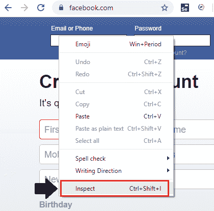

# Selenium WebDriver-CSS 选择器:标签和属性

> 原文：<https://www.tutorialandexample.com/selenium-web-driver-css-selector-tag-and-attribute/>

**Selenium WebDriver-CSS 选择器:标签和属性**

在本节教程中，我们将借助**标签和属性** CSS 选择器来定位 web 元素。

其中 Tag 和 attribute 用于通过 web 元素的**标记名**和**属性**来查找 web 元素。

**标签和属性的语法如下:**

```
Tagname[attribute=’value’]
```

其中**标签名**= web 元素的 html 标签。

**[ ]** =方括号用于放置特定属性的值。

**属性** = id，class，name，它们的值可以作为一个属性。

**值**=所选属性的值。

让我们举一个例子，我们将对 CSS 选择器定位器的**标签和属性**执行操作:

| **步骤** | **动作** | **输入** | **预期结果** |
| **1。** | 打开谷歌 Chrome 浏览器。 |   | 应该会打开 Google Chrome 浏览器。 |
| **2。** | 导航至脸书登录页面。 | [https://www.facebook.com](https://www.facebook.com/) | 必须显示脸书登录页面。 |
| **3。** | 识别**用户名**文本框并传递值。 | [【电子邮件保护】](/cdn-cgi/l/email-protection) | 应该标识用户名文本框，并且应该输入值。 |
| **4。** | 识别**密码**文本框并传递值。 | 密码=1234#45 | 应该识别密码文本框，并输入值。 |
| **5。** | 关闭浏览器。 |   | 浏览器应该关闭。 |

*   首先，我们必须启动 Eclipse 并打开现有的测试套件 **new_test** ，这是我们在 WebDriver 教程的早期会话中创建的。
*   然后，右击 **new_test** 文件夹，从 **New** 创建一个新的类文件？**阶级。**


*   给你的类名命名为 **Tag_and_attribute** 并点击 **Finish** 按钮。


我们正在一步一步地创建我们的测试用例，让您完全理解用于识别特定 web 元素的**标签和属性**定位器。

**第一步:**

 ***   要首先访问谷歌 chrome 浏览器，我们需要下载 chrome 驱动程序，并为 Chrome 驱动程序设置系统属性。
*   我们已经在教程的前几节讨论过这个问题。你也可以参考给定的链接“使用 Chrome 浏览器”来更好地理解我们是如何下载和设置它的系统属性的。

```
// System Property for chrome Driver   
System.*setProperty*("webdriver.chrome.driver","C:\\Users\\JTP\\Downloads\\chromedriver_win32\\chromedriver.exe");
// create an object for Chrome Driver 
WebDriver driver=new ChromeDriver();   
```

**第二步:**

 **之后，我们将编写代码来自动化我们的第二步，这是用来导航给定的 URL。

导航所需 URL 的示例代码:

```
//navigate to the URL
driver.get(“https://www.facebook.com”); 
```

**第三步:**

 **为了定位脸书登录页面的用户名文本框，我们将使用其标签**和**名称属性**的值，如下所示:**

*   右击**用户名文本框**并点击**检查元素**。



*   它将启动一个开发者工具窗口，其中包含所有特定的代码，这些代码用于开发**用户名**文本框。


其中**标签名称**的值是**输入**，其**名称属性**的值是**电子邮件。**

下面是示例代码:

```
//identify the username text box and pass the value.
driver.findElement(By.*cssSelector*("input[name=email]")).sendKeys("[email protected]");
Thread.*sleep*(3000);
System.*out*.println("username value is entered"); 
```

**第四步:**

 **为了定位脸书登录页面的密码文本框，我们将使用其**标签**和**名称属性**的值为:

*   首先，右击**密码文本框**，点击**检查元素**字段。


*   它将启动一个开发者工具窗口，该窗口包含所有用于开发**密码**文本框的特定代码。


其中**标签**的值为**输入，**，其**名称属性**的值为**通过。**

下面是示例代码:

```
//identify the password text box and pass the value.    
driver.findElement(By.*cssSelector*("input[name=pass]")).sendKeys("[email protected]");
Thread.*sleep*(3000);
System.*out*.println("password value is entered"); 
```

**第五步:**

 **在我们的样本测试用例的最后一步，我们将关闭现有的浏览器。

```
//Close the browser
driver.close();   
```

我们最终的测试脚本将如下所示:

```
package testpackage;
import java.util.concurrent.TimeUnit;
import org.openqa.selenium.By;
import org.openqa.selenium.WebDriver;
import org.openqa.selenium.chrome.ChromeDriver;
public class Tag_and_attribute {
public static void main(String[] args)throws InterruptedException {
System.*setProperty*("webdriver.chrome.driver",
"C:\\Users\\JTP\\Downloads\\chromedriver_win32\\chromedriver.exe");                         
// create an object for Chrome Driver    
WebDriver driver = new ChromeDriver();
driver.manage().window().maximize();
driver.manage().timeouts().implicitlyWait(10,TimeUnit.*SECONDS*);
//navigate to the URL
driver.get("https://www.facebook.com");
//Identify the username textbox and passing the value
driver.findElement(By.*cssSelector*("input[name=email]")).sendKeys("[email protected]");
Thread.*sleep*(3000);
System.*out*.println("username value is entered");
 //identify the password text box and passing the value
driver.findElement(By.*cssSelector*("input[name=pass]")).sendKeys("[email protected]");
Thread.*sleep*(3000);
System.*out*.println("password value is entered");
//close the browser
 driver.close();
}
} 
```

*   要在 Eclipse 中运行上面的代码，我们必须右键单击代码，然后选择 **Run As** ？ **Java 应用。**

*   从下面的截图中我们可以看到，上面的测试脚本将启动 Google Chrome 浏览器，并自动执行所有的测试场景。

**********