# Selenium WebDriver-CSS 选择器:子串匹配

> 原文：<https://www.tutorialandexample.com/selenium-web-driver-css-selector-substring-matching/>

**CSS 选择器:匹配 Selenium WebDriver 的子串**

在本教程中，我们将学习如何使用**子串**方法识别 web 元素。

子字符串包含唯一标识 web 元素的三种方法。

子字符串方法如下

*   **包含(*)**
*   **以(^)开头**
*   **以($)结尾**

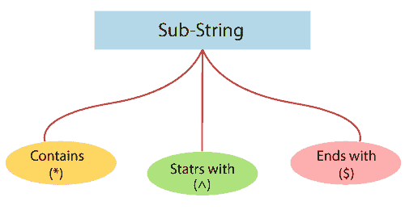

让我们讨论以下这些方法，让你有一个完整的了解:

**包含(*):**

Contains 方法用于使用 ***(即星号)**符号来标识 web 元素。

**contains 方法的语法:**

标记名[attribute*= '部分属性值']

**其中，**

**[*]**=星号符号用于标识特定属性是否包含任何值。

让我们举一个例子来让你更好的理解使用*符号的 **Contains()方法，我们创建了一个样本测试脚本如下；**

| **步骤** | **动作** | **输入** | **预期结果** |
| **1。** | 打开谷歌 Chrome 浏览器。 |   | 应该会打开 Google Chrome 浏览器。 |
| **2。** | 导航到 Rediff 登录页面。 | [https://mail.rediff.com/cgi-bin/login.cgi](https://mail.rediff.com/cgi-bin/login.cgi)T2】 | 必须显示 Rediff 登录页面。 |
| **3。** | 识别用户名文本框并传递值。 | [【电子邮件保护】](/cdn-cgi/l/email-protection) | 应该标识用户名文本框，并且应该输入值。 |
| **4。** | 识别密码文本框并传递值。 | [【电子邮件保护】](/cdn-cgi/l/email-protection) | 应该识别密码文本框，并输入值。 |
| **5。** | 确定并单击“go”按钮。 |   | 应该单击“go”按钮。 |
| **6。** | 关闭浏览器。 |   | 浏览器应该关闭。 |

*   首先，我们必须启动 Eclipse 并打开现有的测试套件 **new_test** ，这是我们在 WebDriver 教程的早期会话中创建的。
*   然后，右击 **new_test** 文件夹，从 **New à Class 创建一个新的类文件。**

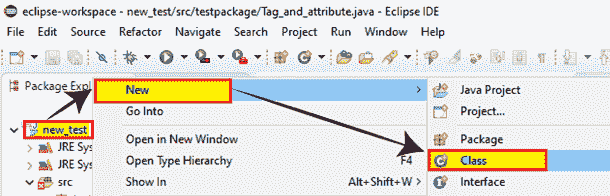

*   并将您的类名命名为 **Sub_string** 并点击**完成**按钮。

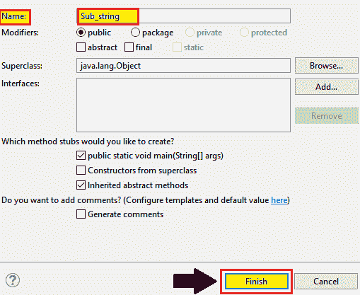

**第一步:**

 ***   要首先访问谷歌 chrome 浏览器，我们需要下载 chrome 驱动程序，并为 Chrome 驱动程序设置系统属性。
*   我们已经在本教程的前几节中讨论过这个问题。
*   你也可以参考给定的链接“[使用 Chrome browse](https://www.tutorialandexample.com/selenium-web-driver-google-chrome-browser/) r”来更好地理解我们是如何下载它并为它设置系统属性的。

```
//SystemPropertyforchromeDriver&nbsp
System.setProperty("webdriver.chrome.driver","C:\\Users\\JTP\\Downloads\\chromedriver_win32\\chromedriver.exe");
//create an object forChrome Driver
WebDriverdriver=newChromeDriver(); 
```

**第二步:**

 ***   之后，我们将导航到给定的 URL。

导航所需 URL 的示例代码:

```
//navigate to the URL
driver.get(“https://mail.rediff.com/cgi-bin/login.cgi”); 
```

**第三步:**

 **要定位 Rediff 登录页面的用户名文本框，

*   首先，右击**用户名文本框**，选择**检查元素**。

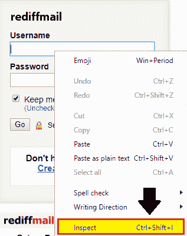

*   将会启动开发工具窗口，显示开发**用户名**文本框时使用的所有特定代码。

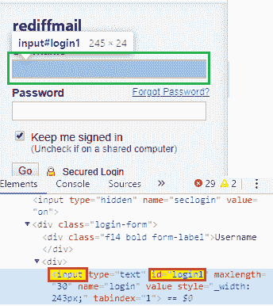

其中**标签名称**值为**输入，**，其 **id 属性**的值为 **login1。**

在使用 Contains()方法时，我们将获取 **id 属性的部分值，即“logi”**

这里是示例代码，

```
driver.findElement(By.cssSelector("input[id*='logi']")).sendKeys("admin");        
```

**第四步:**

 **用于定位 Rediff 登录页面的**密码**文本框，
T3】

*   右击密码文本框，选择**检查元素**字段。

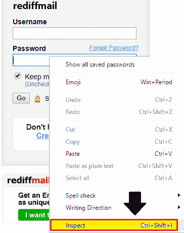

*   将启动开发者工具窗口，其中包含开发**密码**文本框时使用的所有特定代码。

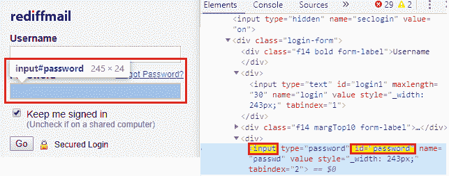

其中**标签名**的值为**输入、**，其 **id 属性**的值为**密码。**

在使用 **Contains()** 方法时，我们将取 **id 属性**的部分值，即“ **passwo”**

这里是示例代码，

```
driver.findElement(By.cssSelector("input[id*='passwo]")).sendKeys("admin");
```

**第五步:**

 **为了识别 Rediff 登录页面的 **Go 按钮**，

*   首先，我们将右击 **Go 按钮**并选择 **Inspect 元素**。

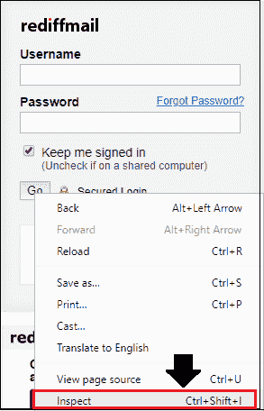

*   将启动开发者工具窗口，其中包含开发 **Go** 按钮时使用的所有特定代码。

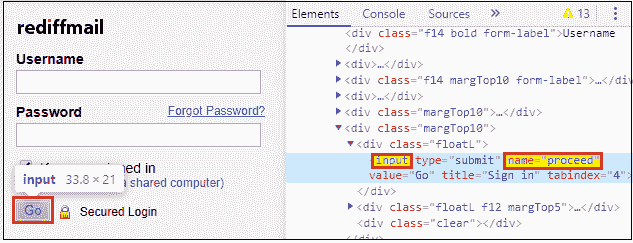

其中**标签名称**的值是**输入，**并且其**名称属性**的值是**继续。**

在使用 **Contains()** 方法时，我们将取其**名称属性**的部分值，即“ **proc”**

这里是示例代码，

```
driver.findElement(By.cssSelector("input[name*='proc']")).click();
```

**第六步:**

 **在最后一步，我们将关闭现有的浏览器。

```
//Close the browser
driver.close();
```

我们最终的测试脚本如下所示:

```
package testpackage;
import java.util.concurrent.TimeUnit;
import org.openqa.selenium.By;
import org.openqa.selenium.WebDriver;
import org.openqa.selenium.chrome.ChromeDriver;
public class Sub_string {
public static void main(String[] args) {
//set the system property for chrome driver
System.setPropert("webdriver.chrome.driver", "C:\\Users\\JTP\\Downloads\\chromedriver_win32\\chromedriver.exe");
//creating the object for chrome driver 
WebDriver driver = new ChromeDriver();
//maximize the browser size 
driver.manage().window().maximize(); 
//navigate to the URL
driver.get("https://mail.rediff.com/cgi-bin/login.cgi");
//Identify the username textbox and pass the value
driver.findElement(By.cssSelector("input[id*='logi']")). sendKeys("[email protected]");
System.out.println("username value is entered");
//Identify the password text box and pass the value
driver.findElement(By.cssSelector("input[id*='passwo']")).sendKeys("admin");
System.out.println("password value is entered");
//identify the go button
driver.findElement(By.cssSelector("input[name*='proc']")).click();
System.out.println("go button is cliked");
//close the browser
driver.close();
} 
} 
```

要在 Eclipse 中运行测试脚本，右键单击代码，然后选择 **Run as** ？ **Java 应用。**

上述测试脚本将启动 Google Chrome 浏览器，并自动执行所有测试场景，如下所示:

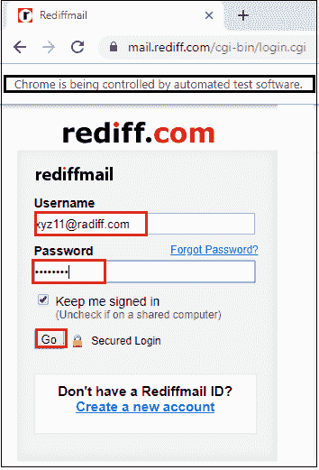

**开始于(^):**

**以**开头，用于使用 **^(即克拉)**符号来标识 web 元素。

**开头为的语法:**

```
Tagname[attribute^ =’Attribute starting value’]
```

在哪里

**【^】**=克拉符号用于标识 web 元素的起始值。

让我们举一个例子来让你更好地理解使用^符号的 **starts-with 方法，我们创建了一个样本测试脚本，如下所示；**

| **步骤** | **动作** | **输入** | **预期结果** |
| **1。** | 打开谷歌 Chrome 浏览器。 |   | 应该会打开 Google Chrome 浏览器。 |
| **2。** | 导航至脸书登录页面。 | [https://www.facebook.com](https://www.facebook.com/)T2】 | 必须显示脸书登录页面。 |
| **3。** | 识别**名字**文本框并传递值。 | 名字=你好 | 应该标识名字文本框，并且应该输入值。 |
| **4。** | 识别**姓氏**文本框并传递值。 | Surename=world | 应该标识姓氏文本框，并且应该输入值。 |
| **5。** | 关闭浏览器。 |   | 浏览器应该关闭。 |

遵循与 Contains()方法中相同的**步骤 1** 。

**第二步:**

 **之后，我们将导航到给定的 URL。

导航所需 URL 的示例代码:

```
//navigate to the URL
driver.get(“https://www.facebook.com”); 
```

**第三步:**

 **为了定位脸书登录页面的**名字文本框**，

*   首先，右击名字文本框并选择**检查元素**字段。

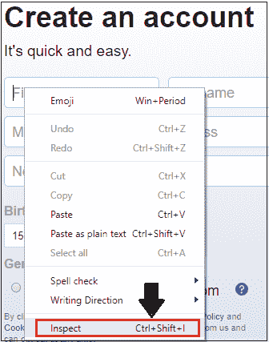

*   将启动开发工具窗口，其中包含开发**名字**文本框时使用的所有特定代码。

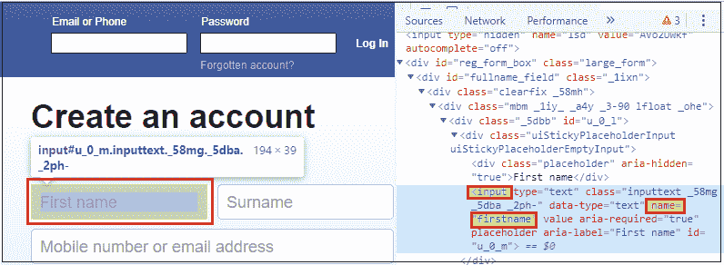

其中**标签名称**的值是**输入**，其**名称属性**的值是**名字。**

在使用 **starts-with** 方法时，我们将采用 **name 属性的起始值，即“first”**

这里是示例代码，

```
driver.findElement(By.cssSelector("input[name^='first']")).sendKeys("hello"); 
```

**第四步:**

 **为了定位脸书登录页面的**姓** **文本框**，

*   右击姓氏文本框并选择**检查元素**字段。

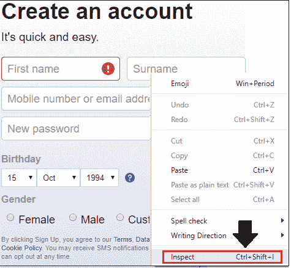

*   将启动开发工具窗口，其中包含开发**姓氏**文本框时使用的所有特定代码。

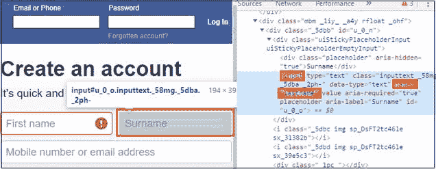

其中**标签名称**的值是**输入**，其**名称属性**的值是**姓氏。**

在使用 **starts-with** 方法时，我们将采用 **id 属性的起始值，**，即“ **last”**

这里是示例代码，

```
driver.findElement(By.cssSelector("input[name^='last']")).sendKeys("world");
```

**第五步:**

 **在最后一步，我们将关闭现有的浏览器。

```
//Close the browser
driver.close(); 
```

我们最终的测试脚本如下所示:

```
package testpackage;
import java.util.concurrent.TimeUnit;
import org.openqa.selenium.By;
import org.openqa.selenium.WebDriver;
import org.openqa.selenium.chrome.ChromeDriver;
public class Sub_string {
public static void main(String[] args) throws InterruptedException {
//set the system property for chrome driver
System.setProperty("webdriver.chrome.driver", "C:\\Users\\JTP\\Downloads\\chromedriver_win32\\chromedriver.exe");
//creating the object for chrome driver 
WebDriver driver = new ChromeDriver();
//maximize the browser size 
driver.manage().window().maximize(); 
//navigate to the url 
driver.get("https://www.facebook.com");
//Identify the first name textbox and pass the value
driver.findElement(By.cssSelector("input[name^='first']")).sendKeys("hello");
Thread.sleep(3000);
System.out.println("firstname value is 
entered");  
//Identify the surname text box and pass the value
driver.findElement(By.cssSelector("input[name^='last']")).sendKeys("world");
Thread.sleep(3000);
System.out.println("surname value is 
entered");  
//close the browser
driver.close();
} 
}
```

要在 Eclipse 中运行测试脚本，右键单击代码，然后选择 **Run as** ？ **Java 应用。**

上述测试脚本将启动 Google Chrome 浏览器，并自动执行所有测试场景，如下所示:

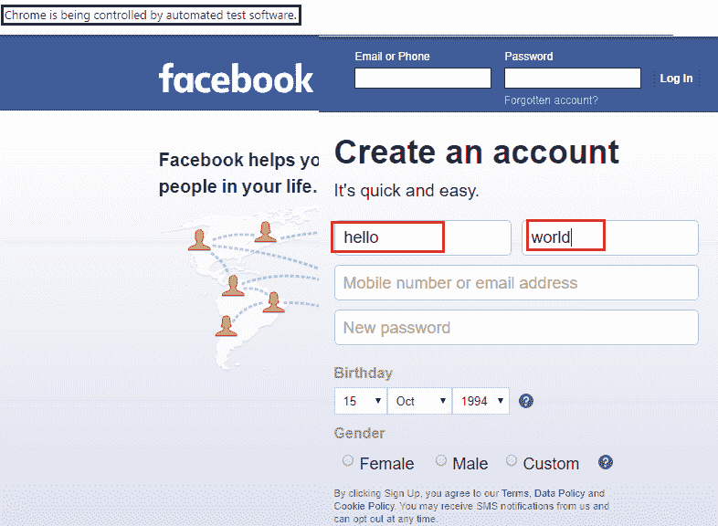

**以($)结尾:**

使用 **$(即美元)**符号来标识 web 元素。

**的语法以:**结尾

```
Tagname[attribute$ =’value’]
```

在哪里

**[$]**=美元符号用于标识 web 元素及其**结束值**。

为了让您更好地理解**的结尾——使用 **$** 符号的**方法，我们创建了一个样本测试脚本，如下所示；

| **步骤** | **动作** | **输入** | **预期结果** |
| **1。** | 打开谷歌 Chrome 浏览器。 |   | 应该会打开 Google Chrome 浏览器。 |
| **2。** | 导航到谷歌搜索主页。 | [https://www.google.com](https://www.google.com/) | 谷歌搜索主页必须显示。 |
| **3。** | 识别 **Google 搜索**文本框并传递值。 | Tutorialandexample.com | Google 搜索文本框应该被识别，并且值应该被输入。 |
| **4。** | 识别并点击**谷歌搜索按钮。** |   | 谷歌搜索按钮应该被识别，按钮应该被点击。 |
| **5。** | 关闭浏览器。 |   | 浏览器应该关闭。 |

遵循 contains()方法的相同步骤 1。

**第二步:**

 ***   之后，我们将导航到给定的 URL。

导航所需 URL 的示例代码:

```
//navigate to the URL
driver.get(“https://www.google.com”); 
```

**第三步:**

 **为了定位谷歌主页的**谷歌搜索文本框**，

*   首先，右键单击 Google 搜索文本框并选择 **Inspect 元素**字段。

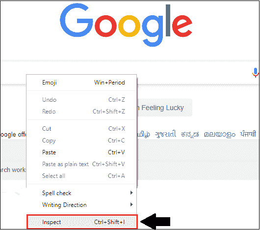

*   开发者工具窗口将被启动，显示所有在开发**谷歌搜索**文本框中使用的特定代码。

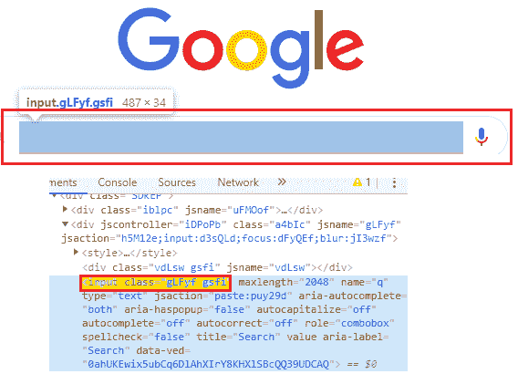

其中**标签名**值为**输入，**，其**类属性**的值为 **gLFyf gsfi** **。**

在使用 **ends-with** 方法时，我们将采用**类属性的结束值，即“fi。**

这里是示例代码，

```
driver.findElement(By.cssSelector("input[class$='fi']")).sendKeys("tutorialandexample.com"); 
```

**第四步:**

 **为了定位谷歌主页的**谷歌搜索按钮**，

*   右键单击 Google 搜索按钮并选择 **Inspect 元素**字段。

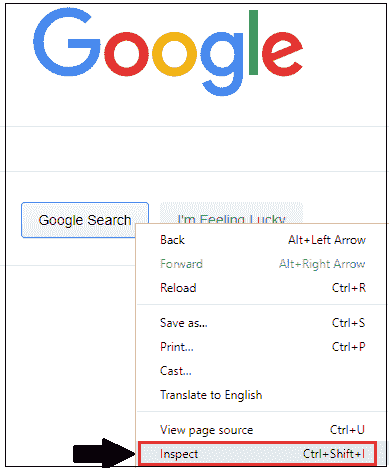

*   开发者工具窗口将被启动，其中包含所有用于开发**谷歌搜索**按钮的特定代码。

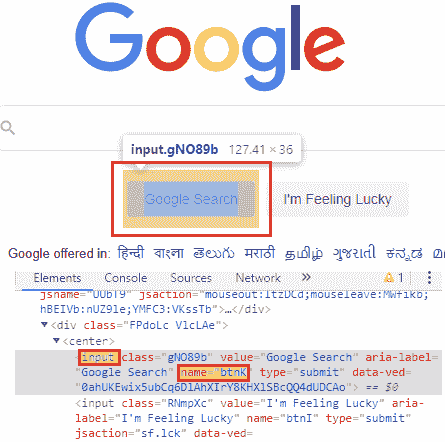

其中**标签名称**值为**输入，**，其**名称属性**的值为 **btnK。**

在使用 **ends-with** 方法时，我们将获取 **name 属性的结束值，**，即“ **nK”**

这里是示例代码，

```
driver.findElement(By.cssSelector("input[name$='nK']")).click();
```

**第五步:**

 **在最后一步，我们将关闭现有的浏览器。

```
//Close the browser
driver.close(); 
```

我们最终的测试脚本如下所示:

```
package testpackage;
import java.util.concurrent.TimeUnit;
import org.openqa.selenium.By;
import org.openqa.selenium.WebDriver;
import org.openqa.selenium.chrome.ChromeDriver;
public class Sub_string {
public static void main(String[] args) throws InterruptedException {
//set the system property for chrome driver
System.setProperty("webdriver.chrome.driver", "C:\\Users\\JTP\\Downloads\\chromedriver_win32\\chromedriver.exe");
//creating the object for chrome driver 
WebDriver driver = new ChromeDriver();
//maximize the browser size 
driver.manage().window().maximize(); 
//navigate to the url 
driver.get("https://www.google.com"); 
//Identify the google search text box and pass the value
driver.findElement(By.cssSelector("input[class$='fi']")).sendKeys("tutorialandexample.com");
Thread.sleep(3000);
System.out.println(" the value is passed"); 
//Identify and click on the Google search button 
driver.findElement(By.cssSelector("input[name$='nK']")).click();
Thread.sleep(3000);
System.out.println(" search button is clicked ");  
//close the browser
driver.close();
} 
} 
```

要在 Eclipse 中运行测试脚本，右键单击代码，然后选择 **Run as** ？ **Java 应用。**

上述测试脚本将启动 Google Chrome 浏览器，并自动执行所有测试场景，如下所示，

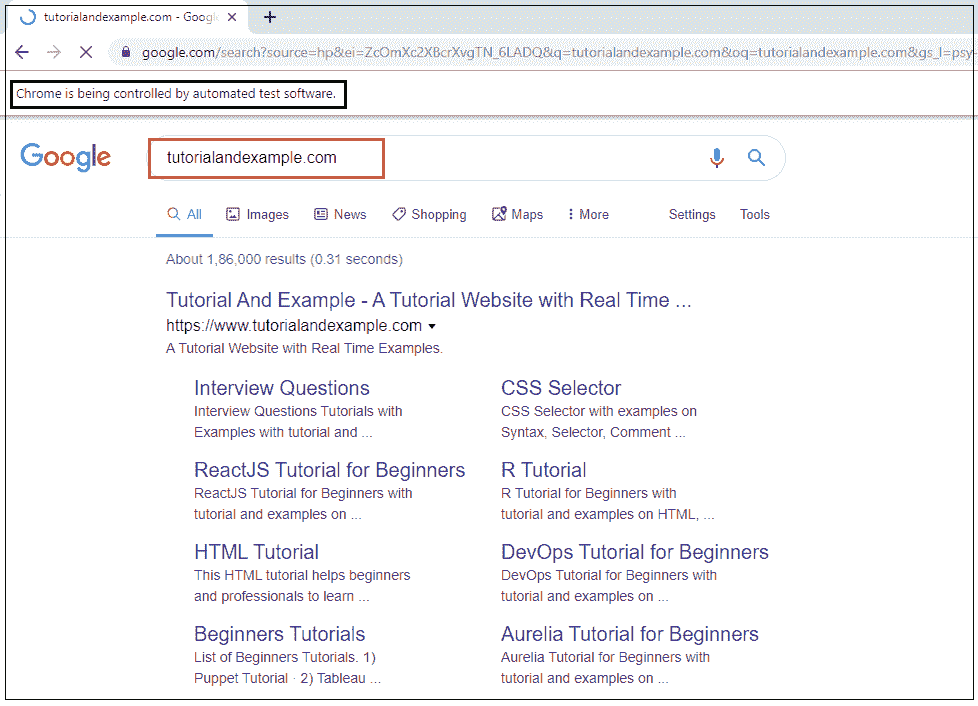****************************