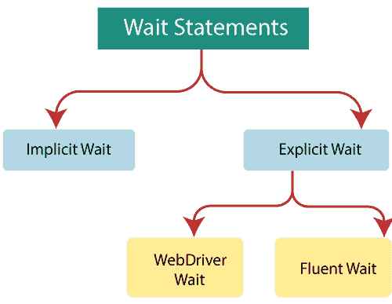
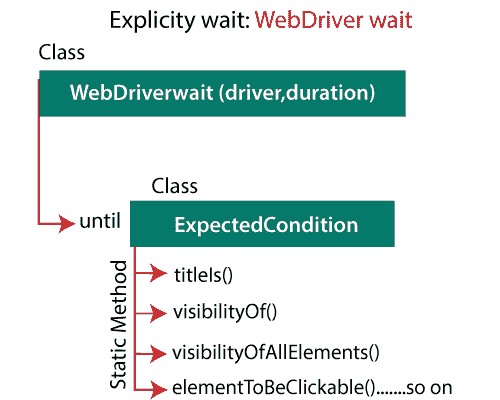
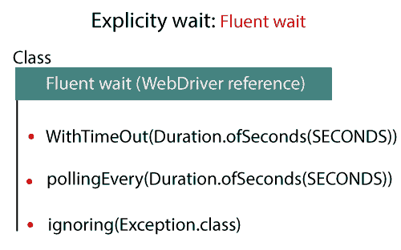
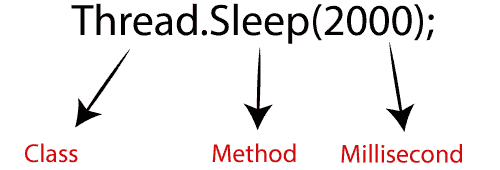

# 硒等待

> 原文：<https://www.tutorialandexample.com/selenium-web-driver-wait-statements/>

在本教程中，我们将了解如何在 selenium WebDriver 中执行测试脚本时避免同步问题。

在继续本教程之前，首先，我们将了解什么是同步问题？

**同步发布:**

 **每当 WebDriver 试图作用于 web 元素，但是 web 元素没有加载到 UI 中时，

在这种情况下，web 驱动程序抛出 **NoSuchElementException** 并因为同步问题而停止整个执行。

为了避免同步问题，我们使用 selenium WebDriver 中的**等待语句**。

“在 selenium WebDriver 中，使应用程序速度与自动化工具速度相匹配的过程称为同步等待。”

selenium WebDriver 中有两个可用的等待语句，如下所示:

*   **隐式等待**
*   **显式等待**



现在，当我们使用等待语句时，问题出现了。

*   每当用户在按钮和链接上执行任何点击操作时，我们就使用 wait 语句。
*   我们应该强制使用 wait 语句，因为点击操作总是导航到另一个页面。
*   使用 Selenium Wait 语句，我们的测试脚本将在继续下一步之前等待 web 元素加载一段时间。

**隐式等待:**

*   隐式等待总是等待整个 HTML 文档加载到 UI 中。
*   换句话说，隐式等待将用于设置驱动程序对象的最大生命周期时间。
*   从技术上讲，如果页面在最大持续时间之前被加载，那么在加载页面时，隐式地等待监视或轮询整个 HTML 文档。
*   它将驱动器控制释放到下一条线，而不是等待整个最大时间。
*   如果我们隐式地插入了 wait before get()方法，那么该等待将适用于 web 驱动程序或驱动程序对象完成的所有操作。

**隐式等待的语法:**

```
driver.manage().timeouts().implicitlyWait(TimeOut,TimeUnit.SECONDS);
```

让我们看一个例子，看看隐式等待是如何工作的。

```
package testpackage;
import java.util.concurrent.TimeUnit;
import org.openqa.selenium.By;
import org.openqa.selenium.WebDriver;
import org.openqa.selenium.firefox.FirefoxDriver;
public class Wait_statement {
public static void main(String[] args) throws InterruptedException {
// System Property for gecko Driver   
System.setProperty("webdriver.gecko.driver","C:\\Users\\JTP\\Downloads\\geckodriver-v0.25.0-win64\\geckodriver.exe");
// create an object for FirefoxDriver class.       
WebDriver driver=new FirefoxDriver();
//maximixe the window size
driver.manage().window().maximize(); 
//delete all cookies
driver.manage().deleteAllCookies();
//wait for dynamic element appear in UI
driver.manage().timeouts().implicitlyWait(30,TimeUnit.SECONDS);
//navigate to the url                         
driver.get("https://www.google.com/"); 
```

**代码解释:-**

*   在上面的代码中，我给了一个 30 秒的隐式等待值，这意味着加载元素的最大等待时间是 30 秒。
*   如果元素没有在最大时间内加载，那么 wait 语句抛出一个异常，这个异常就是 **TimeoutException** **。**

> **注意**:隐式等待的主要缺点是隐式等待不能用于 Ajax 元素(动态)。
> 
> 并且在使用隐式等待时不会发现性能原因问题。

**显式等待:**

 ***   显式等待总是等待预期的元素出现在 UI 中。
*   从技术上讲，会出现对预期元素的显式等待检查；在最大持续时间内，它会将驱动器控制释放到下一条生产线，而不是等待 20 秒。
*   显式等待将在 Ajax 应用程序中扮演重要角色，因为它将用于在 UI 中加载动态元素。

显式等待可以通过以下两种方式实现:

*   **网络驱动等待**
*   **流畅等待**

让我们逐一讨论，让你对显式等待有一个完整的了解:

**网络驱动等待:**

当我们需要建立基于条件的定制等待方法时，使用 WebDriver wait。

**显式等待的语法:**

```
WebDriverWait wait = WebDriverWait(WebDriverReference,TimeOut);
```



为了声明 WebDriver 等待，我们将使用 **ExpectedConditions** 。一些最常用的预期条件如下-

| **预期条件** | **描述** | **命令** |
| **可见度()** | 它用于检查一个已知存在于页面 DOM 中的元素是否可见。 | visibilityOf(WebElement 元素):预期条件<boolean></boolean> |
| **visibility of all elements()** | 它用于检查网页上出现的所有元素以及匹配的定位器是否可见。 | 所有元素的可见性(WebElement 元素):预期条件 <list>></list> |
| **visibilityofallementslocatedby()** | 它用于检查网页上与定位器匹配的元素是否可见。 | 被定位器定位的所有元素的可见性:预期条件 <list>></list> |
| **visibilityOfElementLocated()****T3】** | 它用于检查一个元素是否出现在页面的 DOM 上并且可见。 | 可见性元素定位(通过定位器):预期条件 |
| **元素选择 ateToBe()** | 它用于检查给定的元素是否被选中。 | elementSelectionStateToBe(web element 元素，布尔选定):预期条件<boolean></boolean> |
| **元素 obeliskable()** | 它用于检查一个元素是否可见，并启用以便您可以单击它。 | elementToBeClickable(web element 元素):预期条件 |
| **elementToBeSelected()** | 它用于检查给定的元素是否被选中。 | elementToBeSelected(WebElement 元素):预期条件<boolean></boolean> |
| **【frame tobeavaluable andwittoit()** | 它用于检查给定的帧是否可用于交换。 | frameToBeAvaliableAndSwitchToIt(按定位器):预期条件 |
| **invisibility yoftheelementlocated()** | 这个方法用于检查一个元素是否可见，以及是否存在于 DOM 中 | invisibilityOfTheElementLocated(通过定位器):预期条件<boolean></boolean> |
| **invisibility yofelementwithtext()** | 它用于检查带有文本的元素在 Dom 中是否可见。 | invisibilityOfElementWithText(按定位器，字符串文本):预期条件<boolean></boolean> |
| **presence of allelements located by()** | 它用于检查网页上是否存在至少一个元素。 | presenceOfAllElementsLocatedBy(按定位器):预期条件 <list>></list> |
| **presenceOfElementLocated()****T3】** | 此方法用于检查网页的 DOM 中是否存在某个元素。 | presenceOfElementLocated(通过定位器):预期条件 |
|  | 它用于检查给定的文本是否出现在指定的元素中。 | textToBePresentInElement(web element 元素，字符串文本):ExpectedCondition<boolean></boolean> |
| **texttobepresinelementlocated()** | 它用于检查给定文本是否出现在与给定定位器匹配的元素中。 | textToBePresentInElementLocated(按定位器，字符串文本):预期条件<boolean></boolean> |
| **texttobepresinelementvalue()** | 它用于检查指定的元素值属性中是否存在给定的文本。 | textToBePresentInElementValue((按定位器，字符串文本):预期条件<boolean></boolean> |
| **titleIs()** | 此方法用于检查页面的标题。 | titles(字符串标题):预期条件<boolean></boolean> |
| **title contains()****T3】** | 此方法用于检查标题是否包含区分大小写的子字符串。 | titlesContains(字符串标题):预期条件<boolean></boolean> |
| **urlToBe()** | 它用于使当前页面的 URL 成为特定的 URL。 | urlToBe(字符串 url):预期条件 |

让我们看一个例子，看看 **WebDriver wait** 如何工作，

```
package testpackage;
import java.util.concurrent.TimeUnit;
import org.openqa.selenium.By;
import org.openqa.selenium.WebDriver;
import org.openqa.selenium.chrome.ChromeDriver;
import org.openqa.selenium.support.ui.WebDriverWait;
import org.openqa.selenium.support.ui.ExpectedConditions;
public class Wait_statement {
public static void main(String[] args) throws InterruptedException {
//System Property for gecko Driver   
System.setProperty("webdriver.chrome.driver", "C:\\Users\\JTP\\Downloads\\chromedriver_win32 (1)\\chromedriver.exe");
//create driver class object
WebDriver driver = new ChromeDriver();
//maximize the window size
driver.manage().window().maximize(); 
//delete all the cookies                 
driver.manage().deleteAllCookies();
//launch Chrome and navigate to the url
driver.get("https://mail.rediff.com/cgi-bin/login.cgi");
//wait for dynamic element appear in UI
WebDriverWait wait =new WebDriverWait(driver,20);
//check the expected conditions for email text box
wait.until(ExpectedConditions.visibilityOfElementLocated(By.name("login")));
System.out.println("email text box is visible");
driver.findElement(By.name("login")).sendKeys("[email protected]");
//check the expected conditions for password text box
wait.until(ExpectedConditions.visibilityOfElementLocated(By.id("password")));
System.out.println("password text box is visible");
driver.findElement(By.id("password")).sendKeys("[email protected]");
//identify the go button
driver.findElement(By.name("proceed")).click();
//close the browser
driver.close();
}                                
} 
```

**上述代码的解释:-**

在上面的例子中，我使用了 Rediff 登录凭证，并使用 id 和名称定位器定位它们。

并且，我在这里提供了 WebDriver wait，并且在定位器的帮助下给出了元素的可见性。并要求驾驶员等待 20 秒，直到满足预期条件。

如果预期的条件得到满足，它将移动到下一步，并传递电子邮件和密码文本框的值。

在执行上述测试脚本后，首先，Chrome 驱动程序将启动谷歌 Chrome 浏览器，它将导航到 rediff.com 的登录页面，并传递上述代码中提到的值。

使用显式等待的主要优点是，我们不需要将 WebDriver 等待设置为一个特定的超时值，我们可以根据我们的需求来更改它

但是当使用隐式等待时，如果我们定义了 10 秒的等待，它将应用于网页上的所有元素，并且不能修改。

让我们看看 selenium web 驱动程序中隐式和显式等待的区别

### 隐式等待 v/s 显式等待:

| **隐式等待** | **显式等待** |
| 隐式等待总是等待整个 Html 文档加载到 UI 中。 | 显式等待总是等待预期的元素出现在 UI 中。 |
| 隐式等待用于设置驱动程序对象的最大时间。 | 每 500 毫秒对预期元素进行一次显式等待检查。 |
| 在隐式等待中，我们不需要任何**预期条件**来定位元素。 | 在显式等待中，我们需要**期望条件** (visibilityOfElementLocated()、elementToBeClickable()、titleIs()、urlToBe())等来定位元素。 |
| 隐式等待不能等待 ajax 元素(动态的)，所以不能在 ajax 应用程序中使用。 | 显式等待在 ajax 应用程序中起着重要的作用，因为它将用于在 UI 中加载动态元素。 |

### 流畅等待:

流畅等待是显式等待的扩展等待。

它与 WebDriver wait 非常相似，但是它可以根据用户定义的时间检查预期的元素。

它用于定期重复查找 web 元素，直到超时或找到对象。

> **注意【WebDriver 和 fluent wait 类都实现了 wait 接口。**

**流畅等待的语法:**

```
Wait wait= new FluentWait(WebDriver reference)
.withTimeout(timeout,SECONDS)
.PollingEvery(timeout,SECONDS)
.ignoring(Exception.class); 
```

以上语法**在 Selenium v3.11 及以上版本中已弃用**。

因此，我们将使用下面的流畅等待语法:

```
Wait wait = new FluentWait(WebDriver reference)
.withTimeout(Duration.ofSeconds(SECONDS))
.pollingEvery(Duration.ofSeconds(SECONDS))
.ignoring(Exception.class); 
```



在哪里，

**withTimeOut: -** 设置等待评估条件为真的时间。

**轮询:-** 设置一个带有时间框架的重复周期，以定期验证/检查状态。

**忽略:-** 忽略用于等待条件时特定类型的异常。

让我们看一个使用 fluent wait 的示例文本脚本，看看它是如何工作的，

出于测试目的，我们将看到一个场景，其中一个元素在不同的时间间隔被加载。元素可能在 10 秒、30 秒甚至更长时间内被加载。

在这种情况下，流畅等待是使用的理想等待，因此我们将尝试在不同的频率下查找元素。

```
package testpackage;
import java.time.Duration;
import java.util.concurrent.TimeUnit;
import java.util.function.Function;
import org.openqa.selenium.By;
import org.openqa.selenium.NoSuchElementException;
import org.openqa.selenium.WebDriver;
import org.openqa.selenium.WebElement;
import org.openqa.selenium.chrome.ChromeDriver;
import org.openqa.selenium.support.ui.FluentWait;
import org.openqa.selenium.support.ui.Wait;
public class fluent_wait {
public static void main(String[] args) throws InterruptedException {
// System Property for gecko Driver   
System.setProperty("webdriver.chrome.driver", "C:\\Users\\JTP\\Downloads\\chromedriver_win32 (1)\\chromedriver.exe");
//create driver class object
WebDriver driver = new ChromeDriver();
//maximize the window size                       
driver.manage().window().maximize();
//delete all the cookie 
driver.manage().deleteAllCookies();
// launch Chrome and navigate to the url
driver.get("https://the-internet.herokuapp.com/dynamic_loading/1");
//identify the start button
driver.findElement(By.xpath("//button[contains(text(),'Start')]")).click();
//Wait for 30 seconds to load an element on the page,and check for its presence once every 3 seconds
Wait wait = new FluentWait<webdriver>(driver)
.withTimeout(Duration.ofSeconds(30))
.pollingEvery(Duration.ofSeconds(3))
.ignoring(NoSuchElementException.class);
WebElement wb = wait.until(new Function<webdriver webelement="">() {
public WebElement apply(WebDriver driver) {
if(driver.findElement(By.xpath("//div[@id='finish']//h4")).isDisplayed())
{
return driver.findElement(By.xpath("//div[@id='finish']//h4"));
}
else
{
return null;
}
}
});
//print the value of the text 
System.out.println(driver.findElement(By.xpath("//div[@id='finish']//h4")).getText());
//quit the browser
driver.quit();
}
}</webdriver></webdriver> 
```

**上述代码的解释:-**

在上面的文本脚本中，我们带着**the-internet.herokuapp.com**网站，然后转到**动态加载**页面，在这里我们点击**示例 1:页面上隐藏的元素**，并点击**开始按钮**，它将打印 **Hello world！**在屏幕上。

我们将轮询频率设置为 3 秒，最长时间为 30 秒，这意味着我们将每 3 秒检查一次网页上的元素，最长时间为 30 秒。

流畅等待并不用于实时场景，但一般来说，它会询问面试的目的。

**线程等待:(java)**

*   线程等待也称为硬编码等待(固定时间)，因为它总是等待一段固定的时间。
*   线程等待不用于实时 selenium 测试脚本，因为它总是依赖于等待，这是由用户给出的，或者它仍然等待用户定义的时间，即使页面加载得更早。
*   线程等待增加了自动化执行的时间。

**语法:**

```
Thread.sleep(millseconds);
```



例如:thread . sleep(2000)；

在哪里，

*   **线程**是一个**类。**
*   **睡眠**是一种**方法。******