# Selenium WebDriver 中的鼠标和键盘控件

> 原文：<https://www.tutorialandexample.com/mouse-and-keyboard-controls-in-selenium-web-driver/>

**Selenium web driver 中的鼠标和键盘控件**

在本教程中，我们将学习如何使用 selenium WebDriver 中的 action 类来处理鼠标和键盘事件。

**Selenium web driver 中的操作类:**

Action 是 interactions 包中的一个高级类，用于执行用户交互操作，如**双击**、**右键**、**拖拽、**等。

因此，每当我们创建一个 object actions 类时，我们都应该传递 driver 对象，因为 action 类需要 browser 对象(driver)来控制浏览器。

**动作类方法:**

selenium WebDriver 中的一些 action 类方法如下所示

要首先访问 selenium web 驱动程序中的 action 类，我们必须为 action 类创建一个对象

**Actions act =新动作(驱动)；**

之后，我们将使用 action 类控件，

这里有**，**

**build():** 用于一次编译多个动作，准备执行。

**perform()** :该方法用于每个动作类控件或方法，因为它将负责动作类控件的执行。

**注意**:每当我们在 selenium WebDriver 中使用 action 类时，我们都会强制使用 **build()** 和 **perform()** 方法。

**selenium web driver 的 action 类中可用的键盘事件方法:**

以下是操作类的一些键盘控件:-

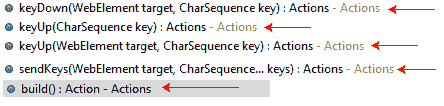

| **键盘控制** | **描述** | **命令** | **语法** | **例子** |
| **发送键():** | 在 action 类中也有，它用于借助**键**类来执行功能键盘操作。 | senKeys(WebElement 目标，charSequence...关键):行动 | **WB . sendkeys(" key borad 操作的值")；**在这里， **wb** 是 action 类的对象。 | **wb.sendKeys("abc")** 其中 **abc** 是字符键。 |
| **keyDown():** | 它用于在不释放按键的情况下发送按键。 | keyDown(WebElement taget，CharSequence key):操作 | **WB . sendkeys(" key borad 操作的值")；** | wb.sendKeys(键。回车，按键。ALT)；其中 **Alt** 和 **Enter** 键是键盘的功能键操作。 |
| **键击():T1** | 它用于执行按键释放。 | keyUp(WebElement 目标，CharSequence 键):操作 | **WB . sendkeys(" key borad 操作的值")；** | wb.sendKeys(键。换档，钥匙。控制)；其中**换档**和**控制键**是键盘的功能键操作。 |

一些关键的类方法如下:

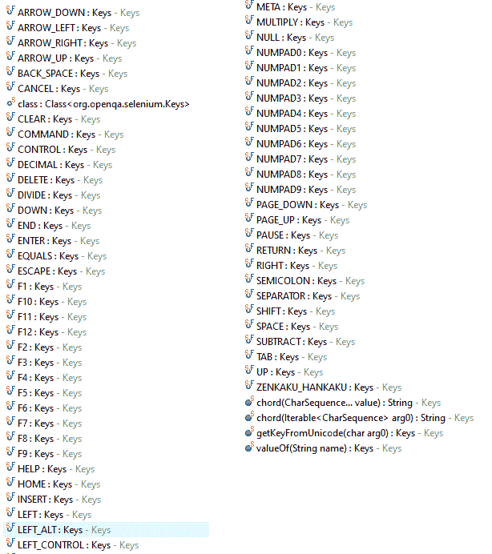

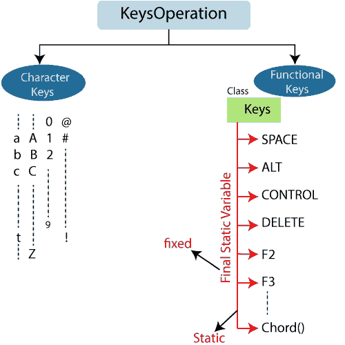

让我们看一个样本测试用例，其中我们使用 selenium WebDriver 中的 action 类来处理键盘操作。

在这个例子中，我们正在使用**并发键盘操作**，

打开 Eclipse IDE 和现有的测试套件 **new_test** ，这是我们在 WebDriver 教程的 WebDriver 安装部分创建的。

然后，右键单击 src 文件夹，从 **New → Class** 创建一个新的类文件。


*   将类名命名为 **KeyBoard_demo** 并点击**完成**按钮。

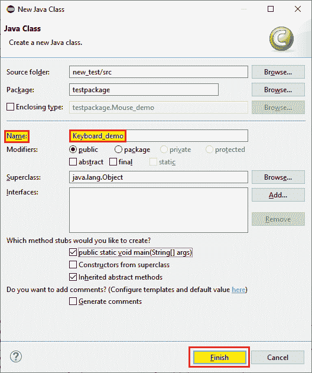

为了我们的测试目的，我们使用 yahoo 的**登录页面来执行 selenium WebDriver 中所有的**键盘操作**，**

在这个测试案例中，我们将自动化以下测试场景:

| **步骤** | **动作** | **使用的方法** | **输入** | **预期结果** |
| **1。** | 打开 Firefox 浏览器。 | System.setProperty() |   | 必须打开 Firefox 浏览器。 |
| **2。** | 导航到雅虎登录页面。 | 获取() | [https://login.yahoo.com/](https://login.yahoo.com/) | 必须显示雅虎主页。 |
| **3。** | 标识用户名文本框。 |   | 用户名=管理员 | 应该标识用户名文本框，并且应该传递值。 |
| **4。** | 创建一个 action 类的对象，并使用 action 类来控制鼠标。 | 双击() |   | 应该创建了 action 类对象，鼠标事件将在浏览器中执行。 |
| **5。** | 执行键盘操作。 | sendKeys() Keys.chord 键。控制键。标签 |   | 应该执行键盘操作。 |
| **6。** | 关闭浏览器 | 关闭() |   | 浏览器应该关闭。 |

**第一步:**

要启动 Firefox 浏览器，我们需要下载 geckoDriver.exe 文件，并将系统属性设置为 geckoDriver.exe 文件的路径。

下面是为 Firefox 设置系统属性的代码:

```
//set the system property of gecko driver
System.setProperty("webdriver.gecko.driver","C:\\Users\\JTP\\Downloads\\geckodriver-v0.25.0-win64\\geckodriver.exe"); 
// create driver object Firefox browser
WebDriver driver=new FirefoxDriver(); 
```

**第二步:**

现在，我们将导航到所需的 URL:

```
//navigate to Amazon home page.
 driver.get("https://login.yahoo.com/"); 
```

**第三步:**

首先，我们会识别出**雅虎登录页面**上的**用户名文本框**，所以右击用户名文本框，选择**检查**选项，如下图所示。

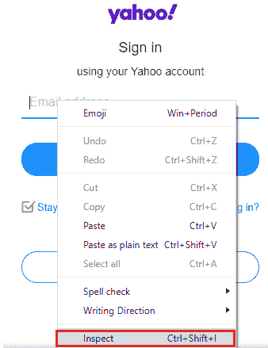

将启动开发工具窗口，其中包含开发用户名文本框时使用的所有指定代码，并复制其名称属性的值。即“**用户名。**

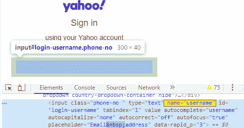

这里是示例代码，

```
//identify the username textbox
WebElement wb=driver.findElement(By.name("username"));
wb.sendKeys("admin");
Thread.*sleep*(2000); 
```

**第四步:**

现在，我们正在进行下一步，创建 action 类对象并使用鼠标控件。

这里是示例代码，

```
//create object to action class
Actions act= new Actions(driver);
//using action class control, take the mouse control
act.doubleClick(wb).perform(); 
```

**第五步:**

创建 action 类对象后，我们将执行键操作，

这里是示例代码，

```
//execute the keyboard operation
act.sendKeys(Keys.chord(Keys.CONTROL,"c")).perform();
Thread.sleep(3000);
System.out.println("key operation is performed 1");
act.sendKeys(Keys.TAB).perform();
Thread.sleep(3000);
System.out.println("key operation is performed 2"); 
```

**第六步:**

最后，我们终止进程并关闭浏览器。

```
 //Close the browser
 driver.close(); 
```

我们最终的测试脚本如下所示:

```
package testpackage;
import org.openqa.selenium.By;
import org.openqa.selenium.Keys;
import org.openqa.selenium.WebDriver;
import org.openqa.selenium.WebElement;
import org.openqa.selenium.firefox.FirefoxDriver;
import org.openqa.selenium.interactions.Actions;
public class Keyboard_demo { 
public static void main(String[] args) throws InterruptedException {
// System Property for gecko Driver   
System.setProperty("webdriver.gecko.driver","C:\\Users\\JTP\\Downloads\\geckodriver-v0.25.0-win64\\geckodriver.exe");
// create an object for FirefoxDriver class.       
WebDriver driver=new FirefoxDriver();  
driver.get("https://login.yahoo.com");
//identify the username textbox 
 WebElement wb=driver.findElement(By.name("username"));
 wb.sendKeys("admin");
 Thread.*sleep*(2000);
 //create object to action class
  Actions act= new Actions(driver);
 //using action class control, take the mouse control
  act.doubleClick(wb).perform(); 
 //execute the keyboard operation
 act.sendKeys(Keys.chord(Keys.CONTROL,"c")).perform();
 Thread.sleep(3000);
 System.out.println("key operation is performed 1");
 act.sendKeys(Keys.TAB).perform();
 Thread.sleep(3000);
 System.out.println("key operation is performed 2");
 //close the browser
 driver.close(); 
 }
 }
```

**注意:这里使用 chord()来执行浏览器上的并发键盘操作。**

在成功运行上面的测试脚本之后，它启动了 Firefox 浏览器并自动化了所有的测试场景，如下所示:

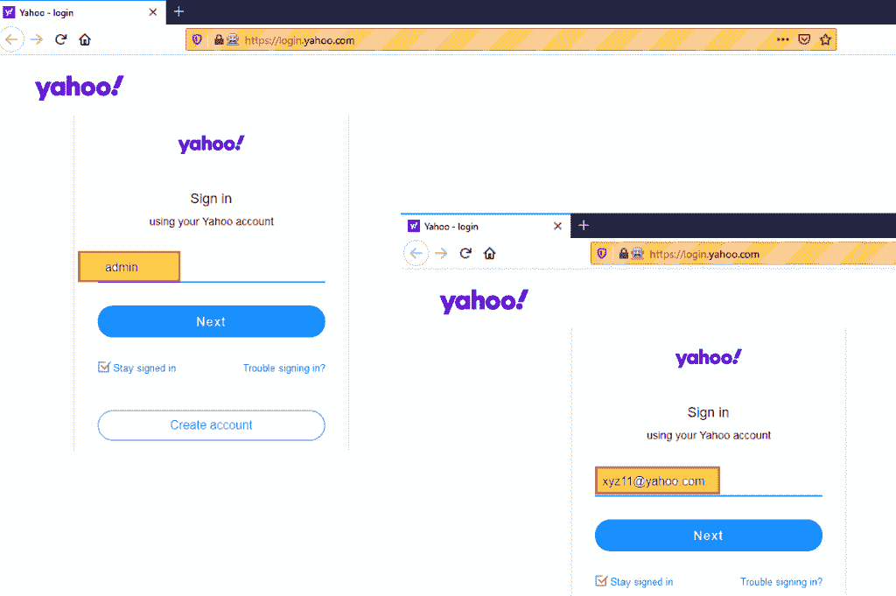

**示例 2(自动建议编辑框)**

在本例中，我们将尝试使用**自动建议编辑框**，然后我们还将捕获 Eclipse IDE 控制台窗口中编辑框中所有可用的建议。

遵循以下步骤，

出于我们的测试目的，我们使用 **Google 搜索主页**将数据写入自动建议编辑框。

*   打开网址[https://www.google.com](https://www.google.com/)
*   识别**谷歌主页的谷歌搜索框。**
*   识别自动建议框。
*   捕捉自动建议框下的所有数据。
*   关闭浏览器。

遵循与设置 Google 搜索浏览器的系统属性相同的过程。

*   现在，我们将导航到所需的 URL:

```
//navigate to Google Home page
 driver.get("https://www.google.com "); 
```

*   首先，我们将在 **Google 主页**上识别 **Google 搜索框**，并选择 **Inspect 元素字段**。

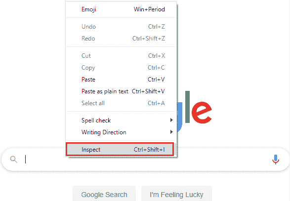

开发者工具窗口将被打开，显示所有用于开发**谷歌搜索框的特定代码。**

并复制**名称属性**的值，即**q .**

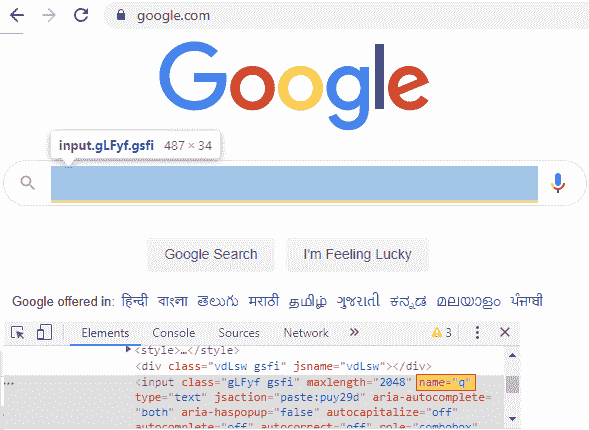

下面是示例代码:

```
//write data in to the auto suggest edit box
 driver.findElement(By.name("q")).sendKeys("wipro jobs");
 Thread.sleep(3000); 
```

*   现在，我们正在进行下一步，即捕获来自自动建议框的数据。
*   在自动建议框下捕获数据之前，我们将在 customize [XPath locator](https://www.tutorialandexample.com/xpath-locator-in-selenium-ide/) 的帮助下识别自动建议框。

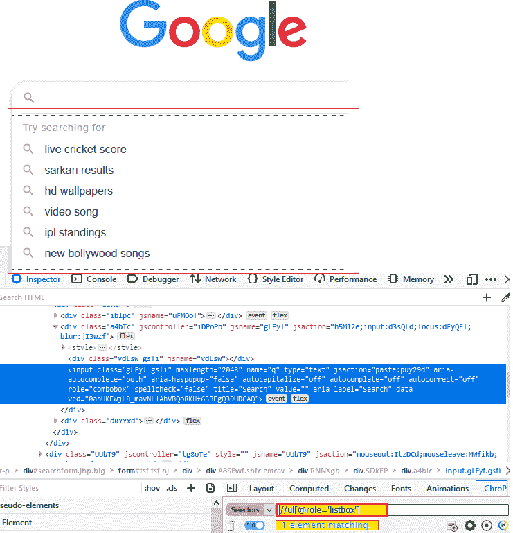

这里是示例代码，

```
//capture all the operation from the auto suggest
 List<WebElement>lst=driver.findElements(By.xpath("//ul[@role='listbox']/li"));
 Thread.sleep(3000);
 //display all the auto suggestion option name
 for(int i=0;i<lst.size(); i++)
 {
 System.out.println(lst.get(i).getText());
 } 
```

*   并且在这之后，我们正在创建一个 action 类对象并按下**回车键**操作。

这里是示例代码，

```
//create object to action class
 Actions act=new Actions(driver);
 //pass the enter key operation
 act.sendKeys(Keys.ENTER).build().perform();
 Thread.sleep(3000); 
```

*   最后，我们终止进程并关闭浏览器。

 **```
 //Close the browser
driver.close();
```

我们最终的测试脚本如下所示:

```
package testpackage;
import java.util.List;
import java.util.concurrent.TimeUnit;
import org.openqa.selenium.By;
import org.openqa.selenium.Keys;
import org.openqa.selenium.WebDriver;
import org.openqa.selenium.WebElement;
import org.openqa.selenium.chrome.ChromeDriver; 
import org.openqa.selenium.interactions.Actions;
public class Auto_suggest {
public static void main(String[] args) throws InterruptedException {
// System Property for gecko Driver   
System.setProperty("webdriver.chrome.driver", "C:\\Users\\JTP\\Downloads\\chromedriver_win32\\chromedriver.exe");
//create driver class object
WebDriver driver = new ChromeDriver(); 
//maximize the browser
driver.manage().window().maximize(); 
//delete all the cookies
driver.manage().deleteAllCookies();
//navigate to the url
driver.get("https://www.google.com");
//write data in to the auto suggest edit box
driver.findElement(By.name("q")).sendKeys("wipro jobs"); 
Thread.sleep(3000);
//capture all the operation from the auto suggest
List<WebElement>lst=driver.findElements(By.xpath("//ul[@role='listbox']/li"));
Thread.sleep(3000);
//display all the auto suggestion option name
for(int i=0;i<lst.size(); i++)
{ 
System.out.println(lst.get(i).getText());
}
//create object to action class
Actions act=new Actions(driver);
//pass the enter key operation
act.sendKeys(Keys.ENTER).build().perform();
Thread.sleep(3000);
//close the browser 
driver.close();
}
}
```

*   在成功运行上述测试脚本后，它启动了 Google Chrome 浏览器，并自动化了所有测试场景，如下所示:

和

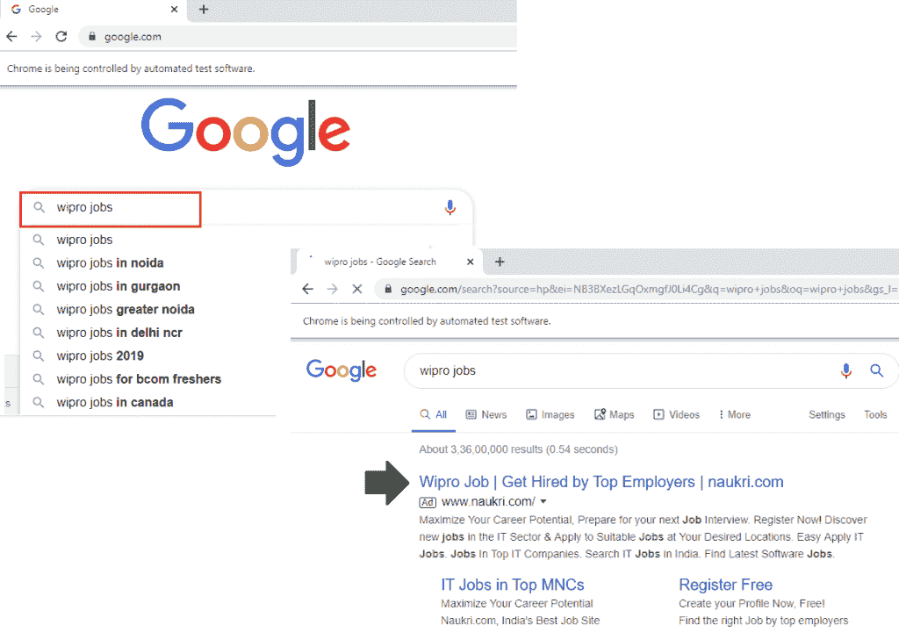

并捕获所有自动建议，如下所示:

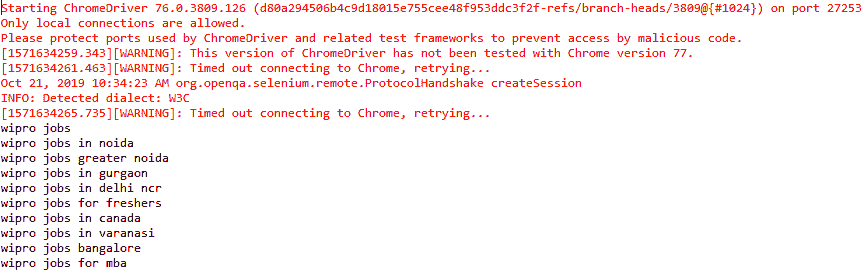

### 鼠标事件处理

**action 类中可用的鼠标事件方法:**

下面是 action 类的鼠标控制方法

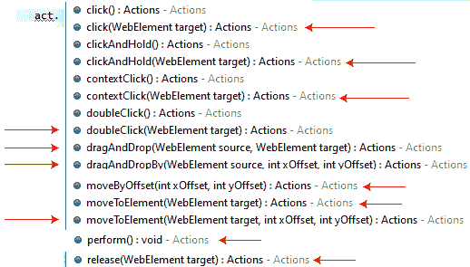

| **鼠标控制** | **描述** | **命令** |
| **点击():** | 用于在**当前鼠标位置**点击**元素。** | 单击(WebElement 目标):操作 |
| **双击():** | 用于在当前鼠标位置双击**元素。** | 双击(WebElement 目标):操作 |
| 上下文点击(): | 用于浏览器上的**上下文点击(右键)**操作。 | contextClick(WebElement 目标):操作 |
| **clickAndHold():** | 该方法用于点击**鼠标位置(不释放**)。 | clickAndHold(WebElement 目标):操作 |
| **dragAndDrop():** | 该方法用于**从源中拖动元素，并将其放到目标**中。 | dragAndDrop(WebElement 源，WebElement 目标):操作 |
| **dragAndDropBy():** | 它用于单击并按住源元素的位置，并按给定的偏移量移动。 | dragAndDropBy(WebElement 源，intxOffset，intyOffset):操作 |
| **moveToElement():** | 它用于将鼠标光标移动到元素的中间。 | movetoelemont_webelement 目标):操作 |
| **moveByOffset():** | 用于将鼠标从当前位置**或(0，0)移动给定的偏移量**。 | movetoooffset(int xOffset，intyOffset):操作 |
| **发布():** | 用于释放处于按下状态的**鼠标左键操作。** | 发布(WebElement 目标):操作 |

让我们看一个样本测试用例，其中我们使用 selenium WebDriver 中的 action 类来处理**鼠标操作**。

首先，打开 Eclipse IDE 和现有的测试套件 **new_test** ，这是我们在 WebDriver 教程的 WebDriver 安装部分创建的。

然后，右击 src 文件夹，从 **New 创建一个新的类文件？类别**。


*   将类名命名为 **Mouse_demo** 并点击**完成**按钮。

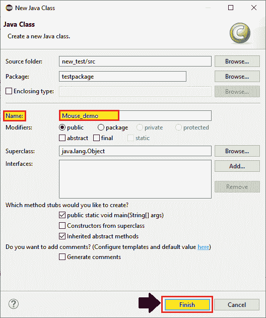

出于测试目的，我们使用亚马逊主页来执行 selenium web 驱动程序中的所有鼠标事件，

在这个测试案例中，我们将自动化以下测试场景:

| **步骤** | **动作** | **使用的方法** | **输入** | **预期结果** |
| **1。** | 打开 Firefox 浏览器。 | System.setProperty() |   | 必须打开 Firefox 浏览器。 |
| **2。** | 导航到亚马逊主页。 | 获取() | [](https://www.amazon.in/) | 必须显示亚马逊主页。 |
| **3。** | 使用 XPath 定位器识别**畅销书**链接。 |   |   | 应该确定畅销书链接。 |
| **4。** | 创建一个对象的行动类和使用行动类采取鼠标控制。 | movetoelemont_) |   | 应该创建了 action 类对象，鼠标事件将在浏览器中执行。 |
| **5。** | 关闭浏览器 | 关闭() |   | 浏览器应该关闭。 |

我们正在一步一步地创建我们的测试用例，以便让您完全理解 WebDriver 中的**鼠标控制**命令。

**第一步:**

要启动 Firefox 浏览器，我们需要下载 geckoDriver.exe 文件，并将系统属性设置为 geckoDriver.exe 文件的路径。

下面是设置 Firefox chrome 系统属性的代码:

```
//set the system property of gecko driver
System.*setProperty*("webdriver.gecko.driver","C:\\Users\\JTP\\Downloads\\geckodriver-v0.25.0-win64\\geckodriver.exe");                                      
// create driver object Firefox browser 
WebDriver driver=new FirefoxDriver();   
```

**第二步:**

现在，我们将导航到所需的 URL:

```
//navigate to Amazon home page.
driver.get("https://www.amazon.in");
```

**第三步:**

首先，我们会在**亚马逊主页**上识别**畅销书**链接，所以右键点击超链接字段，选择**检查**选项来识别网页链接，如下图所示。

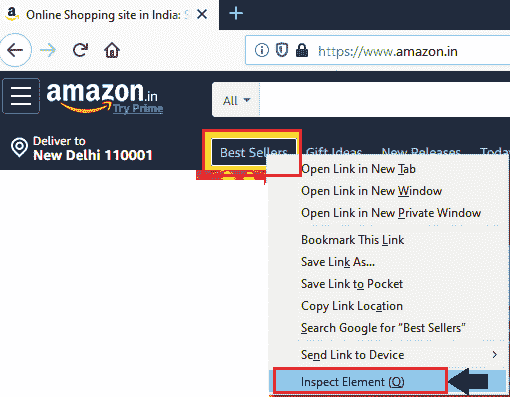

为了定位网页上的超链接，我们将转到 chropath 并复制相对 XPath 定位器的值，注意到 Html 代码属于畅销书**超链接**在开发人员工具窗口中突出显示，如下面的快照所示:

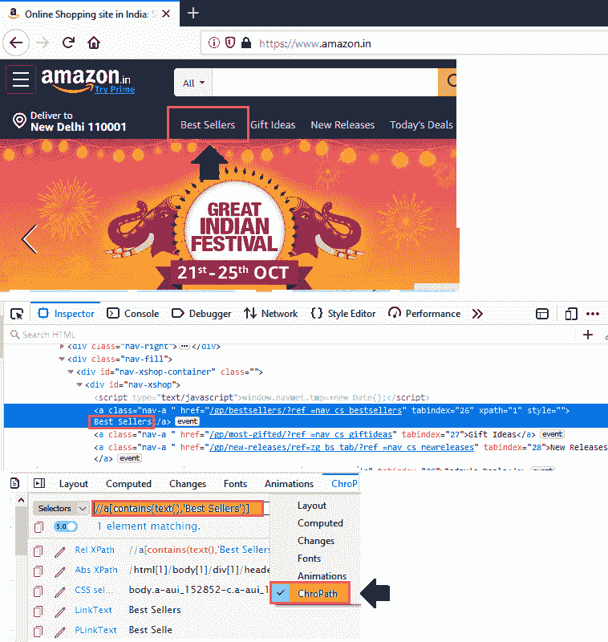

```
 //identify the element
 WebElement wb=driver.findElement(By.*xpath*("//a[contains(text(),'Best Sellers')]")); 
```

**第四步:**

现在，我们正在进行下一步，我们正在创建 action 类对象并使用鼠标控件。

```
//create object to action class
  Actions act= new Actions(driver);
 //using action class control, take mouse control
 act.moveToElement(wb).build().perform()
 wb.click();
 Thread.*sleep*(3000); 
```

**第五步:**

最后，我们终止进程并关闭浏览器。

```
 //Close the browser
driver.close();
```

我们最终的测试脚本将如下所示:

```
package testpackage;
import org.openqa.selenium.By;
import org.openqa.selenium.WebDriver;
import org.openqa.selenium.WebElement;
import org.openqa.selenium.firefox.FirefoxDriver;
import org.openqa.selenium.interactions.Actions;
public class Mouse_demo {
public static void main(String[] args) throws InterruptedException {
// System Property for gecko Driver    
System.setProperty("webdriver.gecko.driver","C:\\Users\\JTP\\Downloads\\geckodriver-v0.25.0-win64\\geckodriver.exe");
// create an object for FirefoxDriver class.       
WebDriver driver=new FirefoxDriver();  
driver.get("https://www.amazon.in");
//identify the element
WebElement wb=driver.findElement(By.xpath("//a[contains(text(),'Best Sellers')]"));
//create object to action class
Actions act= new Actions(driver); 
//using action class control, take mouse control
act.moveToElement(wb).build().perform();
wb.click();
Thread.sleep(3000);
//close the driver
driver.close();
}
}
```

在成功运行上述测试脚本后，它启动了 Firefox 浏览器并自动化了所有测试场景，如下所示:

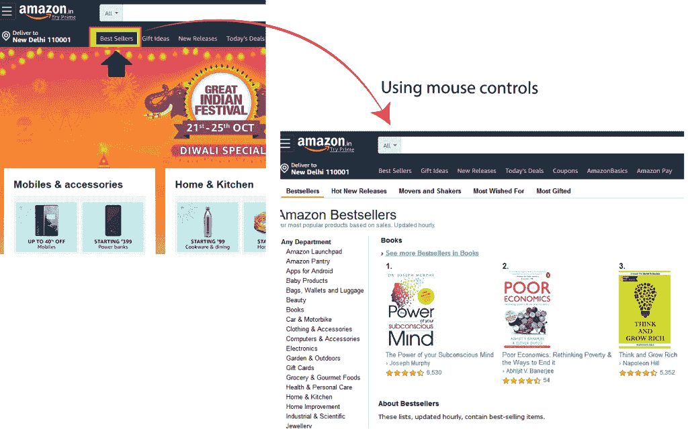

**例 2(右键操作):**

在这个例子中，我们将尝试在 selenium web driver 中的 action 类的帮助下执行**右击操作**。

遵循以下步骤，

为了我们的测试目的，我们采用了 **Google 主页**应用程序。

*   打开网址[https://www.google.com](https://www.google.com/)。
*   识别出现在**谷歌主页右上角的 **Gmail 链接**。**
*   在上面执行**右键操作**。
*   关闭浏览器。

*   现在，我们将导航到所需的 URL:

```
//navigate to Google Home page
driver.get("https://www.google.com "); 
```

*   首先，我们将识别**谷歌主页**中的 **Gmail** 链接，并选择 Inspect 元素字段。

开发者工具窗口将会打开，显示所有用于开发 **Gmail 链接**的特定代码。

并复制**链接文本**的值，即“ **Gmail”**

下面是示例代码:

```
//identify the Gmail link
WebElement lnkwb=driver.findElement(By.linkText("Gmail")); 
```

*   现在，我们正在进行下一步，创建 action 类对象。

```
//create object to action class
Actions act=new Actions(driver);
//pass the enter key operation
act.contextClick(lnkwb).sendKeys("T").build().perform();
Thread.sleep(3000); 
```

*   最后，我们终止进程并关闭浏览器。

```
 //Close the browser
 driver.close(); 
```

我们最终的测试脚本将如下所示:

```
package testpackage;
import java.util.concurrent.TimeUnit;
import org.openqa.selenium.By;
import org.openqa.selenium.Keys;
import org.openqa.selenium.WebDriver;
import org.openqa.selenium.WebElement;
import org.openqa.selenium.firefox.FirefoxDriver;
import org.openqa.selenium.interactions.Actions; 
public class Right_click_operation {
public static void main(String[] args) throws InterruptedException {
// System Property for gecko Driver   
System.setProperty("webdriver.gecko.driver","C:\\Users\\JTP\\Downloads\\geckodriver-v0.25.0-win64\\geckodriver.exe");
// create an object for FirefoxDriver class.       
WebDriver driver=new FirefoxDriver();
driver.manage().timeouts().implicitlyWait(20,TimeUnit.SECONDS);
//navigate to the URL 
driver.get("https://www.google.com");
//identified the Gmail link
WebElement lnkwb=driver.findElement(By.linkText("Gmail"));
//create object to action class
Actions act=new Actions(driver);
//pass the enter key operation
act.contextClick(lnkwb).sendKeys("T").build().perform();
Thread.sleep(3000);
//close the browser 
driver.close();
}
}
```

*   在成功运行上面的测试脚本之后，它启动了 Firefox 浏览器并自动化了所有的测试场景，如下所示:

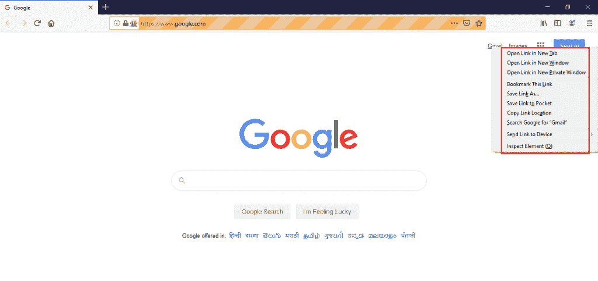**