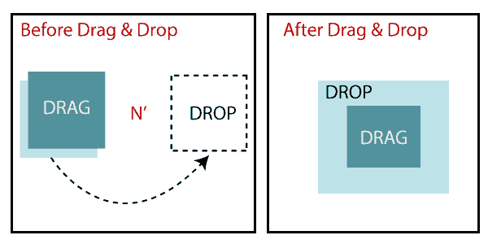
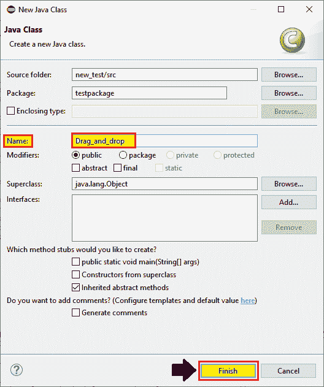
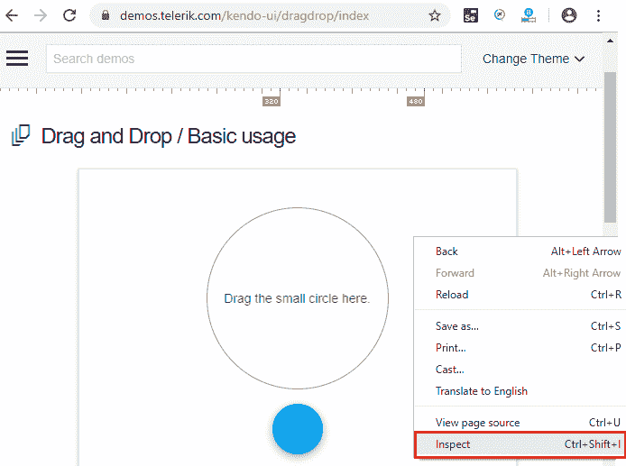
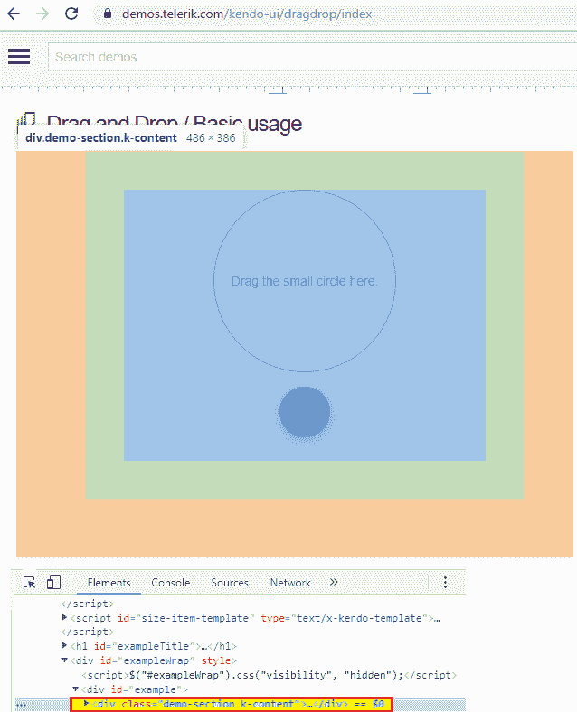
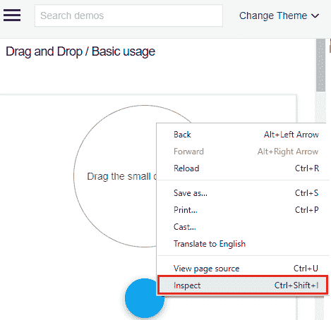
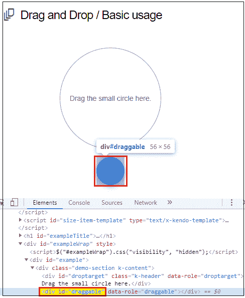
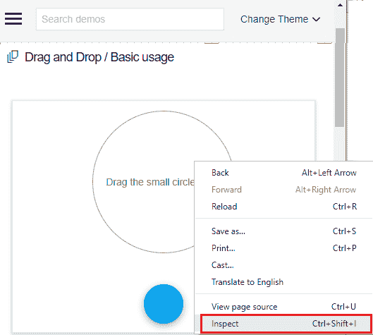
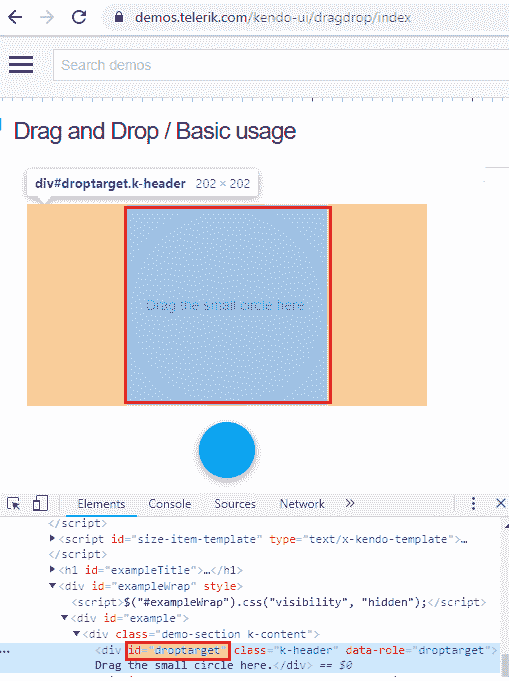
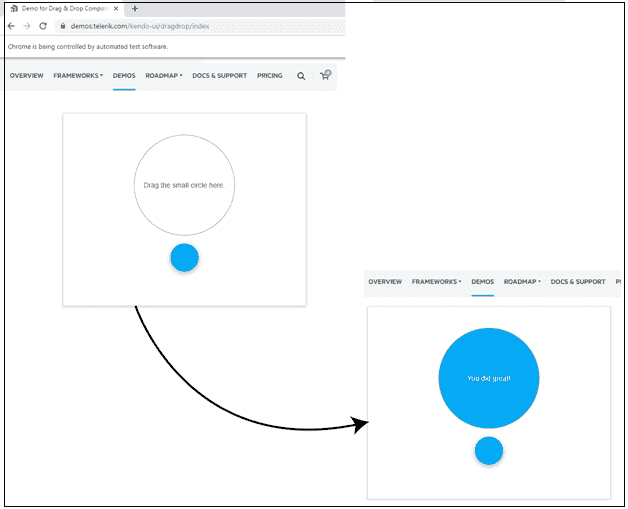

# 拖放事件处理

> 原文：<https://www.tutorialandexample.com/drag-and-drop-event-handling/>

**拖放事件处理:**

在本教程中，我们将学习如何使用 action 类处理 selenium WebDriver 中的**拖放**事件。

在本教程进一步介绍之前，我们先来了解一下什么是**拖放**？

**拖放:**

这个方法用于从源拖动元素**到**元素**到**目标**。**

**或**

拖放用于在鼠标的帮助下将 web 元素、文本和图像移动(拖动)到网页的另一部分/区域。

在 selenium WebDriver 中，我们将借助 action 类使用拖放事件。



让我们举一个例子来让你更好地理解**拖放处理**，我们创建了一个样本测试脚本如下:

出于测试目的，我们使用**demo.telrik.com**网站来执行 selenium WebDriver 中**拖放处理**的所有操作。

在这个测试案例中，我们将自动化以下测试场景:

| **步骤** | **动作** | **使用的方法** | **输入** | **预期结果** |
| **1。** | 打开谷歌 Chrome 浏览器。 | System.setProperty() |   | 谷歌 Chrome 浏览器必须打开。 |
| **2。** | 导航到**demo.telrik.com**。 | 获取() | [https://demos.telerik.com/kendo-ui/dragdrop/index](https://demos.telerik.com/kendo-ui/dragdrop/index) | 必须显示主页窗口。 |
| **3。** | 识别**拖动和** **下拉框架窗口**执行的所有动作。 |   |   | 应该标识框架窗口。 |
| **3。** | 使用 id 定位器识别**源元素(拖动)**。 |  |  | 应该标识源元素以便拖动。 |
| **4。** | 使用 id 定位器识别**目标元素(drop** )。 |  |   | 应该确定要删除的目标元素。 |
| **5。** | 创建一个动作类对象。 |  |  | 应该创建操作类对象。 |
| **6。** | 单击并按住元素，然后释放它。 | clickAndHold()，moveToelement()，release() |   | 使用这些方法，应该将元素从源元素拖放到目标元素。 |
| **7。** | 退出浏览器。 | 退出() |   | 浏览器应该被终止。 |

打开 Eclipse IDE 和现有的测试套件 **new_test** ，这是我们在 WebDriver 教程的 WebDriver 安装部分创建的。

然后，右击 src 文件夹，从 **New** → **Class** 创建一个新的类文件。


*   将类名命名为**拖放**并点击**完成**按钮。



#### **第一步:**

要启动谷歌 Chrome 浏览器，我们需要下载 ChromeDriver.exe 文件，并将系统属性设置为 ChromeDriver.exe 文件的路径。

以下是为谷歌浏览器设置系统属性的代码:

```
//set the system property of Google Chrome
 System.setProperty("webdriver.chrome.driver","C:\\Users\\JTP\\Downloads\\chromedriver_win32\\chromedriver.exe");                                                                                            
```

使用 Chrome driver 类初始化 Chrome 驱动程序:

```
// create driver object for CHROME browser
WebDriver driver=new ChromeDriver(); 
```

#### **第二步:**

现在，我们将访问所需的 URL:

```
//navigate to the home page of telrik.com.
driver.get("https://demos.telerik.com/kendo-ui/dragdrop/index"); 
```

#### **第三步:**

首先，我们要找到拖拽的框架窗口，然后右击 **inspect 元素(Q)。**



开发者工具窗口将被启动，所有特定的代码用于开发给定的链接。



#### **第四步:**

之后，右击**源(拖动)元素**并选择**检查元素(Q)。**



之后打开开发者工具窗口，复制其 **id 属性**的值，即**“可拖动”**



这里是示例代码，

```
// //identify the drag and drop frame window to perform all the action
driver.findElement(By.*xpath*("//div[@class='demo-section k-content']"));
 //to get source locator
WebElement srcwb=driver.findElement(By.*id*("draggable"));
System.*out*.println("the source element is ready to drag"); 
```

#### **第五步:**

现在，我们正在进行下一步，我们将点击**目标(放下)元素**，并选择**检查元素**字段。



将启动开发工具窗口，显示开发给定链接时使用的所有特定代码。



复制其 id 属性的值，即“ **droptarget”**

这里是示例代码，

```
//to get target locator
WebElement dstwb=driver.findElement(By.*id*("droptarget"));
System.*out*.println("the traget element is ready to drop"); 
```

#### **第六步:**

在样本测试脚本的下一步中，我们将创建 action 类对象。

```
//create an object to the action class
 Actions act= new Actions(driver); 
```

#### **第七步:**

之后，我们将使用 action 类方法拖动源元素并将其放入目标元素。

```
//click and hold, and release operation
act.clickAndHold(srcwb).moveToElement(dstwb).release().build().perform(); 
Thread.sleep(3000);
//or we can use this below method
act.dragAndDrop(srcwb, dstwb).build().perform();
 Thread.*sleep*(3000); 
```

**第八步:**

最后，我们终止进程，并退出浏览器。

```
//quit the browser
driver.quit();  
```

完成所有步骤后，我们最终的测试脚本将如下所示:

```
package testpackage;
import java.util.List;
import java.util.concurrent.TimeUnit;
import org.openqa.selenium.By;
import org.openqa.selenium.Keys;
import org.openqa.selenium.WebDriver;
import org.openqa.selenium.WebElement;
import org.openqa.selenium.chrome.ChromeDriver;
import org.openqa.selenium.interactions.Actions;
import org.openqa.selenium.support.ui.WebDriverWait;
public class Drag_and_drop {
public static void main(String[] args) throws InterruptedException {
System.setProperty("webdriver.chrome.driver", C:\\Users\\JTP\\Downloads\\chromedriver_win32\\chromedriver.exe");
//create driver class object
WebDriver driver = new ChromeDriver();
//maximize the browser window
driver.manage().window().maximize(); 
//to delete the all cookies
driver.manage().deleteAllCookies();
driver.manage().timeouts().implicitlyWait(20,TimeUnit.SECONDS);
//navigate to the url
driver.get("https://demos.telerik.com/kendo-ui/dragdrop/index");
//using explicitly wait
WebDriverWait wait = new WebDriverWait(driver, 5);
//identify the drag and drop frame window to perform all the action
driver.findElement(By.xpath("//div[@class='demo-section k-content']"));
//to get source locator
WebElement srcwb=driver.findElement(By.id("draggable"));
System.out.println("the source element is ready to drag");
//to get target locator
 WebElement dstwb=driver.findElement(By.id("droptarget"));
System.out.println("the target element is ready to drop"); 
//create an object to the action class
Actions act=new Actions(driver);
//click and hold, and release operation
act.clickAndHold(srcwb).moveToElement(dstwb).release().build().perform();
Thread.sleep(3000);
System.out.print("the source element is dropped to the target successfully");
//or we can use this below method
//act.dragAndDrop(srcwb, dstwb).build().perform();
//Thread.sleep(3000);
//quit the browser  
driver.quit();  
}
} 
```

*   要在 Eclipse 中运行测试脚本，右键单击窗口，然后单击 **Run as** 拖放事件处理 **Java 应用程序**，测试脚本将在 chrome 浏览器中启动，并自动执行所有测试场景。

