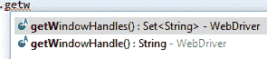
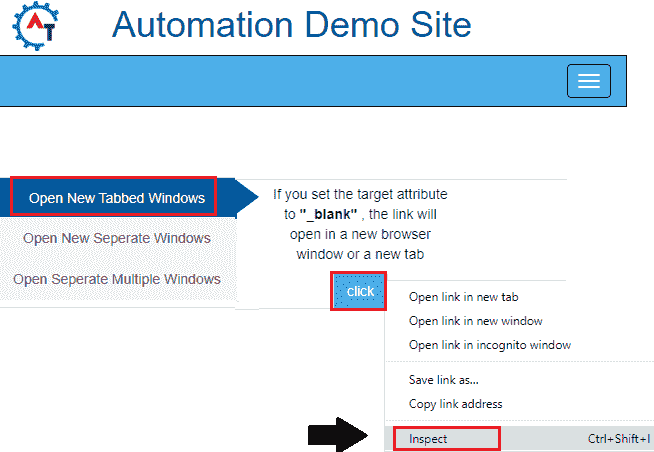
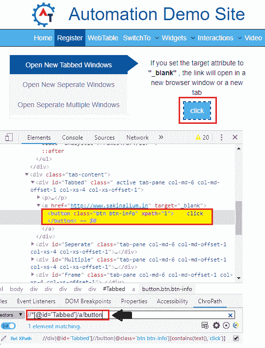
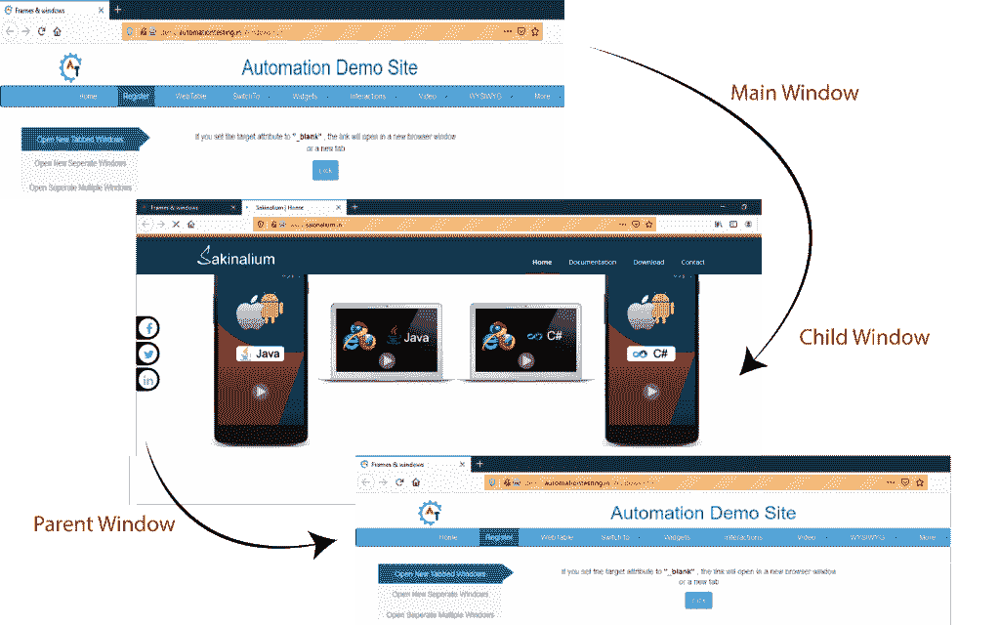
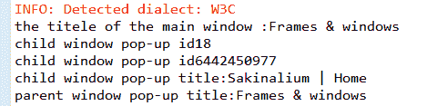

# selenium web driver–窗口处理

> 原文：<https://www.tutorialandexample.com/selenium-web-driver-window-handling/>

**Selenium web driver–窗口处理**

在本教程中，我们将了解如何在 selenium WebDriver 中处理窗口、多窗口和弹出窗口。

我们在 selenium WebDriver 中提供了不同类型的窗口和弹出窗口处理。

*   **新窗口/新标签页**
*   **警报**

现在我们逐一查看以上几点，让您更好地理解我们将如何处理 selenium WebDriver 中的所有弹出窗口。

**新窗口/新标签:**

Selenium WebDriver 没有将控件从一个窗口直接切换到另一个窗口的功能。

为了在 selenium web 驱动程序中处理窗口，我们需要一个惟一的字符串值来惟一地标识桌面上的浏览器窗口。

我们需要借助 WebDriver 接口提供的两个方法来执行这些操作，

*   **getWindowHandle()**
*   **getwindowshandlers()**

**getWindowHandle():-**

此方法用于获取当前活动的窗口 Id。

这个方法的返回类型是**字符串。**

### getWindowHandles()

这个方法用于获取所有窗口 Id，它是由 WebDriver 打开的。

这个方法的返回类型是字符串的**集合。**

**设置<字符串>command = driver . getwindowhandles()；**



注意:要将控件从一个窗口切换到另一个窗口，我们需要使用“**switch To()”**方法。

**driver.switchTo()。窗口(字符串)；**

在 selenium WebDriver 中处理窗口时，我们还将使用 close()和 quit()方法。

**关闭():-**

它用于关闭当前活动的窗口。

**退出():-**

它用于关闭所有由 web 驱动程序打开的浏览器。

让我们举一个例子来让你更好地理解**新窗口/新标签，**，我们创建了一个样本测试脚本如下:

出于测试目的，我们使用网站中的 **demo.automationtesting .来执行 selenium WebDriver 中的**新窗口处理**的所有操作。**

在这个测试案例中，我们将自动化以下测试场景:

| **步骤** | **动作** | **使用的方法** | **输入** | **预期结果** |
| **1。** | 打开 Firefox 浏览器。 | System.setProperty() |   | 必须打开 Firefox 浏览器。 |
| **2。** | 导航到。 | 获取() | http://demo.automationtesting.in/Windows.html | 必须显示主页窗口。 |
| **3。** | 识别主窗口。 |   |   | 应该标识出主窗口。 |
| **4。** | 处理所有新打开的窗口。 | getwindowHandles() |  | 所有新窗口都应该被处理，并返回 web 驱动程序打开的窗口的编号。 |
| **5。** | 切换到**子窗口**并打印子窗口的标题。 | 交换机() |   | 子窗口应该在切换之后出现，并且标题也打印在 Eclipse 的控制台窗口中。 |
| **6。** | 关闭子窗口。 | 关闭() |  | 子窗口应该关闭。 |
| **7。** | 切换到**父窗口，**即主窗口，并打印父窗口的标题。 | 开关。到() |   | 父窗口应该被切换，标题也打印在 eclipse 的控制台窗口中。 |
| **8。** | 关闭父窗口。 | 关闭() |   | 父窗口应该关闭。 |

打开 Eclipse IDE 和现有的测试套件 **new_test** ，这是我们在 WebDriver 教程的 WebDriver 安装部分创建的。

然后，右击 src 文件夹，从 **New 创建一个新的类文件？类别**。


*   将类名命名为 **Win_handle** 并点击**完成**按钮。

**第一步:**

要启动 Firefox 浏览器，我们需要下载 geckoDriver.exe 文件，并将系统属性设置为 geckoDriver.exe 文件的路径。

下面是设置 Firefox 浏览器系统属性的代码:

```
// System Property for gecko Driver   System.setProperty("webdriver.gecko.driver","C:\\Users\\JTP\\Downloads\\geckodriver-v0.25.0-win64\\geckodriver.exe");
// create an object for FirefoxDriver class.      
WebDriver driver=new FirefoxDriver(); 
```

**第二步:**

现在，我们将访问所需的 URL:

```
//navigate to the website.
driver.get("http://demo.automationtesting.in/Windows.html"); 
```

**第三步:**

之后，我们将进入下一步，打印主窗口标题并识别点击按钮，该按钮显示在网站的主窗口上。

要首先识别点击按钮，右击点击按钮并选择**检查**元素字段。



将启动开发工具窗口，其中显示了开发点击按钮时使用的所有特定代码。



这里是示例代码，

```
//print the title of the main window
System.out.println("the title of the main window :"+ driver.getTitle());
WebElement wb=driver.findElement(By.xpath("//*[@id='Tabbed']/a/button"));
wb.click();
Thread.sleep(3000); 
```

**第四步:**

一旦我们确定了主窗口，我们将使用 **getWindowHandles()** 方法处理新窗口，并获取 WebDriver 打开的所有窗口 id。

注意:迭代器用于从 set 对象中获取值。

```
//It returns the no. of the windows opened by the web driver and handle all new opened window.
Set<String> set=driver.getWindowHandles();
//to get the value from set object, we will use iterator
Iterator<String> it=set.iterator();
String parentId=it.next();
//print the parent window id
System.out.println("parent window pop-up id"+ parentId);
String childId=it.next(); 
//print the child window id
System.out.println("child window pop-up id" +childId); 
```

**第五步:**

之后，我们将使用**开关切换到子窗口。**给()方法，并打印子窗口的标题。

这里是示例代码，

```
//switch to child window
driver.switchTo().window(childId);
//print the title of child window
System.out.println("child window pop-up title:"+ driver.getTitle());
Thread.sleep(3000); 
```

**第六步:**

现在，我们正在关闭子窗口，

```
//close the child window 
driver.close();
```

**第七步:**

在这一步，我们将切换到父窗口，也称为主窗口，并打印窗口的标题，以免进一步混淆。

这里是示例代码，

```
//switch to parent window that is main window
driver.switchTo().window(parentId);
//print the title of parent window
System.out.println("parent window pop-up title:"+ driver.getTitle());
Thread.sleep(3000); 
```

**第八步:**

最后，我们关闭父窗口。

```
 //close the parent window
 driver.close();
```

完成所有步骤后，我们最终的测试脚本将如下所示:

```
package testpackage;
import java.util.Iterator;
import java.util.Set;
import java.util.concurrent.TimeUnit;
import org.openqa.selenium.By;
import org.openqa.selenium.WebDriver;
import org.openqa.selenium.WebElement;
import org.openqa.selenium.firefox.FirefoxDriver; 
 public class Win_handle {
 public static void main(String[] args) throws InterruptedException {
 // System Property for gecko Driver   
 System.setProperty("webdriver.gecko.driver","C:\\Users\\JTP\\Downloads\\geckodriver-v0.25.0-win64\\geckodriver.exe");
 // create an object for FirefoxDriver class.       
 WebDriver driver=new FirefoxDriver(); 
 driver.manage().window().maximize(); 
 //navigate to the url
 driver.get("http://demo.automationtesting.in/Windows.html");
 //print the title of the main window
 System.out.println("the title of the main window :"+ driver.getTitle());
 WebElement wb=driver.findElement(By.xpath("//*[@id='Tabbed']/a/button"));
 wb.click();
 Thread.sleep(3000); 
 //It returns the no. of the windows opened by the web driver and handle all new opened window.
 Set<String> set=driver.getWindowHandles();
 //to get the value from set object, we will use iterator
 Iterator<String> it=set.iterator();
 String parentId=it.next();
 //print the parent window id
 System.out.println("parent window pop-up id"+ parentId); 
 String childId=it.next();
 //print the child window id
 System.out.println("child window pop-up id" +childId);
 //switch to child window
 driver.switchTo().window(childId);
 //print the title of child window
 System.out.println("child window pop-up title:"+ driver.getTitle());
 Thread.sleep(3000); 
 //close the child window 
 driver.close();
 //switch to parent window that is main window
 driver.switchTo().window(parentId);
 //print the title of parent window
 System.out.println("parent window pop-up title:"+ driver.getTitle());
 Thread.sleep(3000);
 //close the parent window 
 driver.close();                                                                    
 }
 }
```

*   要在 Eclipse 中运行测试脚本，右键单击窗口，然后单击 **Run as？Java 应用程序、**和测试脚本将在 Firefox 浏览器中启动，并自动执行所有测试场景。



所有打印命令的输出如下所示，

