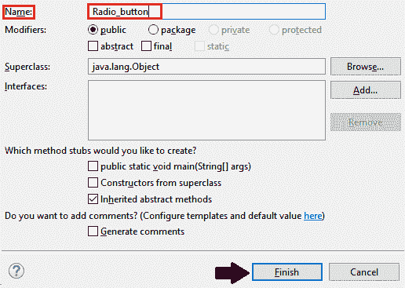
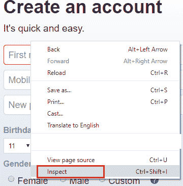
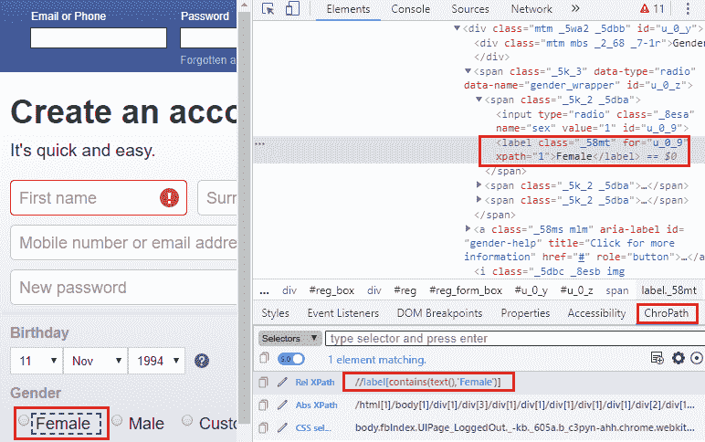
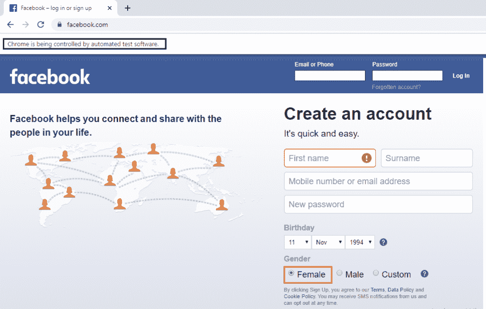

# Selenium WebDriver-单选按钮处理

> 原文：<https://www.tutorialandexample.com/selenium-web-driver-radio-button-handling/>

**Selenium WebDriver-单选按钮处理**

在本教程中，我们将学习如何在 selenium WebDriver 中处理单选按钮。

让我们举一个例子来让你更好地理解**单选按钮处理**，我们将创建一个样本测试脚本，如下所示；

出于测试目的，我们使用**脸书主页**来执行 selenium WebDriver 中的**单选按钮** **处理**。

在这个测试案例中，我们将自动化以下测试场景:

| **步骤** | **动作** | **使用的方法** | **输入** | **预期结果** |
| **1。** | 打开谷歌 Chrome 浏览器。 | System.setProperty() |   | 谷歌 chrome 浏览器必须打开。 |
| **2。** | 导航到该网站。 | 获取() | [https://www.facebook.com/](https://www.facebook.com/) | 必须显示主页窗口。 |
| **3。** | 识别**女性单选按钮，**并选择脸书主页上的女性单选按钮。 | 单击() |   | 应识别并选择一个**女性单选按钮**。 |
| **4。** | 关闭浏览器窗口。 | 关闭() |   | 浏览器窗口应该关闭。 |

打开 Eclipse IDE 和现有的测试套件 **new_test** ，这是我们在 WebDriver 教程的 WebDriver 安装部分创建的。

然后，右击 src 文件夹，从 **New 创建一个新的类文件？类别**。


*   将类名命名为**单选按钮**并点击**完成**按钮。



**第一步:**

要启动谷歌 Chrome 浏览器，我们需要下载**ChromeDriver.exe**文件，并将系统属性设置为 ChromeDriver.exe 文件的路径。

以下是设置谷歌 chrome 浏览器系统属性的代码:

```
System.setProperty("webdriver.chrome.driver","C:\\Users\\JTP\\Downloads\\chromedriver_win32 (1)\\chromedriver.exe");
// create driver object for CHROME browser
WebDriver driver=new ChromeDriver(); 
```

**第二步:**

现在，我们将访问所需的 URL:

```
//navigate to the website.
driver.get("https://www.facebook.com"); 
```

**第三步:**

首先要识别单选按钮，右击**女单选按钮**，选择**检查** **元素**字段，如下图所示。



将启动开发工具窗口，其中显示了开发特定单选按钮时使用的所有特定代码，单击 chropath 并复制相关 XPath 的值，如下所示。



这里是示例代码，

```
//identify and click on the radio button
 try {
 driver.findElement(By.xpath("//label[contains(text(),'Female')]")).click(); 
 System.out.println("radio button is clicked");
 Thread.sleep(2000);
 } 
 catch(Exception e)
 {
 System.out.println(e);
 } 
```

**第四步:**

最后，我们关闭浏览器窗口。

```
 //close the browser
driver.close();
```

完成所有给定的步骤后，我们最终的文本脚本将如下所示:

```
package testpackage;
import java.util.concurrent.TimeUnit;
import org.openqa.selenium.By;
import org.openqa.selenium.WebDriver;
import org.openqa.selenium.chrome.ChromeDriver;
public class Radio_button {
public static void main(String[] args) throws InterruptedException{ System.setProperty("webdriver.chrome.driver","C:\\Users\\JTP\\Downloads\\chromedriver_win32 (1)\\chromedriver.exe");
// Create driver object for CHROME browser 
WebDriver driver=new ChromeDriver();
//maximize the window size
driver.manage().window().maximize(); 
driver.manage().timeouts().pageLoadTimeout(20,TimeUnit.SECONDS);
//delect all the cookies
driver.manage().deleteAllCookies();
//navigate to the url
driver.get("https://www.facebook.com/"); 
//identify and click on the radio button
try {
driver.findElement(By.xpath("//label[contains(text(),'Female')]")).click(); 
System.out.println("radio button is clicked");
Thread.sleep(2000);
} 
catch(Exception e) 
{
System.out.println(e);
}
//Close the  browser  
driver.close();  
}
}
```

*   要在 Eclipse 中运行测试脚本，右键单击窗口，然后单击 **Run as？Java 应用程序**和测试脚本将在 chrome 浏览器中启动，并自动执行所有测试场景。

