# 硒断言

> 原文：<https://www.tutorialandexample.com/selenium-assertion/>

**Selenium 断言**:在本节中，我们将学习 Selenium WebDriver 中的**断言**。

断言是 TestNG 中可用的特性，用于验证测试用例的预期结果。如果应用程序的实际结果与预期结果匹配，那么只有我们可以使用断言。

可以借助 Junit 和 TestNG 框架的预定义方法来处理断言。

### 断言的类型

selenium WebDriver 中有两种类型的断言:

*   软断言
*   硬断言

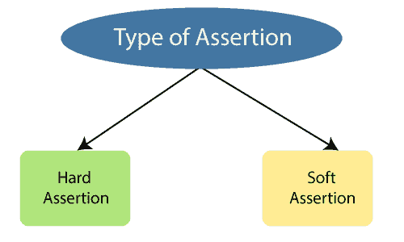

为了在 WebDriver 中使用断言，我们需要下载 **TestNG** 并将其添加到 eclipse 中。

要下载测试，请参考下面的链接。

[http://dl . bin tray . com/TestNG-team/TestNG-eclipse-release/zipped/](https://dl.bintray.com/testng-team/testng-eclipse-release/zipped/)

在 selenium WebDriver 中使用断言时会用到以下包:

导入 org . TestNG . assert JUnit；

导入 org . TestNG . assets . soft assert；

### 硬断言

当测试用例失败并抛出 **AssertException 时，使用硬断言。**

*   硬断言中所有可用的方法都是静态的。
*   每当 **hard assert()** 方法**失败**时，TestNG 生成 assert 错误消息异常以及行 under 和错误跟踪(信息)，然后停止当前测试脚本的执行，继续执行剩余的测试脚本。
*   我们使用硬断言来验证强制信息或关键信息。

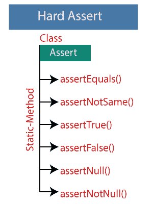

硬断言的断言类中提供了以下方法:

*   **assertEquals()**
*   **assertNotSame()**
*   **assertTrue()**
*   **assertFalse()**
*   断言 Null()
*   **断言 NotNull()**

### assertEquals()

**assertEquals()** 方法用于匹配实际结果和预期结果。

*   如果预期和实际结果**不匹配，**将抛出 **AssertionError** 并终止执行。
*   如果实际结果和预期结果匹配或相同，测试用例将**通过**。

【assertEquals()的语法

**AssertJUnit.assertEquals(字符串实际，字符串预期)；**

例如:

**当实际和预期字符串值相等时**

```
package testpackage;
 import org.testng.AssertJUnit;
 public class Assert_4 {
 public static void main(String[] args) {
 AssertJUnit.*assertEquals*("tutorial", "tutorial");
 System.*out*.println("Selenium WebDriver");   
 }
 } 
```

上述代码的输出如下所示:

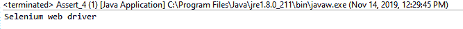

**当实际和预期字符串值不相等时**

 **```
package testpackage;
 import org.testng.AssertJUnit;
 public class Assert_4 {
 public static void main(String[] args) {
 AssertJUnit.assertEquals("tutorial", "example");
 System.out.println("tutorialandExample");   
 }
 } 
```

上述代码的输出如下:

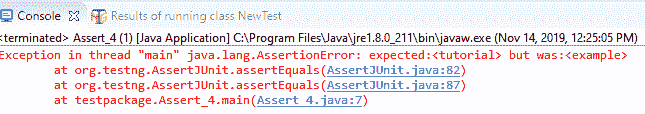

### assertNotSame()

assertNotSame()方法用于匹配实际结果和预期结果。

*   如果实际结果和预期结果不相似，测试用例将无一例外地通过。
*   如果实际结果和预期结果**相同，测试用例将**失败**。**

【assertNotSame()方法的语法

**AssertJUnit.assertNotSame(实际，预期，消息)；**

例如:

**当实际字符串与预期字符串不相似时**

```
package testpackage;
 import org.testng.AssertJUnit;
 public class Assert_4 {
 public static void main(String[] args) {
 AssertJUnit.*assertNotSame*("Hey", "what's up");  
 System.*out*.println("Hello.....cool"); 
 }
 } 
```

在上面的代码中，实际的字符串值是**“嘿”**，这与期望的字符串值**“怎么了”**不一样。因此，断言通过测试用例并执行下一个语句，即**系统。*退出*。println(“你好.....冷却”)**

上面代码的输出:

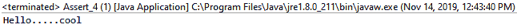

**当实际字符串与预期字符串相同时**

 **```
package testpackage;
 import org.testng.AssertJUnit;
 public class Assert_4 {
 public static void main(String[] args) {
 AssertJUnit.*assertNotSame*("Hey", “Hey");  
 System.*out*.println("Hello.....cool"); 
 }
 } 
```

**上面代码的输出:**

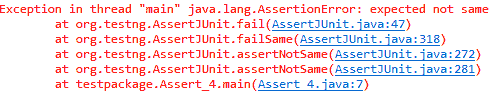

### assertFalse()

assertFalse()方法用于获取一个布尔参数，并检查条件是否为**false**；它将**通过**测试用例。否则，如果条件为**真**，将抛出 **AssertionError** 。

【assertFalse()方法的语法

**AssertJUnit.assertFalse(条件)；**

 **例如

**当条件为假时**

```
package testpackage;
 import org.testng.AssertJUnit;
 import static org.testng.AssertJUnit.assertFalse;
 import org.openqa.selenium.By;
 import java.util.concurrent.TimeUnit;  
 import org.openqa.selenium.WebDriver;  
 import org.openqa.selenium.chrome.ChromeDriver;  
 public class Assert_1 {  
 public static void main(String[] args) {  
 System.setProperty("webdriver.chrome.driver","C:\\Users\\JTP\\Downloads\\chromedriver_win32 (1)\\chromedriver.exe");
 // Create driver object for CHROME browser
 WebDriver driver = new ChromeDriver();   
 //maximize the window size
 driver.manage().window().maximize(); 
 driver.manage().timeouts().pageLoadTimeout(20,TimeUnit.*SECONDS*);
 driver.manage().deleteAllCookies();
 //navigate to the url
 driver.navigate().to("https://www.irctc.co.in/nget/train-search");  
 //using hard assert method, when the condition is false
 AssertJUnit.assertFalse(driver.findElement(By.xpath("//label[contains(text(),'Flexible With Date')]")).isSelected());  
 System.out.println(driver.findElement(By.xpath("//label[contains(text(),'Flexible With Date')]")).isSelected());  
 //closing the driver 
 driver.close();
 }  
 }   
```

在上面的代码中， **assertFalse()** 方法具有条件，这将返回 False 值。因此，测试用例通过了。

正如我们在下面的输出控制台窗口中看到的:

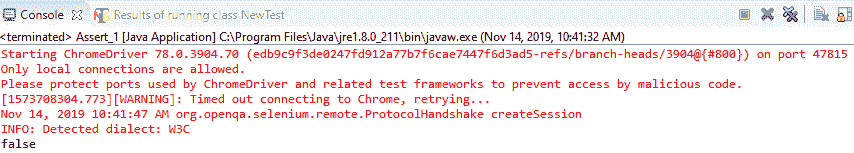

**当条件为真时**

```
package testpackage;
 import org.testng.AssertJUnit;
 import static org.testng.AssertJUnit.assertFalse;
 import org.openqa.selenium.By;  
 import org.openqa.selenium.WebDriver;  
 import org.openqa.selenium.chrome.ChromeDriver;  
 import java.util.concurrent.TimeUnit;
 public class Assert_1 {   
 public static void main(String[] args) {  
 System.setProperty("webdriver.chrome.driver","C:\\Users\\JTP\\Downloads\\chromedriver_win32 (1)\\chromedriver.exe");
 // create driver object for CHROME browser
 WebDriver driver = new ChromeDriver();  
 //maximize the window size 
 driver.manage().window().maximize(); 
 driver.manage().timeouts().pageLoadTimeout(20,TimeUnit.*SECONDS*);
 driver.manage().deleteAllCookies();
 //navigate to the url
 driver.navigate().to("https://www.irctc.co.in/nget/train-search");  
 //when the condition is true
 AssertJUnit.assertFalse(true);  
 System.out.println(driver.findElement(By.xpath("//label[contains(text(),'Flexible With Date')]")).isSelected());   
 //closing the driver
 driver.close();
 }  
 }   
```

在上面的代码中， **assertFalse()** 方法具有**真条件**。因此，断言失败了，这意味着测试用例也失败了。

它将停止执行并给出如下所示的 **AssertionError，**:

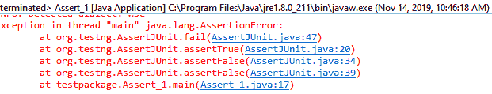

### assertTrue()

assertTrue()方法用于获取一个布尔参数，并检查条件是否为**真、**，然后断言将**通过**测试用例；如果条件不成立，它将抛出一个 **AssertionError** 。

【assertTrue()方法的语法

**AssertJUnit.assertTrue(条件)；**

例如:

**当条件为真时**

```
package testpackage;
 import org.testng.AssertJUnit;
 public class Assert_5 {
 public static void main(String[] args){
 AssertJUnit.assertTrue(true);  
 System.*out*.println("selenium"); 
 }
 } 
```

**输出**

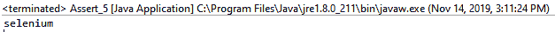

**当条件为假时**

```
package testpackage;
 import org.testng.AssertJUnit;
 public class Assert_5 {
 public static void main(String[] args){
 AssertJUnit.assertTrue(false);  
 System.*out*.println("selenium"); 
 }
 } 
```

**输出**

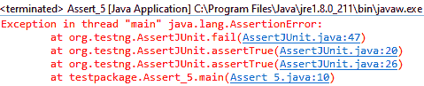

### 断言 Null()

assertNull()用于检查给定对象是否有空值。

*   如果一个对象有一个空值，它将通过测试用例。
*   否则，测试用例将失败并抛出一个 **AssertionError** 。

【assertNull()方法的语法

**assert JUnit . assert null(object)；**

让我们看一个例子

**对象的值为空**

```
package testpackage;
 import org.testng.AssertJUnit;
 public class Assert_4 {
 public static void main(String[] args) {
 AssertJUnit.*assertNull*(null);  
 System.*out*.println("Hello world!!!!");   
 }
 } 
```

**输出**

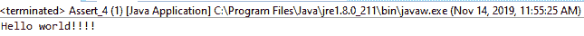

**当对象的值不为空时**

```
package testpackage;
 import org.testng.AssertJUnit;
 public class Assert_4 {
 public static void main(String[] args) {
 AssertJUnit.*assertNull*(5);  
 System.*out*.println("Hello world!!!!");   
 } 
```

**输出**

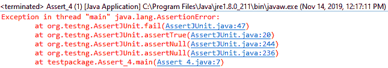

### assertNotNull()

assertNotNull()方法用于检查对象是否为空。

*   如果对象**不为空，**将**通过**测试用例。
*   否则，测试用例将失败并抛出 AssertionError。

【assertNotNull()方法的语法

**assert JUnit . assertnotnull(object)；**

例如

**对象不为空**

```
package testpackage;
 import org.testng.AssertJUnit;
 public class Assert_5 {
 public static void main(String[] args) {
 AssertJUnit.assertNotNull(5);  
 System.*out*.println("tutorialandExample");   
 }
 } 
```

**输出**

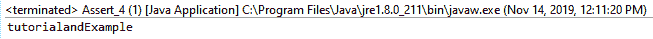

**当对象为空时**

```
package testpackage;
 import org.testng.AssertJUnit;
 public class Assert_5 {
 public static void main(String[] args) {
 AssertJUnit.assertNotNull(null);  
 System.*out*.println("TutorialandExample");   
 }
 } 
```

**输出**

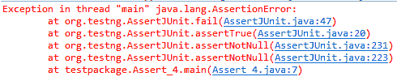

**软断言**

当断言条件不匹配时，使用软断言。

大多数情况下，软断言不会抛出任何错误，但是当断言条件失败时，它会继续测试用例的下一步。

*   软断言中可用的所有方法都是非静态方法。
*   每当 softassert()失败时，TestNG 都会生成错误消息以及断言异常，然后继续执行相同的测试脚本。
*   我们使用软断言来验证非强制字段。
*   在软断言的情况下，assertAll()应该用在测试脚本的末尾，因为它总是收集所有的日志跟踪并显示在控制台上。

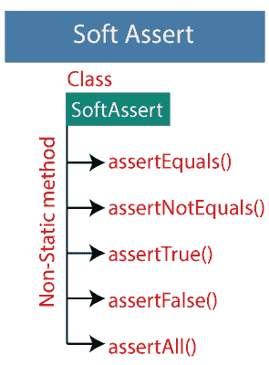

软断言的断言类中提供了以下方法:

*   断言方程()
*   **assertNotEquals()**
*   **assertTrue()**
*   **assertFalse()**
*   **assertAll()**

让我们看一个示例程序，在这里我们将理解软断言的概念:

```
package testpackage;
 import org.testng.Reporter;
 import org.testng.asserts.SoftAssert;
 public class Assert_4 {
 public static void main(String[] args) {
 //creating the soft assert object
 SoftAssert sa=new SoftAssert();
 Reporter.log("step-1",true);
 Reporter.log("step-2",true);
 sa.assertEquals("A", "B");
 Reporter.log("step-3",true);
 sa.assertEquals("B", "Y"); 
 Reporter.log("step-4",true);
 //mandatory used in soft assert
 sa.assertAll();
 }
 } 
```

在上面的代码中，我们使用了 reporter 类，它用于测试方法来记录消息，该消息将包含在 TestNG 生成的 Html 报告中。

以上示例的输出:

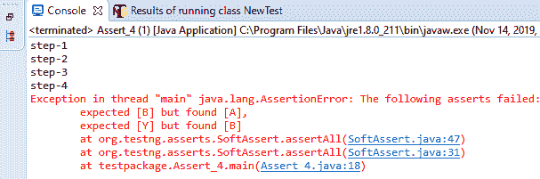

在上面的输出中，我们使用了 **assertAll()** 方法，**，它用于捕获错误消息并将其显示到控制台窗口**。******